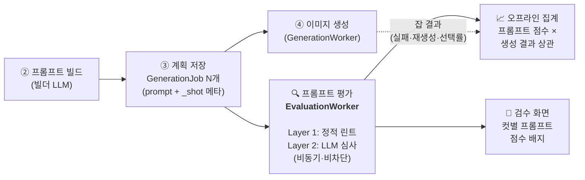
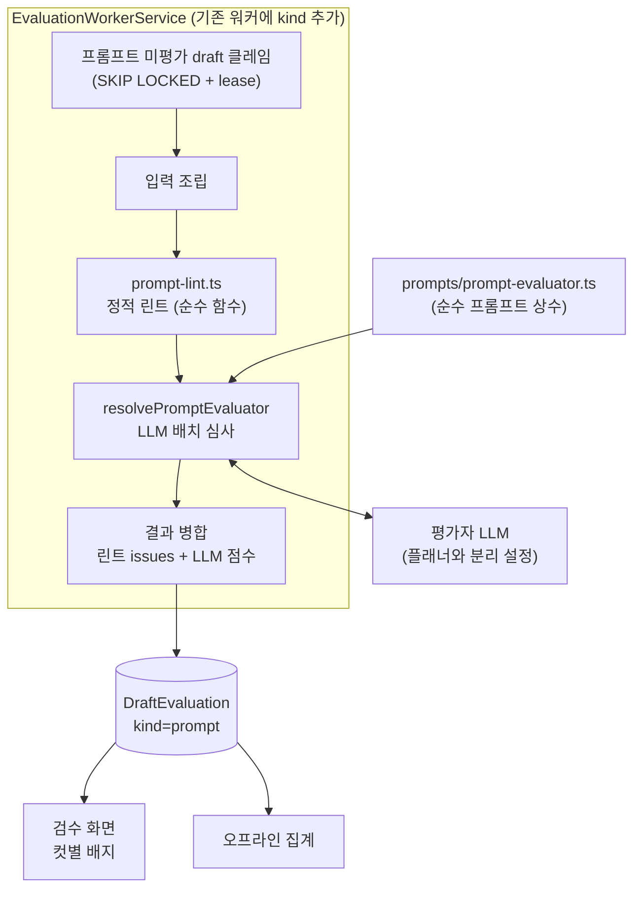
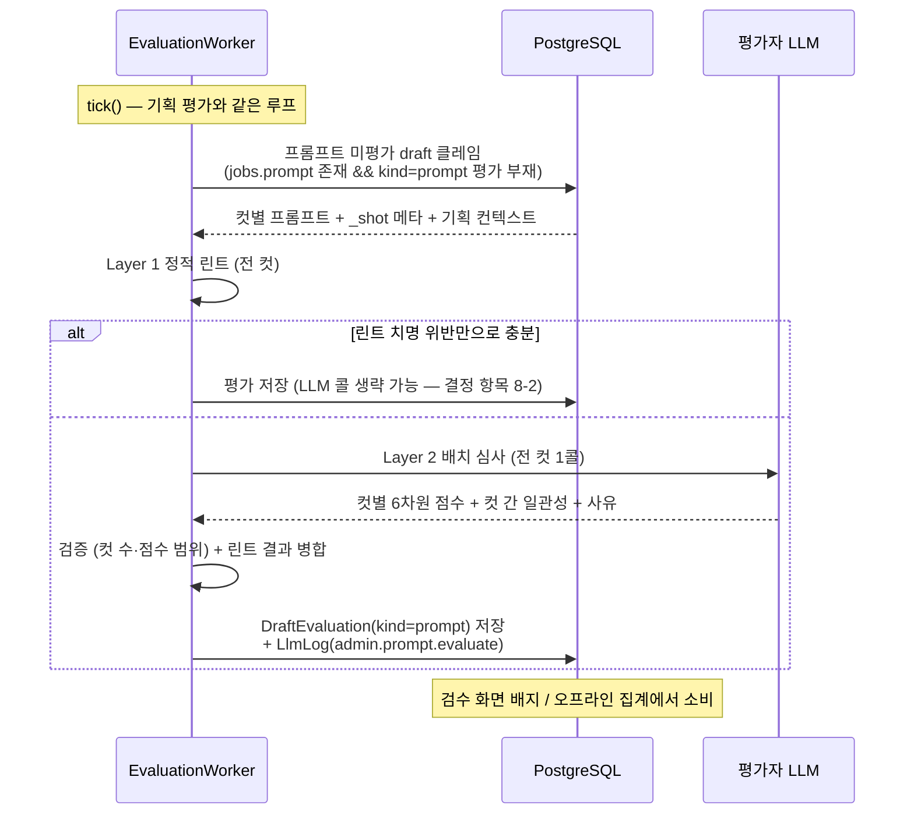

# 이미지 프롬프트 평가 Agent 아키텍처

Status: 구현 승인 (2026-08-07) — 코드베이스 검증 리뷰 반영판
상위 문서: `plan-prompt-evaluation-agent.md` (kind: `prompt` 평가의 상세 설계)

## 1. 목적과 범위

이미지 프롬프트 빌더가 생성한 **컷별 영어 프롬프트**가 이미지 생성에
투입되기에 적합한지 평가한다. 목적은 두 가지:

1. **검수 참고** — 검수 화면에서 컷별 프롬프트 품질을 미리 보여줘 저품질
   컷을 빠르게 식별.
2. **빌더 고도화** — 어떤 프롬프트 결함이 실제 이미지 실패(재생성·거절)로
   이어지는지 상관을 계측해 `prompts/image-prompt-builder.ts` 개선의 정량
   근거 확보.

평가 대상은 **텍스트 프롬프트**다. 생성된 이미지 자체의 평가(비전 모델
심사)는 범위 밖이며 후속 단계 후보로만 남긴다(9절).

## 2. 파이프라인 내 위치



기획 평가와 동일하게 `persistPlan` 이후 비동기로 실행되어 이미지 생성과
병렬로 진행된다. 평가 결과는 생성을 막지 않는다.

## 3. 2계층 평가기

프롬프트 결함의 상당수는 LLM 없이 결정적으로 검출 가능하다. 비용과
신뢰성을 위해 평가를 두 계층으로 나눈다.

### Layer 1 — 정적 린트 (결정적, LLM 무비용)

`src/worker/prompt-lint.ts` 순수 함수. 위반은 즉시 `issues`로 기록되고
같은 항목을 LLM에 중복 질문하지 않는다.

| 검사 | 내용 |
|---|---|
| language_check | 프롬프트가 영어인가 (한글 잔존 검출) |
| unmanned_person_leak | `characterVisible=false` 컷에 인물 어휘(woman, her, face 등) 잔존 여부 — 기존 레퍼런스 정책의 프롬프트 층 재검증 |
| length_bounds | 대상 모델 패밀리별 권장 토큰 범위 초과/미달 |
| forbidden_terms | 금칙어·provider 정책 위반 어휘 |
| duplicate_prompt | 컷 간 프롬프트 중복(동일·유사도 임계 초과) |
| meta_leak | captureSetup 어휘(camera held by, photographer 등)가 scene 프롬프트에 누출됐는지의 사전 기반 1차 검사 |

### Layer 2 — LLM 심사 (draft당 배치 1콜)

빌더가 전 컷을 1콜로 생성하듯, 심사도 **전 컷을 한 번에** 평가한다.
컷 간 일관성 차원은 배치 평가여야만 판정 가능하다.

| 차원 | 확인 내용 |
|---|---|
| scene_capture_separation | scene(프레임 안 픽셀)과 captureSetup(프레임 밖 과정) 분리 규칙 준수 — 린트의 사전 검사를 넘어선 의미 수준 판정 |
| physical_consistency | 카메라 위치·촬영자·손·거울·행동의 물리적 양립 |
| model_family_rules | 대상 모델 패밀리(flux/nano-banana/SD) 작문 규칙 준수 |
| plan_fidelity | 기획의 장면 의도(한국어 scene)가 영어 프롬프트에 손실·왜곡 없이 반영됐는가 |
| reference_alignment | 레퍼런스 활용 지시가 컷 의도·정책과 일치하는가 |
| cross_shot_consistency | **컷 간** 의상·시간대·조명·장소 묘사가 한 게시물로 이어지는가 (배치 평가 고유 차원) |

## 4. 평가 입력 조립

`EvaluationRepository`가 draft 1건에 대해 조립한다. 모두 기존 데이터 —
신규 저장 없음.

| 입력 | 출처 |
|---|---|
| 컷별 영어 프롬프트 | `GenerationJob.prompt` |
| scene / captureSetup / characterVisible / sortOrder | `GenerationJob.paramsJson._shot` |
| 대상 모델 패밀리 | `_shot.targetModelId` → `imageModelFamily()` |
| 기획 컨텍스트 (장소·시간대·의상 힌트) | `PostDraft.conceptJson.plan` |
| 레퍼런스 캡션 (인물·환경 설명) | `CharacterVisualProfileReference.description`, `CharacterLocationReference` |
| 네거티브 프롬프트·스타일 규칙 | `CharacterVisualProfile` |

## 5. 컴포넌트



| 컴포넌트 | 위치 | 책임 |
|---|---|---|
| `promptLint` | `src/worker/prompt-lint.ts` | Layer 1 정적 검사. 순수 함수, 단위 테스트로 규칙 고정 |
| `PROMPT_EVALUATOR_SYSTEM_PROMPT` 등 | `prompts/prompt-evaluator.ts` | 심사 기준·차원 정의·출력 JSON 스키마. 경계 규칙 준수(문자열만) |
| `resolvePromptEvaluator` | `src/worker/prompt-evaluator.ts` | LLM 호출 + JSON 파싱·검증(컷 수 일치, 점수 범위). resolver closure 패턴 |
| `EvaluationWorkerService` 확장 | `src/worker/evaluation-worker.service.ts` | tick에 프롬프트 평가 단계 추가. 기획 평가와 동일 클레임·lease·재시도 규칙 |
| `LlmLog` 신규 타입 | — | `admin.prompt.evaluate` (배치 1콜 = 로그 1행) |

## 6. 실행 시퀀스



## 7. 데이터 모델과 재평가

상위 문서의 `DraftEvaluation` 스키마를 그대로 쓴다. `kind=prompt`의
`scoresJson` 형태:

```jsonc
{
  "shots": [                       // sortOrder 순, GenerationJob과 1:1
    {
      "sortOrder": 0,
      "jobId": "…",                // 평가 시점의 잡 (재생성 추적용)
      "lint": [{ "rule": "meta_leak", "detail": "…" }],
      "scores": { "scene_capture_separation": 4, "physical_consistency": 2, "...": 0 },
      "issues": ["거울 셀피인데 카메라가 프레임에 없음"],
      "suggestions": ["…"]
    }
  ],
  "crossShot": { "score": 3, "issues": ["1컷은 노을, 2컷은 대낮"] },
  "overallScore": 2.8
}
```

재평가 트리거 — 프롬프트가 바뀌는 모든 경로에서 새 `attempt` 레코드 추가
(기존 평가는 이력 보존):

1. 재기획으로 잡이 새로 생성될 때
2. 수동 `build-prompts` 재실행으로 프롬프트가 갱신될 때
3. 컷 재생성(`originJobId`)으로 새 잡이 생길 때 — 해당 컷만 부분 재평가
   (crossShot은 최신 컷 조합으로 재산정)

## 8. 생성 결과와의 상관 계측 (프롬프트 평가의 고유 가치)

기획 평가의 정답 신호가 휴먼 검수라면, 프롬프트 평가의 정답 신호는
**생성 결과**다. 오프라인 집계에서:

- `DraftEvaluation(kind=prompt)` × `GenerationJob` 결과(영구 실패율,
  재시도 횟수) × 휴먼 시그널(컷 재생성 횟수, 후보 선택까지 걸린 후보 수,
  필터 사용률)을 sortOrder/jobId로 조인.
- "저점 차원 → 실제 실패"의 예측력을 차원별로 검증한다. 예측력 없는 차원은
  루브릭에서 강등하고(eval-rubric-vN), 예측력 높은 차원의 결함 패턴은
  빌더 시스템 프롬프트 수정안(builder-vN)으로 연결한다.

이 상관 데이터가 곧 "프롬프트 평가가 이미지 품질을 실제로 예측하는가"에
대한 답이며, 포트폴리오 관점에서 핵심 실험 결과다 —
`prompt-research-log.md`에 회차별로 기록한다.

## 9. 구현 순서와 결정 필요 항목

구현 순서 (상위 문서 2차 단계의 세부):

1. `prompt-lint.ts` + 단위 테스트 — LLM 없이 즉시 가치, 위험 없음
2. `prompts/prompt-evaluator.ts` + `resolvePromptEvaluator` + 워커 확장
3. 검수 화면 컷별 배지
4. 집계 질의에 생성 결과 조인 추가

결정 이력 (2026-08-07):

1. 린트 치명 위반이 있어도 LLM 심사는 항상 실행 — 현재 저볼륨 단계에서는
   데이터 완결성(차원별 예측력 검증)이 비용 절감보다 중요. 볼륨 증가 시 재검토.
2. 컷 재생성 시 새 attempt로 전체 컷 재평가(crossShot은 최신 컷 조합) —
   부분 재평가 최적화는 비용 데이터 축적 후.
3. 검수 화면은 기획/프롬프트 평가를 분리 표시 (스테이지가 다름 —
   `draft-pipeline-ux.md` IA 참조).
4. (후속 후보 유지) 생성 이미지 자체의 비전 모델 평가 — 프롬프트 평가의
   예측력 확인 후 검토.

추가 리뷰 반영: 빈 프롬프트 잡(수동 모드 기획 직후) 제외, 평가 시점 잡 id를
`scoresJson.shots[].jobId`에 고정, LlmLog 연결은 `requestId = draft.id` 관례.
구현에서는 재기획·프롬프트 재빌드·컷 재생성 action이 최신 완료 평가보다
새로울 때 다음 attempt를 만들며, 검수 화면은 기획 총점/차원 사유와 컷별
프롬프트 점수·정적 린트를 분리해 표시한다.
