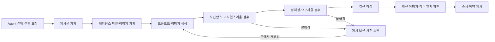

# 자연스러운 사진 자동 제작 Agent

게시물 만들기에서 **기존 Agent**와 **새 Agent · 자연스러운 사진 자동 제작**을 선택한다.
기존 선택과 선택값이 없는 이전 요청은 기존 동작을 유지한다. 새 Agent는
기획부터 검수·캡션·게시까지 자동 진행하며, 운영자 확인은 매 단계의 필수 조건이 아니다.
예약 시각이 있으면 해당 시각 이후 게시한다. 새 Agent의 예약 생성 기본값은 별도 설정하며,
초기 기본값은 기존 Agent다.

## 설정과 실행 경계

Agent 관리의 새 Agent 탭에서 기획·캡션 모델과 검수 모델을 선택하고 여섯 단계 지침을
검토한 뒤 저장한다. 두 모델 모두 이미지 입력을 지원해야 한다. 이미지 생성 모델은
공통 이미지 생성 모델에 먼저 저장한 버전을 새 설정 저장 시 함께 고정한다.
미설정이면 모델 영역의 이미지 생성 모델 설정 버튼으로 같은 화면에서 저장할 수 있다.
기존·새 Agent는 공통 이미지 생성 모델을 함께 사용하며, 단계 지침은 별도로 관리한다.
누락된 필수값은 저장 전에 해당 항목과 오류 요약으로 안내한다.
화면에 제공하는 지침은 명시적으로 저장하기 위한 초안이다. 런타임은 코드 지침으로
fallback하지 않으며, 설정이 없으면 새 Agent 초안을 생성하지 않는다.

새 설정은 `GenerationSettingsService`가 기존 `admin_settings`의
`postAgent.natural-v1` 키에 저장한다. 서버가 제공하는 출력 계약, 단계 지침,
기획·검수 모델, 이미지 생성 모델의 저장 버전, 예약 기본 선택을 content hash로 식별한다.
동시 저장은 expected revision 및 Repository의 원자 비교로 충돌을 반환한다.
현재 설정 번들 한 개와 초안별 실행 스냅샷을 보존하며, 기존
`post_agent_prompts` 지침·이력은 수정하지 않는다. 추가 DDL은 없다.

새 초안의 `postGenerationAgent=natural-v1`은 실행 엔진의
`pipelineVersion=post-pipeline-v4`와 독립이다. 생성 시 `mode=auto`와 전체 설정 번들을
복사한다. 재시도·복구는 이 스냅샷을 사용하므로 이후 설정 저장이 진행 중 작업의
지침이나 모델을 바꾸지 않는다. 네트워크 주소·키는 기존 설정 owner가 제공하며
키 원문은 번들·초안에 넣지 않는다. 실행·잡·lease·CAS·미디어 저장·게시의 기존 인프라를
재사용하고, 새 지침과 픽셀 검수 동작을 별도 경로로 실행한다.

## 단계별 입력·판단·산출물

**게시물 기획**은 캐릭터의 authored 맥락, 제작 지침, 선택적 운영자 요청, 최근 게시물을
입력으로 받는다. 계정에 맞는 구체적인 행동·순간을 정한다. 이전 게시물의 사건을 반드시
이어갈 필요는 없다. 최근 게시물은 반복과 문맥을 확인하는 참고 자료다. 산출물은 기존
PostPlan 계약의 의도·목적이며, 생성된 사건을 새 Agent가 자동으로 Canon에 저장하지 않는다.

**이미지 기획**은 의도, 외형·제약, 검색된 정체성·장소 레퍼런스의 설명과 실제 픽셀,
이미지 수·캔버스·최근 시각 기록을 받는다. 고정 정체성과 바꿀 수 있는 표정·포즈·시선·조명을
구분하고, 각 레퍼런스의 보존 범위와 바꿀 것·복사하지 않을 것을 판단한다.
행동의 시선·손·몸통·접촉·지지 관계를 하나의 순간으로 연결한다. 얼굴·몸·옷·배경의 완벽한
동시 노출을 요구하지 않는다. 산출물은 장면·촬영 방식·인물 상태·동작 단서·참조 바인딩이다.
전달한 참조 ID와 원본 바이트 hash를 `referenceInspection`에 기록하며, 필요한 참조 원본을
읽지 못하면 설명만으로 우회하지 않고 멈춘다.

**이미지 프롬프트·생성**은 저장된 ImagePlan, 각 참조 범위, 모델 정책과 생성 파라미터를
받는다. 행동과 물리적 연결을 전달하고 불필요한 세부 지시를 과적재하지 않도록 작성한다.
현재 V4의 컷당 한 장 생성 계약을 유지한다. 산출물은 저장된 프롬프트와 미디어이며,
이미지 모델 버전은 기존 잡의 `_postAgent` snapshot으로 고정한다.

**첫 사진 검수**는 생성된 사진 픽셀과 익명 컷 번호만 받는다. 계획·프롬프트·인물 설명을
받기 전에 얼굴·표정·자세·시선·손·접촉·촬영 가능성·배경 통합·조명·아티팩트를 직접 본다.
계획을 따랐다는 이유로 어색함을 통과시키지 않는다. 컷별 accept/reject와 관찰 근거를
출력한다. 불합격이 하나라도 있으면 다음 검수·캡션·게시를 진행하지 않는다.

**두 번째 사진 검수**는 첫 검수 결과, 생성 픽셀, 실제 배정된 레퍼런스 픽셀, 정체성,
ImagePlan·운영자 제약을 받는다. 보존해야 하는 정체성과 실제 행동·요구사항을 대조한다.
가려지거나 나오지 않아도 되는 부위를 완벽히 보여 주라고 요구하지 않는다.
산출물은 별도의 컷별 판정·관찰 근거다. 두 검수를 모두 통과한 이미지 집합만 채택한다.
검수 결과, 실제 입력, 미디어 ID·바이트 hash, 실행 설정·LLM 로그 ID를 `photoReview`에 보존한다.
누락되거나 잘못된 검수 응답도 통과시키지 않는다.

**캡션 작성**은 채택된 이미지 픽셀, 캐릭터 말투·제작 지침·의도·최근 캡션을 받는다.
사진을 설명하는 목록보다 해당 인물의 짧고 구체적인 말을 판단한다. 산출물은 캡션·언어·해시태그와
작성 기준 이미지 집합 hash다.

**최종 확인·게시**는 최신 생성 잡·선택 이미지, 검수와 캡션의 원본 집합 hash를 대조한다.
두 검수의 모든 컷이 accept인지, 현재 이미지·계획·프롬프트·설정 버전·운영자 요청과 일치하는지
확인한다. 검수 누락·불합격·오래된 결과는 수동 게시에서도 차단한다.
통과한 작업은 기존 게시 트랜잭션을 거쳐 즉시 또는 예약 시각 이후 게시한다.
새 Agent 경로의 생성 사건은 게시와 함께 Canon에 자동 반영하지 않는다.
수동 진행에서 운영자가 후보를 명시적으로 선택한 뒤 수동 게시하면 기존 Canon 저장 경로를 사용한다.
자동 진행으로 재개한 작업은 후보 선택값이 있어도 자동 Canon 저장을 하지 않는다.

## 운영자 개입과 복구

브리프와 사진 검수·캡션 화면에서 자동 진행을 보류·재개할 수 있다. 보류는 다음 자동 단계와
게시를 멈추며 이미 시작한 사진 생성은 완료된다. 단계 실행 또는 게시 lease가 잡힌 동안에는
정책을 변경하지 않는다. 입력 보완·검수 불합격·실패 상태를 자동 재개만으로 통과시키지 않는다.
먼저 해당 입력·사진을 보완하고 현재 단계를 다시 실행해야 한다.

불합격 사진은 `needs_input/photo_quality_rejected`와 구체적인 문제·다음 행동으로 표시한다.
이 상태의 새 Agent 사진은 재생성할 수 있고, 완료 후 사진 검수·캡션으로 돌아온다.
매 캡션 실행은 현재 사진을 새로 검수한다. 오래된 accept를 재생성 사진에 재사용하지 않는다.
운영자 요청을 수정한 경우에도 재검수가 필요하다.

자동 품질 재생성 루프는 추가하지 않았다. 품질 불합격은 보류하며 운영자가 재생성을 선택한다.
외부 호출의 실패·재시도는 기존 워커의 시도 제한과 복구 정책을 따른다.
무한히 이미지를 생성하며 품질이 좋아질 때까지 반복하는 동작은 없다.
설정 편집 입력은 브라우저에 임시 보관하고, 충돌 시 최신값을 확인하며 입력을 유지한다.

## 검증 범위

단위 테스트는 실제 전송 입력의 픽셀 포함·첫 검수의 문맥 분리, 불합격·잘못된 응답의 보류,
두 검수 후 캡션 전이, 최신 검수·캡션 게시 조건과 Canon 미삽입을 보호한다.
DB E2E는 설정의 동시 저장·초안 스냅샷·예약 기본 선택과 보류·lease·불합격 재생성 복구를 확인한다.
UI 테스트는 선택한 Agent의 생성 요청과 설정 충돌 시 입력 보존을 확인한다.

외부 모델 응답과 원본 바이트는 해당 테스트에서 대체한다. 이 검증은 실모델이 사진의
자연스러움과 정체성을 정확하게 판정하거나 더 좋은 사진을 생성함을 보증하지 않는다.
실제 생성 이미지의 기존/새 Agent 비교 검증과 배포·실제 게시·운영 설정 저장은 별도다.

좁은 검증 명령:

- `npm run test -- --runInBand --runTestsByPath src/drafts/drafts.service.spec.ts src/drafts/draft-worker.service.spec.ts src/post-production/post-pipeline-v3.runner.spec.ts`
- `npm run test:e2e -- --runTestsByPath test/natural-post-agent.e2e-spec.ts`
- `npm run admin:check`
