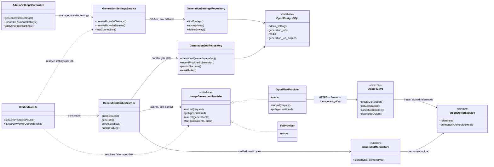
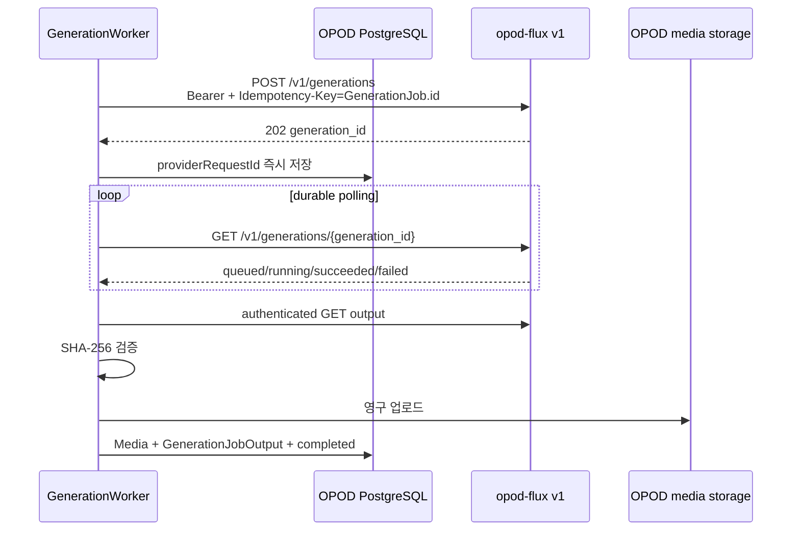

# opod-flux v1 admin integration

Status: implemented client contract
Decision date: 2026-08-19

`opod-admin`은 `opod-flux`의 영속 저장소나 공개 API가 아니다. 기존
`GenerationWorkerService`의 provider 경계에서 승인된 `/v1/generations`
비동기 계약을 호출하고, 결과를 OPOD 소유 스토리지로 옮기는 caller다.

## Static structure UML

핵심 경계는 `ImageGenerationProvider`다. worker가 durable job 실행과 영구 저장을
소유하고 `OpodFluxProvider`는 v1 HTTP 변환만 소유한다. `WorkerModule`은 잡마다
설정을 다시 해석하므로 admin 설정에서 provider를 변경해도 프로세스를 재시작할
필요가 없다. UML의 `OpodFluxProvider`와 `FalProvider`는 TypeScript class가 아니라
각 factory가 `ImageGenerationProvider` 계약으로 반환하는 adapter 인스턴스다.

## Runtime sequence UML

admin worker는 webhook을 등록하지 않는다. 기존 PostgreSQL job lease와
providerRequestId 기반 polling이 재시작 복구를 소유하기 때문이다.

## Request mapping

| Admin source                            | opod-flux v1                                                |
| --------------------------------------- | ----------------------------------------------------------- |
| `GenerationJob.id`                      | `Idempotency-Key`                                           |
| identity preservation required          | `photoreal_identity_v1`                                     |
| identity preservation not required      | `photoreal_scene_v1`                                        |
| first ordered identity reference        | `role=identity, primary=true`                               |
| later identity references               | `role=identity`                                             |
| identity asset used without identity QA | `role=outfit`                                               |
| location/environment reference          | `role=background`                                           |
| `candidateCount`                        | `output.count`                                              |
| resolved format ratio                   | `output.aspect_ratio`                                       |
| allowlisted common params               | `long_edge`, `format`, `quality`, `seed`, `identity_strict` |

`paramsJson`의 provider-specific raw 필드는 opod-flux에 전달하지 않는다.
모델·LoRA·ComfyUI 설정은 named profile의 서버 내부 책임이다. 기존
`falImageModel` / `falImageT2iModel` 값은 opod-flux 실행 파라미터가 아니라
이미지 프롬프트 문법을 고르는 logical model-policy ID로 계속 사용한다.

## Failure and retry semantics

- submit 응답 유실과 pre-creation 5xx는 같은 GenerationJob ID로 다시 제출한다.
  opod-flux idempotency가 중복 생성을 막는다.
- 이미 받은 `generation_id`의 polling 429/5xx는 request ID를 유지해 같은
  리소스를 다시 조회한다.
- opod-flux terminal failure의 `retryable=true`는 **새 idempotency key**가
  필요하다는 뜻이다. 같은 GenerationJob을 자동 재제출하지 않고 failed로
  끝낸다. 운영자의 기존 regenerate가 새 GenerationJob ID를 만들어 재시도한다.
- 결과는 Bearer 인증으로 다운로드하고 응답 metadata의 SHA-256과 실제 bytes가
  다르면 OPOD 스토리지에 저장하지 않는다.
- Bearer 키 유출을 막기 위해 `download_url`은 설정된 API와 같은 HTTPS origin 및
  `/generations/` 경로여야 한다. 별도 다운로드 origin이 필요하면 admin에 명시적
  신뢰 설정을 추가한 뒤 사용한다.

## Configuration

`GenerationSettingsService`가 DB 값을 먼저, 환경 변수를 fallback으로 읽는다.

| Admin setting                   | Environment fallback        |
| ------------------------------- | --------------------------- |
| `generation.imageProvider`      | `IMAGE_GENERATION_PROVIDER` |
| `generation.opodFluxApiBaseUrl` | `OPOD_FLUX_API_BASE_URL`    |
| `generation.opodFluxApiKey`     | `OPOD_FLUX_API_KEY`         |

`imageProvider`는 `fal` 또는 `opod-flux`다. opod-flux URL은 Bearer credential을
보내므로 URL credential 없는 HTTPS만 허용한다. provider 설정은 worker가 잡을
처리할 때마다 다시 해석하므로 저장 후 프로세스 재시작이 필요 없다.

## Verification owners

- HTTP contract: `src/worker/image-generation.provider.spec.ts`
- request/profile/reference mapping and output digest:
  `src/worker/generation-worker.service.spec.ts`
- DB/env resolution and connection probe:
  `src/domain/settings/generation-settings.service.spec.ts`
- admin form payload: `packages/admin/src/features/settings/payload.test.ts`
