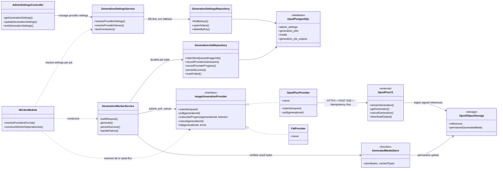
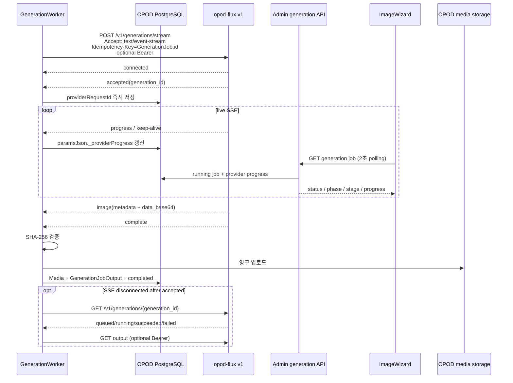

# opod-flux v1 admin integration

Status: implemented SSE client contract
Decision date: 2026-08-20

`opod-admin`은 `opod-flux`의 영속 저장소나 공개 API가 아니다. 기존
`GenerationWorkerService`의 provider 경계에서 승인된
`POST /v1/generations/stream` 계약을 호출하고, 결과를 OPOD 소유 스토리지로
옮기는 caller다. 현재 Tailnet endpoint는
`https://taeho.taildac41e.ts.net:8850/v1`이며 URL은 설정으로 주입한다.

## Static structure UML

핵심 경계는 `ImageGenerationProvider`다. worker가 durable job 실행과 영구 저장을
소유하고 `OpodFluxProvider`는 v1 HTTP 변환만 소유한다. `WorkerModule`은 잡마다
설정을 다시 해석하므로 admin 설정에서 provider를 변경해도 프로세스를 재시작할
필요가 없다. UML의 `OpodFluxProvider`와 `FalProvider`는 TypeScript class가 아니라
각 factory가 `ImageGenerationProvider` 계약으로 반환하는 adapter 인스턴스다.

## Runtime sequence UML

admin worker는 webhook을 등록하지 않는다. 정상 실행은 SSE의 `image` 바이트를
직접 저장하고, `accepted` 이후 연결이 끊기거나 프로세스가 재시작된 경우에만
기존 PostgreSQL job lease와 providerRequestId 기반 polling으로 복구한다.

진행 상태는 별도 schema를 추가하지 않고 기존 `generation_jobs.params_json`의
`_providerProgress` 메타데이터에 원자적으로 저장한다. admin 생성 상세 API는
running job에서 검증된 `status`, `phase`, `stage`, `progress`, `updatedAt`만
노출한다. `ImageWizard`는 기존 2초 polling으로 이 값을 갱신하므로 브라우저가
opod-flux 주소나 API key에 직접 접근하지 않는다. provider가 숫자 진행률을 주지
않는 단계에는 진행 막대를 만들지 않는다.

## Request mapping

| Admin source                            | opod-flux v1                                                |
| --------------------------------------- | ----------------------------------------------------------- |
| `GenerationJob.id`                      | `Idempotency-Key`                                           |
| identity preservation required          | `photoreal_identity_v1`                                     |
| identity preservation not required      | `photoreal_scene_v1`                                        |
| first ordered identity reference        | `role=identity, primary=true`                               |
| later identity references               | `role=identity`                                             |
| identity asset used without identity QA | `role=outfit`                                               |
| location/environment reference          | `role=background`                                           |
| `candidateCount`                        | `output.count`                                              |
| resolved format ratio                   | `output.aspect_ratio`                                       |
| unset output params                      | `long_edge=2048`, `format=jpeg`, `quality=95`, `seed=null`  |
| allowlisted common params               | `long_edge`, `format`, `quality`, `seed`, `identity_strict` |

`paramsJson`의 provider-specific raw 필드는 opod-flux에 전달하지 않는다.
모델·LoRA·ComfyUI 설정은 named profile의 서버 내부 책임이다. 기존
`falImageModel` / `falImageT2iModel` 값은 opod-flux 실행 파라미터가 아니라
이미지 프롬프트 문법을 고르는 logical model-policy ID로 계속 사용한다.

provider adapter는 prompt 길이, idempotency key 길이, count, aspect ratio,
long edge, format, quality, seed와 profile별 identity/primary 규칙을 제출 전에
검증한다. 위반은 같은 입력으로 재시도해도 성공하지 않으므로 permanent 입력
오류다.

## Stream, failure and retry semantics

- 브라우저 `EventSource`가 아니라 `fetch` response body와 `TextDecoder`로 SSE를
  읽는다. 네트워크 chunk와 이벤트 경계가 다르므로 빈 줄 기준 buffer parser가
  `connected`, `accepted`, `progress`, `image`, `complete`, `error`, `cancelled`와
  comment keep-alive를 처리한다.
- `accepted` 수신 즉시 `generation_id`를 반환해 DB에 기록한다. 이후 stream은
  provider adapter가 계속 소비하므로 제출과 영속화 사이의 중복 생성 창을
  늘리지 않는다.
- `image.data_base64`는 decoding 후 SHA-256을 검증하고 영구 저장한다. stream
  복구 경로의 status output만 same-origin `download_url`을 사용한다.
- submit 연결 유실과 stream 시작 전 5xx는 같은 GenerationJob ID로 다시
  제출한다. opod-flux idempotency가 중복 생성을 막는다.
- 이미 받은 `generation_id`에서 SSE가 끊기면 status endpoint polling으로
  전환한다. polling 429/5xx는 request ID를 유지해 같은 리소스를 다시 조회한다.
- stream 시작 전 인증·헤더·schema 실패는 HTTP 오류로, 시작 후 실패는
  `error` event로 해석한다. `cancelled`도 terminal failure로 변환한다.
- opod-flux terminal failure의 `retryable=true`는 **새 idempotency key**가
  필요하다는 뜻이다. 같은 GenerationJob을 자동 재제출하지 않고 failed로
  끝낸다. 운영자의 기존 regenerate가 새 GenerationJob ID를 만들어 재시도한다.
- 응답 metadata의 SHA-256과 실제 bytes가 다르면 OPOD 스토리지에 저장하지
  않는다.
- Bearer 키 유출을 막기 위해 fallback `download_url`은 설정된 API와 같은 HTTPS
  origin 및 `/generations/` 경로여야 한다. 별도 다운로드 origin이 필요하면
  admin에 명시적 신뢰 설정을 추가한 뒤 사용한다.

## Configuration

`GenerationSettingsService`가 DB 값을 먼저, 환경 변수를 fallback으로 읽는다.

| Admin setting                   | Environment fallback        |
| ------------------------------- | --------------------------- |
| `generation.imageProvider`      | `IMAGE_GENERATION_PROVIDER` |
| `generation.opodFluxApiBaseUrl` | `OPOD_FLUX_API_BASE_URL`    |
| `generation.opodFluxApiKey`     | `OPOD_FLUX_API_KEY`         |

`imageProvider`는 `fal` 또는 `opod-flux`다. opod-flux URL은 Bearer credential을
보낼 수 있으므로 URL credential 없는 HTTPS만 허용한다. API key는 선택 사항이며
값이 있을 때만 `Authorization: Bearer`를 보낸다. Tailnet 인증이 비활성화된
배포는 URL만으로 동작한다. provider 설정은 worker가 잡을 처리할 때마다 다시
해석하므로 저장 후 프로세스 재시작이 필요 없다.

## Verification owners

- HTTP contract: `src/worker/image-generation.provider.spec.ts`
- request/profile/reference mapping and output digest:
  `src/worker/generation-worker.service.spec.ts`
- progress persistence and admin read model:
  `src/worker/generation-job.repository.spec.ts`,
  `src/admin/generation/generation.service.spec.ts`
- live progress UI: `packages/admin/src/features/generation/ImageWizard.test.tsx`
- DB/env resolution and connection probe:
  `src/domain/settings/generation-settings.service.spec.ts`
- admin form payload: `packages/admin/src/features/settings/payload.test.ts`
