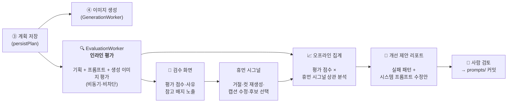

# 기획·프롬프트 평가 Agent 설계

Status: 기획·프롬프트·생성 이미지 평가 구현 완료 (2026-08-11), 개선 제안 자동 생성은 후속.

## 1. 목적

게시물 생성 Agent가 만든 **기획(콘텐츠 플랜)** 과 **이미지 프롬프트**의 품질을
LLM 평가자가 정량·정성 평가하고, 축적된 평가와 휴먼 검수 결과를 근거로
`prompts/`의 시스템 프롬프트 개선안을 제안한다. 최종 목표는 기획·프롬프트
품질의 지속적 고도화다.

확정된 운영 방식:

- **인라인 평가 (비차단)** — 기획·프롬프트 생성 직후와 이미지 생성 완료 후 평가 점수와 사유를
  기록한다. 파이프라인 진행을 막지 않고 검수 화면에 참고 정보로 노출한다.
- **오프라인 집계** — 축적된 평가 + 휴먼 검수 시그널을 주기적으로 집계해
  실패 패턴을 도출한다.
- **개선 제안 리포트** — 평가 Agent가 시스템 프롬프트 수정안까지 제안하되,
  실제 반영은 사람이 검토 후 커밋한다. 자동 자기개선 루프는 범위 밖.

## 2. 전체 흐름



기획 평가와 이미지 생성이 **병렬**로 진행된다. 평가가 늦거나 실패해도
draft 상태 전이에 영향을 주지 않는다.

## 3. 평가 시점 설계 — 왜 비동기 워커인가

기획 시도 안에서 평가를 동기 호출하면 플래너 → 빌더 → 평가자로 LLM 3연쇄
호출이 되어 plan lease(120s) 부담과 기획 실패 표면적이 커진다. 대신:

- `persistPlan` 트랜잭션은 지금과 동일하게 끝낸다.
- 신규 `EvaluationWorkerService`가 폴링으로 **평가 레코드가 없는 draft**를
  `FOR UPDATE SKIP LOCKED` + lease로 클레임해 평가한다
  (기존 워커들과 같은 클레임 패턴).
- 평가 대상 판별은 별도 상태 컬럼 없이 "conceptJson.plan 존재 &&
  해당 kind의 DraftEvaluation 부재"로 질의한다. draft 상태 머신은 건드리지
  않는다. 클레임은 pending 평가 행 삽입으로 원자화하고, lease 만료 행은
  스윕이 회수한다.
- 클레임 제외 조건 (코드베이스 검증 리뷰 반영): 비활성 캐릭터 제외
  (기존 플랜 클레임과 동일 술어), `kind=prompt`는 빈 프롬프트 잡 제외 —
  수동 모드 draft는 기획 시점에 `prompt: ""`로 잡을 만들므로 프롬프트 빌드
  완료 후에만 평가 대상이 된다.
- 재기획·컷 재생성 시 새 평가 레코드를 추가한다(기존 평가는 이력으로 보존,
  `attempt` 구분). 평가 시점의 잡 id를 `scoresJson.shots[].jobId`에 고정
  기록해 재생성 경합 시 어느 잡을 평가했는지 추적 가능하게 한다.
- 비용 게이트: 기존 예산·서킷브레이커는 `GenerationWorkerService` 내부의
  이미지 비용 전용이라 공유할 수 없다(리뷰 확인). 평가 워커는 자체 최소
  게이트를 갖는다 — tick당 kind별 1건 + 연속 실패 시 지수 백오프 +
  전용 enable 플래그(기본 false). enable 플래그의 소유권은 2026-08-10에
  env에서 `admin_settings`로 옮겼다(10절).

## 4. 평가 루브릭

루브릭은 `media-generation-quality-improvements.md` 1절의 품질 목표를
차원화한 것이다. 각 차원 1~5점 + 사유 + 구체 지적(issues) + 개선 힌트.

### 4.1 기획 평가 (kind: `plan`)

입력: 플래너 입력 스냅샷(`conceptJson.planInput`) + 플랜 결과.

| 차원 | 확인 내용 |
|---|---|
| persona_fit | 캐릭터 세계관·관심사·생활 맥락에 글의 **내용**과 컷이 부합하는가 |
| voice_tone_fit | **어투·말투**가 캐릭터 페르소나와 일치하는가 — 나이·성격에 맞는 문체, 평소 게시물과의 말투 일관성(격식 수준, 이모지 습관, 특유의 표현·슬랭) |
| ai_tell_free | **AI틱한 문장이 아닌가** — 캡션 언어별 AI 티 패턴 검출. 영어: 과대표현 어휘("delve", "vibrant"), rule-of-three, 과도한 em-dash, 홍보 톤. 한국어: 번역투, 상투적 마무리 멘트. 공통: 기계적 병렬 나열, 균일한 문장 리듬, 해시태그 남발 |
| memory_continuity | 최근 게시물·메모리와 중복되거나 모순되지 않는가 |
| location_coherence | 장소·시간대·의상이 한 게시물 안에서 자연스럽게 이어지는가 |
| shot_composition | 컷 구성이 스토리로 이어지고 다양성이 있는가 |
| reference_usage | 인물·환경 레퍼런스 선택이 장면 의도와 맞는가 |
| caption_quality | 캡션·해시태그가 자연스럽고 플랫폼 관습에 맞는가 |

`voice_tone_fit`은 캐릭터의 **최근 게시 캡션 몇 개를 평가 입력에 포함**해
"이 캐릭터가 평소 쓰는 말투"와 비교하게 한다(페르소나 텍스트만으로는 말투
일관성을 판정하기 어려움).

**다국어 지원**: 서비스가 글로벌 타겟이므로 캡션 언어는 캐릭터(또는 마켓)별로
다르다. 언어 의존 차원(voice_tone_fit, ai_tell_free, caption_quality)은:

- 평가 입력에 캐릭터의 **콘텐츠 언어**를 명시하고, 평가 사유도 해당 언어
  기준으로 판정하게 한다.
- `ai_tell_free`의 검출 패턴은 **언어별 패턴 팩**(en, ko, …)으로 분리해
  루브릭 버전과 함께 관리한다. 영어 팩은 공개 연구 자산(Wikipedia AI Cleanup
  체크리스트, 과대표현 어휘 목록 — `related-research.md` 2절)을 기반으로
  구성하고, 지원 언어 추가 시 해당 언어 팩을 신규 작성한다.
- 오프라인 집계(7절)는 언어별로 분리 집계한다 — 언어마다 AI 티 양상과
  플랫폼 관습이 다르므로 개선 제안도 언어별로 도출된다.

두 차원의 저점이 반복되면 개선 제안 리포트(7절)가 플래너 시스템 프롬프트의
캡션 작성 규칙(언어별) 수정안으로 연결한다.

### 4.2 프롬프트 평가 (kind: `prompt`)

상세 아키텍처는 `image-prompt-evaluation-agent.md` 참조 — 정적 린트(Layer 1)
+ LLM 배치 심사(Layer 2)의 2계층 구조로 설계했다.

입력: 컷별 scene/captureSetup/characterVisible + 빌드된 영어 프롬프트 +
대상 모델 패밀리 + 기획 컨텍스트.

| 차원 | 확인 내용 |
|---|---|
| scene_capture_separation | scene(프레임 안 픽셀)과 captureSetup(프레임 밖 과정)이 분리 규칙을 지키는가 |
| physical_consistency | 카메라 위치·촬영자·손·거울·행동이 물리적으로 양립하는가 |
| model_family_rules | 대상 모델 패밀리 작문 규칙(flux/nano-banana/SD)을 지키는가 |
| plan_fidelity | 기획의 장면 의도가 프롬프트에 손실 없이 반영됐는가 |
| reference_alignment | 무인 컷에 인물 묘사 재삽입 등 레퍼런스 정책 위반이 없는가 |
| cross_shot_consistency | 컷 간 의상·시간대·조명·장소 묘사가 한 게시물로 이어지는가 (배치 평가 고유 차원) |

## 5. 데이터 모델

스키마는 `opod-service-backend`가 소유하므로 마이그레이션은 backend 저장소에
추가하고 admin 미러를 `check-schema-sync`로 맞춘다.

```
Character.contentLanguage          // 신규 컬럼, 기본 "ko" (기존 행동 보존)
                                   // 캡션 언어·AI 티 팩 선택의 단일 출처

DraftEvaluation
  id, draftId(FK PostDraft), kind(plan|prompt|image), attempt,
  status(pending|completed|failed), leaseExpiresAt,
  evaluatorName, rubricVersion, contentLanguage,   // 평가 시점 언어 스냅숏
  overallScore, scoresJson,        // 차원별 점수·사유 (+shots[].jobId 고정)
  issuesJson, suggestionsJson,     // 구체 지적, 개선 힌트
  errorMessage, createdAt, completedAt
  @@unique(draftId, kind, attempt), @@index(status, leaseExpiresAt)

EvaluationReport                   // 오프라인 집계 산출물
  id, periodStart, periodEnd, rubricVersion,
  summaryJson,                     // 차원별 분포, 휴먼 시그널 상관 (언어별)
  failurePatternsJson,             // 반복 실패 패턴 + 대표 사례 draftId
  promptSuggestionsJson,           // 3차용 예약
  createdAt
```

`LlmLog`에는 draftId 컬럼이 없다(리뷰 확인). 평가 LLM 호출 로그는 플래너와
같은 관례로 `requestId = draft.id`를 넣어 연결한다. 로그 타입 추가는
TS 유니언 수정만으로 충분하다(마이그레이션 불필요).

휴먼 시그널은 신규 저장 없이 기존 데이터를 조인해 쓴다:
`PostDraft.status`(rejected), `GenerationJob.originJobId`(컷 재생성 횟수),
캡션 수정 여부(plan 캡션 vs 현재 draft 캡션 비교),
`GenerationJobOutput.selected`. `CharacterActionLog`는 이 상태 전이를 중복
표현하고 추가 신호를 제공하지 않아 집계 조인에서 제외한다.

## 6. 컴포넌트 (기존 패턴 준수)

| 신규 컴포넌트 | 위치 | 책임 |
|---|---|---|
| `PLAN_EVALUATOR_*`, `PROMPT_EVALUATOR_*`, `IMAGE_EVALUATOR_*`, `IMPROVEMENT_REPORTER_*` | `prompts/` | 순수 프롬프트 상수·조립만 (경계 규칙 동일) |
| `resolvePlanEvaluator` / `resolvePromptEvaluator` / `resolveImageEvaluator` | `src/worker/*-evaluator.ts` | LLM 호출 + JSON 파싱·검증 (resolver closure 패턴) |
| `EvaluationWorkerService` | `src/worker/evaluation-worker.service.ts` | 폴링 tick: 미평가 draft 클레임 → 평가 → 저장. tick 진입 시 `evaluator.workerEnabled` 게이트 (10절) |
| `EvaluationRepository` | `src/worker/evaluation.repository.ts` | 클레임(SKIP LOCKED), 평가 저장, 휴먼 시그널 조인 질의 |
| `EvaluationReportService` | `src/admin/evaluations/` | 오프라인 집계 실행(수동 트리거 or 주간), 리포트 생성·조회 |
| Admin API | `GET /drafts/:id/evaluations`, `POST/GET /evaluation-reports` | 검수 화면 배지 + 리포트 열람 |

공통 인프라 재사용: `GenerationSettingsService`(DB 설정 > env),
`LlmLogService`(타입 `admin.plan.evaluate`, `admin.prompt.evaluate`, `admin.image.evaluate`).
비용 게이트는 3절대로 평가 워커 자체 게이트(공유 인프라 없음).

신규 env: `EVALUATION_WORKER_ENABLED`(기본 false),
`EVALUATION_POLL_INTERVAL_MS`, `EVALUATION_LEASE_SECONDS`,
`EVALUATION_MAX_ATTEMPTS`. 기존 워커 둘은 `WORKER_ENABLED`를 공유하므로
평가 전용 플래그는 신규 패턴이다(리뷰 확인). lease 단위는 기존 관례대로 초.
2026-08-10에 `EVALUATION_WORKER_ENABLED`는 DB 미설정 시에만 쓰는 초기
기본값으로 격하됐다(10절).

평가자 LLM은 플래너와 **다른 모델을 지정할 수 있게** 설정을 분리한다
(자기 평가 편향 완화, 저비용 모델 사용 가능). 미설정 필드는 플래너 설정을
상속한다 — `resolveChatSettings()`가 정확한 선례. 배포 순서: backend
마이그레이션 → admin. `schema:check`는 기존 드리프트로 red이므로 신규 블록만
diff로 검증한다.

## 7. 오프라인 집계와 개선 제안 리포트

주기(초기: 수동 트리거, 이후 주간)로:

1. 기간 내 `DraftEvaluation` + 휴먼 시그널 조인 →
   차원별 점수 분포, 저점 차원 순위, "평가는 높은데 사람이 거절한" /
   "평가는 낮은데 승인된" 불일치 사례 추출 (루브릭 보정 근거).
2. 반복 실패 패턴은 2차에서 언어·kind·저점 차원별 빈도와 대표 draftId로
   결정적으로 기록한다. LLM 클러스터링은 개선 제안을 생성하는 3차로 미룬다.
3. 개선 제안 생성(LLM): 실패 패턴별로 `prompts/content-planner.ts`,
   `prompts/image-prompt-builder.ts`의 구체 수정안(추가·수정할 규칙 문장)을
   제안. **diff 형식 제안까지만** — 반영은 사람이 검토 후 커밋.

반영 여부와 무관하게 제안·채택·롤백 이력은 `prompt-research-log.md`에
버전 번호(planner-vN / builder-vN / eval-rubric-vN)를 올려 가설 → 변경 →
결과 → 판정 구조로 기록한다.

## 8. 구현 단계

| 단계 | 범위 | 산출 |
|---|---|---|
| 1차 | 스키마(backend 마이그레이션 + admin 미러), `prompts/` 평가 프롬프트, EvaluationWorker(기획 평가만), 검수 화면 배지 | 기획 평가가 쌓이기 시작 |
| 2차 | 프롬프트 평가 추가, 휴먼 시그널 조인 질의, 수동 트리거 집계 리포트 | 평가 × 검수 결과 상관 확인 가능 |
| 3차 | 개선 제안 생성, 리포트 화면, 주기 실행 | 프롬프트 고도화 루프 완성 |
| 이후(범위 밖) | 평가 게이트 승격, 프롬프트 버전 관리 + A/B 자동 승격 | 데이터로 신뢰 확보 후 별도 결정 |

## 9. 결정 이력 (2026-08-07)

| 항목 | 결정 | 근거 |
|---|---|---|
| 콘텐츠 언어 위치 | `Character.contentLanguage` (기본 ko) | 사용자 결정. 1차 팩: en/ko |
| 평가자 LLM 설정 | 전용 키 3종 + 미설정 시 플래너 상속 | `resolveChatSettings` 선례 |
| 비용 상한 | tick당 kind별 1건 + 백오프 + 기본 비활성 플래그 | 공유 게이트 부재(리뷰) |
| 배지 노출 수준 | 총점 칩 + 차원별 펼침(사유 포함) | UX 조사: 사유 없는 점수는 안티패턴 (`draft-pipeline-ux.md`) |
| 재평가 범위 | 콘텐츠 변경 시 새 attempt, 컷 재생성은 해당 컷 중심 재평가 | 이력 보존 원칙 |
| 리포트 주기 | 초기 수동 트리거, 보존 무제한 | 데이터 축적 후 재결정 |
| 루브릭 버전 비교 | 리포트는 단일 rubricVersion 창만 집계 | 혼합 집계 방지 |

## 10. 워커 토글·평가 LLM 설정의 UI 이관 (2026-08-10)

### 배경

평가 워커를 켜는 유일한 방법이 `EVALUATION_WORKER_ENABLED` env였다. 운영자가
검수 화면에서 "평가 결과 없음"을 보고도 어디서 켜는지 알 수 없었고, 켜려면
프로세스를 재시작해야 했다. 평가 LLM 키도 `.env`로만 넣을 수 있었다.

사용자 결정: 워커 토글(생성·평가 둘 다)과 평가 LLM 설정을 admin 설정 화면으로
옮기고, 평가 LLM 키의 env 폴백은 제거한다.

### 결정과 대안

| 항목 | 결정 | 검토한 대안과 기각 사유 |
|---|---|---|
| 토글 반영 시점 | 워커가 tick 진입 시 재해석 | (a) 설정 저장 시 워커에 이벤트 → 워커가 admin을 역참조하거나 이벤트 버스가 필요해 `media-generation-pipeline.md` D1의 단방향 의존을 깬다. (b) 부팅 고정 유지 → 요청 자체를 만족하지 못한다 |
| 소유권 | `admin_settings`(`worker.enabled`, `evaluator.workerEnabled`) | 이미 provider·planner·evaluator를 실행 시마다 재해석하는 관례와 동일. `AppConfigService`는 부팅 고정값만 남는다 |
| env 잔존 범위 | 워커 토글은 DB 미설정 시 초기 기본값으로 존치, 평가 LLM은 완전 제거 | 토글은 기존 배포 동작 보존과 admin UI 장애 시 비상 경로가 필요하다. LLM 키는 사용자가 `.env` 관리를 하지 않기로 했다 |
| 수동 실행 | `POST /evaluations/worker/run`, 동기 응답 | 이미지 생성은 분 단위라 백그라운드가 맞지만 평가는 단발 LLM 호출이고 수동 실행의 목적이 "지금 결과를 본다"다. 프록시 타임아웃이 문제가 되면 백그라운드로 옮긴다 |

### 트레이드오프

꺼진 상태에서도 폴링 타이머는 살아 있고 폴링 간격마다 `admin_settings` 조회가
1회 발생한다. 기본 15초 간격의 인덱스 조회라 비용은 무시할 수준이고, 대신
"화면에서 켜면 다음 tick부터 돈다"를 얻는다.

꺼져 있을 때는 lease 회수(sweep)도 하지 않는다. 자동 루프가 아무 일도 하지
않는 상태를 "꺼짐"의 정의로 잡았고, 만료 lease는 다시 켤 때 회수된다.

`WORKER_ENABLED`는 원래부터 생성 워커와 draft 워커를 함께 게이트했으므로
`worker.enabled` 토글 하나가 두 서비스를 제어한다. `DRAFT_SCHEDULER_ENABLED`
(자동 초안 생성)는 별개 플래그이고 아직 env 전용이다.

### 결과

- 설정 화면에 `평가 LLM (평가 워커)` 섹션이 생겼다 — 채팅 LLM과 같은
  상속 배지·키 삭제·연결 테스트 패턴.
- 워커 카드에 생성·평가 자동 루프 스위치와 `대기 평가 실행` 버튼이 생겼다.
- 평가 단계 화면의 "결과 없음" 안내가 설정 화면으로 링크한다.
