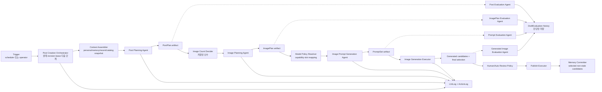
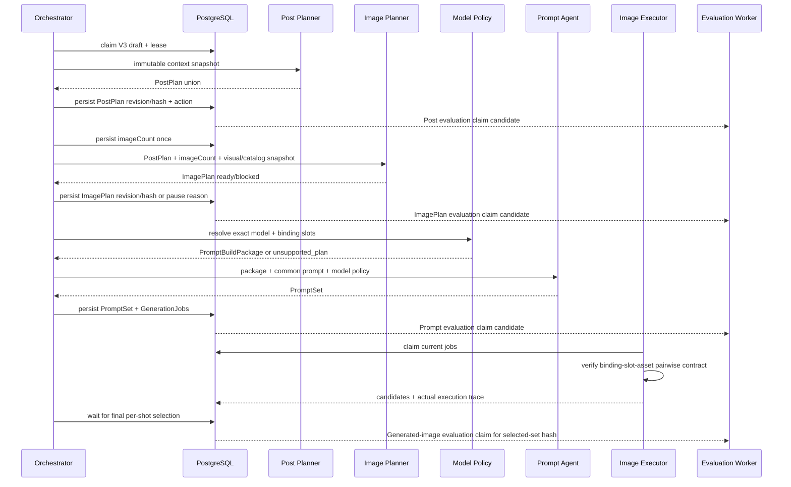
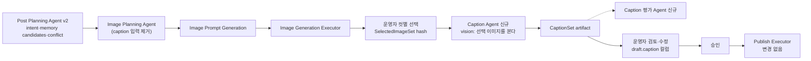
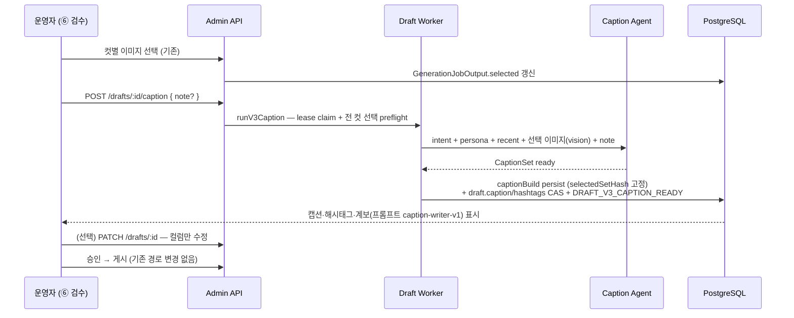

# 게시글 생성 Agent 아키텍처 V3 개선안

- 작성일: 2026-08-13
- 상태: V3 contract 및 runtime 구현 완료, production rollout 비활성
- 범위: 게시글 기획부터 게시·메모리 반영까지의 Agent 구성, 계약, 실행 구조와 개선 효과
- 상세 구현 계획: [V3 PAVE 구현 계획](../.codex/pave/plans/2026-08-13-post-pipeline-v3-implementation.md)

## 1. 문서 목적

`게시글 생성 Agent`를 하나의 LLM 호출로 취급하지 않고, 운영자에게는 하나의 기능으로
보이지만 내부에서는 판단 책임이 분리된 여러 전문 Agent와 결정적 실행기가 협업하는
시스템으로 재설계한다.

V3의 목표는 Agent 수를 늘리는 것이 아니다. 한 구성요소가 글, 이미지, 레퍼런스,
모델 문법과 파이프라인 상태를 동시에 판단하면서 생긴 역할 혼합을 제거하고, 각 결과의
진실원과 실패 위치를 명확하게 만드는 것이다.

최종 품질 목표:

> 글은 해당 캐릭터가 직접 작성한 게시물처럼 보이고, 이미지는 그 상황에 있던 사람이
> 직접 촬영한 사진처럼 보여야 한다. 어느 단계에서 무엇이 잘못됐는지 운영자가 설명할
> 수 있어야 한다.

## 2. 기존 문서와 구현 근거

기존 전체 흐름 정본은 [post-creation-agent-workflow.md](./post-creation-agent-workflow.md)다.
현재 구현은 이 문서의 `ContentPlanner -> ImagePromptBuilder -> GenerationWorker` 구조를
따른다.

세부 품질 결함과 1차 보강 내역은
[media-generation-quality-improvements.md](./media-generation-quality-improvements.md)에
있다. V3 생성·검증 Agent의 역할과 전문은 다음 설계가 정본이다.

- [게시물 생성 Agent 역할 재정립](../.codex/pave/plans/2026-08-12-post-generation-agent-role-redesign.md)
- [이미지 기획 평가 Agent](../.codex/pave/plans/2026-08-12-image-planning-evaluation-agent.md)
- [이미지 프롬프트 평가 Agent](../.codex/pave/plans/2026-08-12-image-prompt-evaluation-agent.md)
- [생성 이미지 평가 Agent](../.codex/pave/plans/2026-08-12-generated-image-evaluation-agent.md)

문서마다 소유하는 것이 다르다. 같은 사실을 두 곳에 쓰지 않는다.

| 문서 | 소유 |
|---|---|
| [post-creation-agent-workflow.md](./post-creation-agent-workflow.md) | V2 워크플로우와 UML. V2가 legacy로 동결됐으므로 **역사 기록**으로 읽는다 |
| 이 문서 | V3 설계 정본 — 계약, 상태 경계, 검증 아키텍처, 유보(§17), V4 백로그(§18), 개선 연대기(§19), V4 설계(§20) |
| [prompt-research-log.md](./prompt-research-log.md) | 프롬프트·루브릭 실험. 가설 → 변경 → 결과 → 판정 |
| [pipeline-v3-ux-plan.md](./pipeline-v3-ux-plan.md) | V3 운영 화면 설계 — 8단계 데이터 성격별 표현 |
| [media-generation-quality-improvements.md](./media-generation-quality-improvements.md) | 품질 결함과 1차 보강 누적 기록 |
| [media-generation-pipeline.md](./media-generation-pipeline.md) | 미디어 생성 파이프라인 |
| [image-prompt-optimization-report.md](./image-prompt-optimization-report.md) | 프롬프트 최적화 실측 보고 |
| [plan-prompt-evaluation-agent.md](./plan-prompt-evaluation-agent.md), [image-prompt-evaluation-agent.md](./image-prompt-evaluation-agent.md), [generated-image-evaluation-agent.md](./generated-image-evaluation-agent.md) | 평가 Agent 3종 설계 |
| [api/admin-drafts.md](./api/admin-drafts.md) | draft API 계약 |

작업 단위 기록은 `.codex/pave/plans/`(착수 시점 판단)와 `.codex/pave/reports/`
(완료 시점 실측과 정정)에 있다. 둘이 다르면 **정정 자체가 자료다**.

현재 코드의 주요 소유자:

| 책임 | 현재 코드 |
|---|---|
| 글·컷·레퍼런스를 한 번에 기획 | `prompts/content-planner.ts`, `src/worker/content-planner.ts` |
| 컷별 이미지 프롬프트 빌드 | `prompts/image-prompt-builder.ts`, `src/worker/image-prompt-builder.ts` |
| draft 상태·lease·자동/수동 실행 | `src/worker/draft-worker.service.ts`, `draft-worker.repository.ts` |
| 이미지 생성·provider 실행 | `src/worker/generation-worker.service.ts`, `image-generation.provider.ts` |
| 기획·프롬프트·이미지 평가 | `src/worker/evaluation-worker.service.ts`, `evaluation.repository.ts` |
| LLM 시도 이력 | `src/domain/llm-logs/*`, Prisma `LlmLog` |
| 평가 시도 이력 | Prisma `DraftEvaluation` |

## 3. 아키텍처 버전 계보

여기서 V1/V2/V3는 DB schema 버전이 아니라 `게시글 생성 Agent 아키텍처` 버전이다.

| 버전 | 구조 | 특징 | 한계 |
|---|---|---|---|
| V1 | 결합형 콘텐츠 기획 + 직접 프롬프트 조립 | 빠른 POC | 글·장면·촬영·레퍼런스 책임이 한 입력과 자연어에 섞임 |
| V2 | `ContentPlanner + ImagePromptBuilder + GenerationWorker`, 평가 3종 | 장면/촬영 분리, 레퍼런스 추적, 재생성 안전성 보강 | ContentPlanner가 여전히 글과 이미지 기획을 함께 결정하며 모델 정책도 prompt 계층에 혼재 |
| V3 | 생성 Agent 3개 + 검증 Agent 4개 + 결정적 오케스트레이터/실행기 | 역할별 진실원, strict 계약, revision lineage, 단계별 진단 | 호출 수·계약 수·운영 UI 복잡도 증가 |

V3 신규 draft는 `pipelineVersion="post-pipeline-v3"`로 고정한다. 이 값이 없는 기존
V2 draft는 생성 도중 V3로 변환하지 않고 기존 코드로 완주한다.

V4 후보 항목은 §18에 모은다. 현재는 캡션 Agent 후치가 유일한 확정 백로그다.

## 4. V2에서 해결되지 않은 구조적 문제

### 4.1 게시물 의미와 시각화가 한 Agent에 섞여 있다

현재 `ContentPlanner`는 caption/hashtag뿐 아니라 location, shots, capture setup,
character visibility와 reference IDs까지 결정한다. 글쓰기 페르소나와 이미지 촬영 규칙이
한 시스템 프롬프트에서 경쟁하고, 한쪽 개선이 다른 쪽 회귀를 만들 수 있다.

### 4.2 레퍼런스의 의미와 모델 입력 방식이 분리되지 않았다

현재 planner가 고른 `referenceIds`가 이미지 모델의 실제 입력 순서로 바로 이어진다.
왜 선택했는지, 무엇을 보존하고 무엇을 복사하면 안 되는지가 typed contract가 아니므로
모델별 slot 문법을 바꿀 때 기획 의미까지 흔들릴 수 있다.

### 4.3 Agent의 의미 실패와 시스템 실패가 같은 경로에 모인다

입력 부족, 확정 사실 충돌, 지원하지 않는 이미지 계획, LLM 설정 누락과 HTTP 실패가
대부분 planning failure로 수렴한다. 운영자는 입력을 고쳐야 하는지, 모델 설정을 고쳐야
하는지, 같은 요청을 재시도해야 하는지 구분하기 어렵다.

### 4.4 산출물 계보가 단계 단위로 고정되지 않는다

현재 `conceptJson.planInput/plan`과 `GenerationJob.paramsJson._shot`으로 일부 입력을
추적하지만, 어느 revision의 PostPlan이 어느 ImagePlan·prompt·선택 이미지에 사용됐는지
일관된 hash로 고정하지 않는다. 중간 편집 후 오래된 하위 산출물이 섞일 위험이 있다.

### 4.5 평가가 생성 단계와 1:1로 대응하지 않는다

현재 평가는 plan/prompt/image 3종이다. 결합된 plan 평가가 글의 캐릭터 적합성과 이미지
기획의 촬영·레퍼런스 품질을 동시에 소유하므로 결함 귀속과 prompt 개선 효과 측정이
불명확하다.

## 5. V3 설계 원칙

1. **한 결정에는 한 소유자만 둔다.** 같은 의미를 두 Agent가 다시 판단하지 않는다.
2. **Agent는 의미를 만들거나 진단하고, 실행기는 확정 계약을 수행한다.**
3. **오케스트레이터는 상태를 결정하지만 콘텐츠 품질을 판단하지 않는다.**
4. **모든 Agent 출력은 strict discriminated union과 runtime parser를 통과한다.**
5. **각 산출물은 upstream revision/hash를 고정한다.** 편집 후 하위 결과는 stale이다.
6. **평가는 비차단 진단이다.** 재작성·재시도·모델 변경·후보 선택을 하지 않는다.
7. **자동과 수동은 같은 오케스트레이터를 사용한다.** 차이는 다음 단계 실행 주체뿐이다.
8. **모델 정책과 generation 설정을 분리한다.** 모델 문법은 policy, seed/steps 등은
   executor가 소유한다.
9. **기존 이력 소유자를 재사용한다.** raw LLM attempt는 `LlmLog`, 평가 attempt는
   `DraftEvaluation`에 둔다.

## 6. V3 목표 구조



점선 평가 경로는 생성의 선행 조건이 아니다. 평가가 실패하거나 낮은 점수를 반환해도
오케스트레이터 상태를 직접 바꾸지 않는다.

## 7. 구성요소별 책임

| 구성요소 | 담당 | 담당하지 않음 |
|---|---|---|
| Post Creation Orchestrator | version pinning, stage/lease/revision, input preflight, 호출 순서, persistence, retry class | 글·이미지·프롬프트 품질 판단 |
| Context Assembler | 캐릭터 사실, writing profile, memory, recent posts, visual/catalog snapshot 조립 | 새 사실 추론, prompt 작성 |
| Post Planning Agent | premise, purpose, caption, hashtags, memory candidates, semantic conflict | 이미지 수·컷·구도·reference·모델 문법 |
| Image Count Decider | 허용 범위 내 난수 선택과 최초 호출 전 저장 | 이미지 내용 결정 |
| Image Planning Agent | 컷 역할, scene/capture, character presentation, continuity, reference semantic binding | 글 수정, 모델 선택·slot·prompt·generation 설정 |
| Model Policy Resolver | exact model capability, route, binding-to-slot/order, policy version | 보이는 장면·reference 의미 생성 |
| Image Prompt Generation Agent | 확정 plan/package를 모델별 문장으로 표현 | 사건·구도·reference 재선택, seed/steps/CFG 등 결정 |
| Image Generation Executor | provider 요청, poll, download, storage, media/job 상태 | prompt/slot/reference 수정 |
| 4 Evaluation Agents | 대응 산출물의 근거 기반 진단 | rewrite, retry, pipeline transition, model/candidate selection |
| Publish Executor | 승인된 snapshot과 선택 media를 원자 게시 | memory 의미 추론 |
| Memory Committer | selected/non-stale memory candidate만 dedupe 저장 | caption/scene에서 새 memory 합성 |

## 8. 단계별 정본 산출물

| 단계 | 정본 산출물 | 다음 단계가 신뢰하는 내용 |
|---|---|---|
| Post Planning | `PostPlan` | 게시물 전제·목적·caption·hashtags·memory candidates |
| Image Planning | `ImagePlan` | 모델 독립 scene/capture/presentation/continuity/reference semantics |
| Model Policy | `PromptBuildPackage` | target model, capability, binding slot/order, subject contract |
| Prompt Generation | `PromptSet` | 컷별 positive/negative prompt와 policy version |
| Generation | `GenerationSet` | 실제 model/route/reference asset과 candidate media |
| Review | `SelectedImageSet` | 컷마다 게시에 사용할 정확히 한 media와 set hash |
| Publish | `PublicationReceipt` | post/media/memory IDs와 source revision/hash |

각 accepted artifact 공통 metadata:

```json
{
  "revision": 2,
  "hash": "sha256:canonical-json",
  "contractVersion": "...",
  "producerVersion": "...",
  "producerLogId": "12345",
  "sourceArtifacts": [
    { "name": "postPlanning", "revision": 1, "hash": "sha256:..." }
  ]
}
```

- `conceptJson`에는 최신 accepted artifact만 둔다.
- raw request/response/error attempt는 `LlmLog`에 보존한다.
- 평가는 target artifact 또는 selected-set hash를 `DraftEvaluation.scoresJson._meta`에
  기록한다.
- upstream hash 변경 시 downstream을 삭제하지 않고 stale로 판정한다.
- stale artifact/job/evaluation은 화면 이력에는 남지만 실행·게시 입력으로 사용할 수 없다.
  실질 규칙(2026-08-15 V4 리뷰에서 명문화): **파이프라인이 소유한 값은 hash로
  거르고, 운영자가 소유한 값은 거르지 않는다.** 코드에서 게시 시 hash 검사가
  실제로 적용되는 곳은 `memoryCandidates`뿐이며(`selectedPublishedMemories`),
  ImagePlan/PromptSet은 게시가 읽지 않고 캡션 컬럼은 V3에서도 운영자 소유였다.
  stale은 진단(평가)의 대상 자격까지 빼앗지 않는다 — 평가는 비차단 진단이다.

## 9. 실행 흐름



자동 모드는 ready 단계 뒤 같은 오케스트레이터가 계속 진행한다. 수동 모드는 accepted
artifact를 저장한 뒤 멈추고 운영자의 다음 단계 명령을 기다린다. 둘은 별도 Agent endpoint나
서로 다른 저장 계약을 사용하지 않는다.

## 10. 상태와 실패 경계

V3의 의미 상태:

| 상태 | 소유자 | 의미 | 재개 조건 |
|---|---|---|---|
| `needs_input` | preflight/생성 Agent | 필수 캐릭터·요청 입력 부족 | 입력 보완 |
| `conflict` | Post Planning | 요청과 확정 사실 또는 필수 지시 충돌 | 요청/설정 수정 |
| `blocked` | Image Planning | 의미를 지키면서 지원 계약으로 시각화 불가 | 레퍼런스/기획/범위 보완 |
| `unsupported_plan` | Model Policy | 모델·route·reference 조합 실행 불가 | 모델 또는 ImagePlan 변경 |
| `needs_configuration` | settings/capability gate | LLM 설정 또는 strict output capability 부족 | 설정 검증 |
| `failed` | worker/executor | transient/system 오류가 retry 한도를 소진 | 운영 진단 후 재시도 |

Evaluator는 위 상태를 만들거나 해제하지 않는다. retry 횟수와 종료는 오케스트레이터/
executor의 운영 정책이며 Agent 시스템 프롬프트의 책임이 아니다.

## 11. V3 검증 아키텍처

| 평가 Agent | 평가 대상 | 핵심 질문 |
|---|---|---|
| Post Evaluation | `PostPlan` | 캐릭터 persona/memory/recent/writing profile에 맞고 AI식 문체·근거 없는 지속 사실이 없는가 |
| ImagePlan Evaluation | `ImagePlan` | PostPlan을 보존하면서 컷이 구별되고 촬영·노출·reference·continuity가 타당한가 |
| Prompt Evaluation | package + `PromptSet` | 확정된 scene/reference/policy가 누락·추가·모순 없이 모델 문장에 반영됐는가 |
| Generated Image Evaluation | ImagePlan + selected image set | 실제 픽셀이 계획·identity·reference·연속성·물리·품질 계약을 충족하는가 |

공통 원칙:

- 고정 차원, score anchor, issue owner, evidence와 verdict를 strict schema로 저장한다.
- 단일 결함을 여러 차원에서 중복 감점하지 않는다.
- 입력으로 관측할 수 없는 사실은 단정하지 않는다.
- 정상 대조군과 one-variable mutation fixture로 prompt와 parser를 함께 검증한다.
- 텍스트 contract 승인과 실제 생성 이미지 calibration 승인을 분리한다.

## 12. 구현 현황

상세 파일·테스트·승인 gate는
[2026-08-13-post-pipeline-v3-implementation.md](../.codex/pave/plans/2026-08-13-post-pipeline-v3-implementation.md)를
정본으로 사용한다.

적용된 구현:

1. **Version/lineage 기반**: V3 pinning, artifact revision/hash, stage CAS와 lease 회수를 적용했다.
2. **Capability gate**: settings의 strict structured-output probe를 통과해야 V3를 켤 수 있다.
3. **생성 Agent 3개**: Post Planning, Image Planning, Image Prompt Generation의 전문,
   native schema, runtime parser와 공통 오케스트레이터를 적용했다.
4. **Model Policy + Generation**: exact model registry, slot binding과 provider 직전 asset
   순서 검증을 적용했다.
5. **Evaluation Agent 4개**: 대응 산출물 revision/hash 또는 selected-set hash를 대상으로
   비차단 진단을 저장한다.
6. **Admin UI**: typed V3 read model, 8단계 rail, paused reason/next action과 수동 단계 실행을
   기존 작업 화면에 연결했다.
7. **Publish/memory**: current PostPlan hash와 일치하는 selected candidate만 기존 게시
   transaction에서 dedupe 저장한다. V2의 게시 요약 memory 동작은 유지한다.

아직 rollout gate로 남은 항목:

- 수동 초안의 memory candidate 선택·편집 UI와 PostPlan 편집 후 downstream stale UX
- generated-image 실제 PNG fixture 및 복수 vision reviewer calibration
- staging 관찰과 V2/V3 지표 비교

따라서 `pipeline.v3Enabled`의 기본값은 `false`이며, 위 품질 gate 전에는 production에서
활성화하지 않는다.

검증된 선행·통합 변경:

- `DraftEvaluationKind.image_plan` canonical migration과 admin mirror 반영
- service schema/client/architecture/build 및 admin schema sync/client 검증
- admin unit 390개, UI 42개, E2E 11개와 lint/schema/build 통과

## 13. 기대 효과

아래는 구조로부터 기대되는 효과이며, 실제 개선 여부는 14절 지표로 검증한다.

### 13.1 캐릭터다운 글의 안정성

Post Planning Agent가 이미지 규칙 없이 persona, memory, recent posts와 writing profile에
집중한다. 글을 평가하는 Agent도 같은 범위만 진단하므로 caption 품질 문제와 이미지 기획
문제를 분리해 개선할 수 있다.

### 13.2 이미지 기획의 핍진성과 연속성

ImagePlan이 scene과 captureSetup, character presentation, cross-shot locks와 reference
semantics를 모델 독립 계약으로 고정한다. 카메라 위치·손·거울·노출의 물리적 모순과 컷마다
의상·장소·빛이 흔들리는 문제를 prompt 작성 전에 발견할 수 있다.

### 13.3 모델 교체 시 의미 보존

ImagePlan은 모델과 무관하고 Model Policy는 slot/capability만 소유한다. 이미지 모델을
교체하거나 정책을 고칠 때 게시물 사건과 구도를 다시 기획하지 않아도 되며, 모델별 지침이
공통 Agent prompt를 비대하게 만들지 않는다.

### 13.4 재실행 비용과 회귀 범위 축소

revision/hash lineage로 변경된 단계 이후만 stale 처리할 수 있다. caption 수정 때문에
레퍼런스 선택 이전의 모든 LLM 호출을 무조건 반복하거나, prompt만 바꿨는데 PostPlan까지
달라지는 결합 재시도를 줄인다.

### 13.5 운영 진단과 복구 개선

`needs_input/conflict/blocked/unsupported_plan/needs_configuration/failed`를 분리해 운영자가
입력, 기획, 모델 정책, 설정, 시스템 중 어디를 고쳐야 하는지 알 수 있다. LLM log,
artifact hash, action log와 evaluation attempt가 같은 draft에서 연결된다.

### 13.6 메모리 오염 방지

PostPlan이 명시한 지속 사실 후보만 게시 후 memory가 된다. 일회성 이미지 장식이나 최초
기획 후 삭제된 caption 내용이 캐릭터의 확정 세계관으로 굳는 위험을 줄인다.

### 13.7 평가 개선의 귀속 가능성

생성 단계와 평가 단계가 1:1 대응한다. evaluator 점수 변화가 Post prompt, ImagePlan
prompt, model policy 또는 image model 중 어느 변경에서 발생했는지 비교할 수 있다.

## 14. 효과 측정 계획

V2와 V3를 같은 캐릭터·입력 묶음으로 비교한다. 단순 평균 점수만으로 개선을 선언하지 않고
운영자 행동과 계약 위반을 함께 본다.

| 영역 | 지표 | 기대 방향 |
|---|---|---|
| 글 품질 | caption 수동 편집률, AI-tell issue율, persona/voice issue율 | 감소 |
| 기획 품질 | ImagePlan blocked reason 분포, 촬영 물리/continuity issue율 | 초기에는 관측 증가, 안정화 후 감소 |
| 레퍼런스 | binding-slot-asset 불일치율, identity/reference hard failure율 | 0 또는 감소 |
| 이미지 | 컷 재생성률, draft 거절률, 최종 선택까지 후보 수 | 감소 |
| 운영 | paused reason별 해결 시간, 원인 불명 failed 비율 | 감소 |
| 안정성 | stale artifact 실행 차단 건수, publish retry 중복 건수 | 중복 0 |
| 메모리 | 게시 전 candidate 수정/제외율, 게시 후 memory 정정률 | 정정률 감소 |
| 평가 신뢰성 | evaluator-owner 합의율, evaluator verdict와 human action 상관 | 증가 |
| 비용 | draft당 생성 LLM/평가 LLM token·latency, 부분 재실행 비용 | 총호출 증가는 관찰, 재실행 비용 감소 |

최소 rollout 비교 단위:

- 동일 fixture set의 V2/V3 생성 결과
- 캐릭터별 최소 표본을 분리해 한 캐릭터의 문체가 전체 결과를 지배하지 않게 함
- prompt/contract/model policy/evaluator version 고정
- human reviewer가 architecture version을 모르는 blind review
- contract pass와 pixel quality pass를 별도 기록

## 15. 비용과 트레이드오프

| 비용/위험 | 영향 | 완화 |
|---|---|---|
| 생성 LLM 호출이 2회에서 3회로 증가 | latency/token 증가 | 모든 컷 batch 호출, 변경 단계 이후만 재실행 |
| 평가 Agent 4개 | 평가 비용과 처리량 증가 | 비차단 별도 worker, rollout에서 sampling 가능하되 계약 자체는 유지 |
| strict schema와 revision 계약 증가 | 구현·테스트 복잡도 증가 | 공통 transport helper만 공유하고 의미 검증은 owner별 유지 |
| `conceptJson` 최신 snapshot 확대 | row 크기 증가 | 항목 수/문자/직렬화 크기 상한, raw 이력은 LlmLog에만 저장 |
| 운영 UI 단계 증가 | 초기 인지 부담 | 상태·원인·다음 행동 중심의 8단계 rail과 단계별 평가 inline 표시 |
| provider structured output 차이 | 일부 LLM 설정에서 V3 실행 불가 | 저장 전 capability probe, loose fallback 금지, legacy V2 유지 |

V3를 별도 microservice, 범용 agent framework 또는 provider plugin system으로 만들지 않는다.
현재 modular monolith, PostgreSQL durable queue와 lease owner를 그대로 확장한다.

## 16. 수용 기준

V3 아키텍처가 적용됐다고 판단하려면 다음을 모두 만족해야 한다.

- PostPlan에 이미지 수·구도·reference·모델 문법 필드가 없다.
- ImagePlan은 PostPlan caption/hashtags를 바꾸지 않고 입력 imageCount와 정확히 같은 컷을 만든다.
- Prompt Agent는 ImagePlan의 scene, continuity와 binding 의미를 변경하지 않는다.
- model policy가 모든 binding을 실제 asset slot과 정확히 1:1 매핑한다.
- generation executor는 pairwise 검증 실패 시 provider를 호출하지 않는다.
- 네 evaluator 어디에도 draft/job 전이, retry, rewrite, model/selection 호출 경로가 없다.
- 중간 artifact 편집 후 stale downstream job을 실행·선택·게시할 수 없다.
- 자동과 수동 경로가 같은 stage transition과 저장 메서드를 사용한다.
- 기존 V2 draft는 V3 rollout과 무관하게 기존 경로로 완주한다.
- 선택되지 않았거나 stale인 memory candidate는 게시 transaction에 들어가지 않는다.
- 운영 화면에서 현재 stage/state/reason/next action과 target revision 평가를 확인할 수 있다.

## 17. 이번 개선에서 확정하지 않는 것

- evaluator 점수로 자동 재작성·재생성하는 정책
- 생성 모델 자동 교체와 비용 최적화 라우팅
- seed, steps, CFG, sampler, scheduler를 Prompt Agent가 추천하는 기능
- 식별 가능한 보조 인물 reference와 multi-location ImagePlan
- human review를 제거하는 production 자동 게시 기준
- legacy V2 제거 시점

이 항목은 V3 contract와 측정 데이터가 안정된 뒤 별도 제품 결정으로 다룬다.

## 18. V4에서 다룰 개선 — 캡션 Agent 후치

- 제안일: 2026-08-13
- 상태: 설계 확정 진행 — 정본은 §20 (2026-08-15). 이 절은 발단 기록으로 남긴다

### 18.1 발단

서린 초안(`필라테스` 미러 셀카)에서 나온 캡션이 어색하다는 운영자 지적이
출발점이다.

```
필라테스 다녀오면 자세가 살짝 정리된 느낌이라,, 괜히 거울 앞에 한 번 더
서게 돼요 🤍 오늘도 무리 없이 완룟
```

`,,`·`완룟`·`괜히`는 서린 `voice` 페르소나가 명시적으로 선언한 서명 표현이라
문제가 아니다. 문제는 **"자세가 정리되다"** 라는 비자연 연어다. 한국어에서
`정리되다`는 공간·사물·생각에 붙지 신체 상태에 붙지 않는다. 페르소나의 검증된
예시 캡션 3건은 전부 구체 명사(`하체`, `붓기`, `팥붕`)를 쓰는데, 생성된 캡션은
추상명사(`자세`)를 서술 주어로 삼았다.

게시글 평가 Agent는 이를 `ai_tell_free 5/5`, `caption_quality 5/5`로 통과시켰다.
`ai_tell_free`의 소유 범위에 `translationese`가 있지만, 그 목록은 전부 문체·구조
층위(기계적 병렬, 상투 표현, 과잉 설명)이고 **연어 층위**를 다루지 않는다.

### 18.2 제안

캡션과 해시태그 작성을 Post Planning Agent에서 떼어내 **파이프라인 끝의 전용
Caption Agent**로 옮긴다. Post Planning Agent는 의도(premise/purpose)·메모리
후보·충돌 판정만 소유한다.

### 18.3 근거 (2026-08-13 코드 실측)

캡션은 이미 이미지 파이프라인에서 거의 쓰이지 않는다.

| 소비처 | 실제 사용 |
|---|---|
| Image Planning Agent | 입력으로 받지만 프롬프트가 `caption is supporting tone only`로 명시하고 `postPlan.intent`가 authoritative |
| Image Prompt Generation Agent | 참조하지 않음 |
| `draft.caption` | `persistV3PromptJobs` 시점에 기록되고 게시 시 본문으로 사용 |

즉 캡션을 뒤로 옮겨도 이미지 계약이 잃는 것은 톤 힌트 하나뿐이다.

**더 중요한 근거**: 현재 캡션은 이미지가 존재하기 전에 작성된다. 사람은 찍고,
보고, 쓴다. 후치하면 Caption Agent가 **실제 선택된 이미지**를 보고 쓸 수 있다.
같은 초안에서 캡션은 "거울 앞에 한 번 더 서게 돼요"였는데 ImagePlan은 전면
카메라로 거울 반사가 성립하지 않는 상태였다(`image-planner-v2` 참조). 캡션이
이미지를 보지 못하므로 이 어긋남은 사람 눈에 걸릴 때까지 살아남는다.

### 18.4 평가 차원 분할

현행 11개 ready 차원이 두 덩어리로 갈린다. 자연스럽게 갈린다는 것 자체가 원래
두 책임이었다는 신호다.

| 이동 (Caption 평가) | 잔류 (Post Plan 평가) |
|---|---|
| `voice_fit`, `ai_tell_free`, `caption_quality`, `hashtag_fit` | `status_validity`, `character_grounding`, `intent_quality`, `continuity_and_novelty`, `content_style_fit`, `memory_discipline`, `scope_compliance` |

### 18.5 검토한 대안 — 실행 위치

| 안 | 내용 | 판단 |
|---|---|---|
| A | ⑤ 이미지 생성 직후 | 후보 선택 전이라 어느 이미지를 근거로 쓸지 모호 |
| B | **⑥ 검수 안, 이미지 선택 직후** | **채택 후보.** 선택 → 캡션 생성 → 사람이 읽고 수정 → 승인. 사람의 마지막 판단에 캡션이 포함된다 |
| C | ⑦ 게시 직전 | 사람이 캡션을 보지 못한 채 승인하게 된다 |

### 18.6 트레이드오프

- LLM 호출 1회 추가. 이미지를 근거로 삼으면 비전 호출이 된다.
- 대신 **재실행이 싸진다.** 현재는 캡션만 고치려 해도 ② 재실행이라 ③④가 stale이
  된다. 분리하면 캡션만 다시 돌린다.
- `draft.caption`이 늦게 채워져 작업 큐·목록 제목이 그때까지 플레이스홀더로
  남는다.
- 메모리 후보는 Post Planning Agent에 **남긴다.** intent에서 파생되고
  `postPlanning.hash`에 묶여 있다. Caption Agent에는 "새 사실 금지" 제약이
  필수다 — 캡션이 세계관에 없는 사실을 만들면 memory discipline이 깨진다.

### 18.7 한계 — 이것만으로 해결되지 않는 것

Agent를 분리해도 LLM이 한국어 연어 자연스러움을 판단하지 못하는 것은 그대로다.
평가 프롬프트에 "자연스러운지 보라"를 추가하는 접근은 `v3-schema-v2` 엔트리의
capability probe와 같은 가짜 통과를 만들 위험이 크다 — 모델에게 자기 판단을
물으면 통과를 답한다.

분리가 여는 것은 **자리**다. 현재 게시글 기획 프롬프트는 11개 차원어치 책임을
지느라 캡션 예시에 쓸 지면이 없다. 전용 Agent라면 페르소나 예시와 **운영자가
⑥에서 실제로 고친 과거 캡션**을 few-shot으로 넉넉히 넣을 수 있다. 운영자 수정이
다음 캡션의 입력이 되는 피드백 루프가 생기며, 이것이 추측한 규칙보다 확실하다.

이 루프를 만들려면 승인된 캡션의 원본/수정본 쌍을 보존해야 한다. 현재 스키마에는
그 기록이 없다 — V4 설계 시 함께 결정한다.

### 18.8 함께 관측된 평가 Agent 사각지대

같은 초안 하나에서 평가 Agent가 놓친 것이 세 건이다. Caption Agent 분리와 별개로
평가 프롬프트 보정 근거로 남긴다.

| 평가 | 놓친 것 | 소유했어야 할 차원 |
|---|---|---|
| 이미지 기획 | `captureSetup`의 "세로 4:5" (종횡비는 설정이 게시 형식에서 유도) | `scope_compliance` |
| 게시글 | `,,`의 형태가 페르소나 예시(` ,, `)와 다름 | `voice_fit` |
| 게시글 | "자세가 정리되다" 비자연 연어 | `ai_tell_free` |
| 생성 이미지 | 굽힌 무릎에 옷 주름 없음, 접지 그림자 없음 | `style_fidelity`, `visual_integrity` |
| 생성 이미지 | 허리-골반 비율 과장 (네거티브가 `extreme pinched waist`로 금지한 것) | `identity_and_appearance` |

**2026-08-14 관측 — 같은 Agent가 축에 따라 유능하고 무능하다.** 생성 이미지
평가(`019ffa17…`)에서 컷 1은 8개 차원 전부 5점·지적 0건을 받았다. 운영자가
"어색하다"고 지목한 바로 그 이미지다. 반면 컷 2는 정확했다 — 거치 촬영이어야
할 것이 미러 샷으로 나온 것을 major로 잡았고, 크롭이 턱 아래여야 하는데 턱·입술이
보이는 것까지 잡았다(사람 판정자가 놓친 것).

경계가 뚜렷하다. **언어화할 수 있는 계약-픽셀 대조는 잡고, 사람이 느끼는 사진
자연스러움은 못 잡는다.** 따라서 이 Agent를 "자연스러움"을 재는 실험의 판정
도구로 쓸 수 없다. `negative-block-ablation`이 정확히 그 축을 재므로, 그 실험은
사전 등록 이진 체크와 블라인딩으로 판정해야 한다.

**별건 — `overallScore`가 항상 0이다 (버그, 미수정).** `evaluationAverage()`의
수집기가 `key === "score"`인 키로만 하위로 내려간다. V3 이미지 평가는 점수가
`shots[].dimensions.<차원>.score`와 `setDimensions.<차원>.score`에 있어 한 단계
더 깊고, shot 레코드의 키는 `issues`/`sortOrder`/`dimensions`뿐이라 수집기가
멈춘다. 숫자를 하나도 못 모아 0을 반환한다. 실제 평균이 4.8인데 화면에는
`이미지 심사 0.0/5`가 뜬다.

수정 시 함정: 무작정 전 계층을 순회하면 `sortOrder: 0`, `sortOrder: 1`을 점수로
주워 담는다. 원 구현이 `key === "score"`로 제한한 이유다. **하위로는 자유롭게
내려가되 `score` 키에서만 수확**해야 한다. 텍스트 평가 3종은 `result.scores`가
평면 `{차원: 숫자}`라 정상 동작하므로 그 경로를 깨뜨리면 안 된다.

측정 대상과 측정 도구를 동시에 바꾸면 원인을 가릴 수 없으므로, `image-planner-v2`
효과를 먼저 관측한 뒤 평가 프롬프트를 다룬다.

## 19. 개선 연대기와 되풀이된 실패 유형

나중에 문서·연구로 정리할 때 쓰는 뼈대다. 결론이 아니라 인과 사슬과 1차 증거의
위치를 담는다.

### 19.1 관측 → 변경 → 결과

| # | 관측 | 변경 | 결과 | 1차 증거 |
|---|---|---|---|---|
| 1 | V2 ContentPlanner가 글·장면·촬영·레퍼런스를 한 자연어 입력에 섞어 결정한다 | 역할별 Agent 분리(V3) — 생성 3 + 검증 4 + 결정적 오케스트레이터 | 구현 완료, 설정 게이트로 신규 초안만 적용 | §4~§12, `902b459` |
| 2 | V3를 켜니 게시글 기획이 전부 400 — `'oneOf' is not permitted` | 판별 union을 루트 object 한 겹으로, `const`→`enum`, `uniqueItems` 제거 | 세 스키마 전부 SCHEMA ACCEPTED | research-log `v3-schema-v2`, `8f13aeb` |
| 3 | (2를 조사하다 발견) capability probe가 `{ok:true}` 하나로 "지원 확인"을 반환해 **가짜 초록불**을 냈다 | probe를 실제 스키마 문법으로 교체 + 네트워크 전 정적 검사 | 회귀 테스트로 고정 | `src/worker/strict-schema.spec.ts` |
| 4 | "이미지 기획 단계가 없다" | 진단: 기능 누락이 아니라 **버전 발견성** 문제(게이트 off, 초안 31건 전부 V2, 화면에 버전 표시 없음) | 파이프라인 버전 배지 | ux-plan §1 |
| 5 | 평가가 만점인데 화면엔 `{"issues": [], "suggestions": null}`만 | 표시 버그 2건 — 화면이 V2 모양만 읽고, 조기 반환이 총점까지 삼켰다 | 수정 | ux-plan §2, report `v3-stage-screen-visibility` |
| 6 | 단계 상태·산출물이 화면에 없어 실행 여부를 눈으로 확인 못 한다 | 8단계 횡단 규칙 + 단계별 산출물 노출 | 완료 | ux-plan §3, reports `v3-stage-screen-*` |
| 7 | 평가 "원문 보기"가 빈 껍데기 | V3는 `suggestionsJson`이 항상 null이고 지적 0건이면 `issuesJson`도 `[]`. 실제 산출물은 `scoresJson`에 있다 | 원문을 `scoresJson`으로 교체 | `6c6eae4` |
| 8 | ImagePlan이 "전면 카메라로 미러 셀피" — 기하학적으로 불가능 | `image-planner-v2` — 촬영 기하 원칙 + 거울 사례 | **부분 성공.** 거울 결함은 사라졌고 같은 차원에서 새 유형(카메라를 올려둔 물체가 배경에 보인다)이 났다 | research-log `image-planner-v2`, `c8c9c73` |
| 9 | 평가가 정확한 진단을 내놔도 재실행에 반영할 방법이 없다 | 운영자 요청 수정 API + 브리프 편집 폼 | 사람을 통한 우회로 확보. 자동 되먹임은 §17 유보 | report `operator-request-edit`, `52620fb` |
| 10 | 캡션 "자세가 정리된 느낌" — 한국어 연어가 아니다 | (미적용) 캡션 Agent 후치를 §18에 기록 | 관측만 | §18 |
| 11 | 생성 이미지가 사람 눈에 어색하다 (허리-골반 과장, 주름 없음, 접지 그림자 없음) | 운영자 가설 검증 — 제약 과다가 원인인가. 워커가 붙이는 네거티브 1,102자(전송본의 36%, 금지어 62개)를 제거한 어블레이션 | **기각 — 현행 유지.** 시드 페어링 6쌍 블라인드 본실험에서 현행이 4/6 승, 유일한 이진 체크 실패(로고)도 제거 조건에서 발생. 파일럿의 "다섯 축 개선"은 시드 분산이 만든 착시였다 | research-log `negative-block-ablation` |
| 12 | 두 모델이 장소 레퍼런스를 반대로 다룬다 | (미적용) 원인은 계약 모순 — 같은 프롬프트가 레퍼런스 시점과 거울 반사 시점을 동시에 요구한다 | 관측만 | research-log `negative-block-ablation` 부수 발견 |
| 13 | 운영자 재리뷰: 실험 12장 중 게시 가능 2~3장. 공통 탈락은 배경 비현실성과 마루 위 운동화 | (미적용) 위반은 프롬프트가 상류에서 지시했다 — "stands on the oak floor … gray running shoes, all fully visible". 주거 문화 규범을 소유하는 평가 차원이 없다 | 관측만. planner-v3 후보 2건 추가 | research-log `negative-block-ablation` 재리뷰 |
| 14 | (13의 후속 가설) 결함은 디테일 간 상호작용에서 난다 — 플래너가 과잉 단언한다 | "없어도 되는" 단언 11건(마루·신발·거리·정체성 재서술 등, 727자)을 뺀 조건 C를 사전 등록 후 시드 페어 6쌍으로 검증 | **기각.** 통과 A 2/6 : C 2/6 동률, 둘 다 통과한 쌍 0. B(악화)·C(무효과)로 과제약 가설 양 절반이 닫혔다 — 프롬프트 길이 층은 통과율의 지렛대가 아니다 | research-log `detail-budget-ablation` |
| 15 | 계약 모순 2유형이 픽셀까지 내려간다 — 지지물 프레임 침입, layout↔반사 시점 | `image-planner-v3` — 지지물은 카메라 위치(직촬에서 프레임 밖), preserve는 요소만(layout·composition·시점 금지, 시점은 captureSetup 소유) | **유지 확정** (관측 1: 두 모순 미발생 + 운영자 게이트 통과, 2026-08-15). n=1 위험 항목은 유지 | research-log `image-planner-v3` |
| 16 | 이미지 트랙 안정 — 다음 병목은 글 트랙(#10) | V4 설계 — 캡션 Agent를 검수의 이미지 선택 직후로 후치 | 설계 완료, 구현 승인 대기 | §20 |

### 19.2 되풀이된 실패 유형

개별 사건보다 이 분류가 오래 간다.

**가짜 초록불.** 측정 도구가 자기 대상보다 약해서 통과를 반환한 사례가 둘이다 —
capability probe(#3)와, 한국어 연어 부자연스러움에 만점을 준 평가 Agent(#10,
§18.8). 공통 구조는 하나다: **검증자에게 "이게 괜찮은가?"를 묻고 답을 믿었다.
검증자가 그 판단을 실제로 수행할 능력이 있는지는 확인하지 않았다.** §18.7의
판단이 여기서 나온다 — 평가 프롬프트에 "자연스러운지 보라"를 추가하는 접근은
같은 실패를 재생산할 가능성이 크다.

**저장돼 있는데 화면이 못 읽는다.** #5, #7. 데이터는 전부 도착해 있는데 화면이
다른 세대의 모양을 읽는다. 미구현으로 오인되어 "기능이 없다"는 요청으로 들어왔다.
징후는 DB에 값이 있는데 화면에 빈 배열·null·"없음"이 뜨는 것이다.

**사례는 고쳐지고 원칙은 일반화되지 않는다.** #8. 프롬프트에 원칙 한 문장과 재발
사례 한 문장을 함께 넣었더니 사례만 지켜졌다. 사례를 계속 추가하면 프롬프트가
결함 목록으로 자라고, 목록에 없는 결함은 계속 난다.

**금지어가 결함을 부른다 — 검증 결과 기각(이 표본에서).** #11. 관측한 결함
다섯 개가 전부 금지 목록에 이름 그대로 있어 "부정이 결함을 소환한다"는 가설을
세웠고, 파일럿 4장은 그것을 지지하는 듯 보였다. 시드를 짝지은 블라인드
본실험에서 뒤집혔다 — 현행(네거티브 포함)이 강제 선택 4/6으로 이겼고, 유일한
이진 체크 실패(신발 로고)도 제거 조건에서 나왔다. 파일럿의 신호는 조건 차이가
아니라 시드 분산이었다.

더 중요한 반전: 운영자가 제거 조건을 탈락시킨 사유(거울 반사가 아님, 실내에서
신발)는 제거한 블록 안의 방어 항목(`impossible mirror reflection`, 장소
네거티브의 `shoes`)과 텍스트로 대응한다. **네거티브 블록은 장면 정합성 축에서
실제로 일하고 있었다.** 자연스러움을 질감·체형으로 좁혀 읽으면 이 이득이
안 보인다 — 보는 사람의 자연스러움에는 장면 정합성이 포함된다.

**모순된 계약은 모델이 임의로 푼다.** #11 부수 발견, 그리고 컷 1의 공간 모순.
계약이 서로 배타적인 두 가지를 요구하면 모델은 하나를 버리거나 둘 다 그린다.
무엇을 버릴지는 우리가 통제하지 못하고, 모델마다 다르게 고른다.

**계약 안에 있는 결함은 아무도 잡지 않는다.** #13. 평가자들은 계약 충실도를
재므로, 계약 자체가 틀리면(마루 위 운동화를 지시) 기획 평가→프롬프트 평가→
이미지 평가 전 단계를 통과하고 모델이 충실할수록 위반이 선명해진다. 모순(#11
부수)과 다르다 — 여기엔 모순이 없고, 정합적으로 틀린 지시가 있다.

**진단은 정확한데 처방 경로가 없다.** #9. 평가자는 설계상 진단 전용
(`Diagnose only`)이고 러너는 평가를 읽지 않는다. 정확한 지적이 나와도 되먹일 수
없어 프롬프트를 전역으로 바꾸고 주사위를 다시 굴리는 것 외에 할 게 없었다.

### 19.3 측정 방법

- **측정 대상과 측정 도구를 동시에 바꾸지 않는다.** #8을 관측하는 동안 이미지
  기획 평가자를 건드리지 않았다. 함께 바꾸면 점수 변화의 원인을 가릴 수 없다.
- **총점은 약한 신호다.** #8에서 major 하나가 11차원 평균을 5.0 → 4.818로 깎아
  "거의 만점"으로 읽힌다. 판정과 최저 차원을 본다.
- **표본 1건으로 판정하지 않는다.** LLM이 비결정적이라 규칙 없이도 우연히 맞는다.
  research-log의 판정에는 표본 수를 명시한다.
- **1차 증거는 DB에 있다.** artifact의 `promptVersion`으로 어느 프롬프트가 실제로
  쓰였는지, `draft_evaluations.scores_json._meta.targetHash`로 평가가 어느
  리비전을 봤는지, `generation_jobs.prompt`와 `params_json`으로 provider에 실제로
  간 것을 확인한다.

### 19.4 아직 검증되지 않은 것

여기 있는 것을 성과로 적으면 안 된다.

| 항목 | 상태 |
|---|---|
| V3 생성 이미지 평가 표시 | 2026-08-14 첫 실데이터 확보(`019ffa17…`). 화면 렌더링은 아직 눈으로 확인하지 않았다. `overallScore=0` 버그 때문에 총점 배지가 `0.0/5`로 뜬다 |
| `image-planner-v2` 효과 | 관측 1건, 부분 성공 판정 |
| 캡션 자연스러움 개선 | 관측만, 변경 없음(§18) — 설계는 §20 |
| 평가자 사각지대 3건 | 기록만(§18.8), 보정 미적용 |
| V3 파이프라인 완주 | 2026-08-15 기준 ⑤ 생성까지 완주한 초안 존재(`01a003f0…`, image-planner-v3 관측 1). ⑦ 게시까지 간 V3 초안은 아직 없다 |

## 20. V4 설계 — 캡션 Agent 후치 (2026-08-15)

- 설계일: 2026-08-15
- 상태: 설계 리뷰 2라운드 반영 완료(§20.13·§20.14, 2026-08-15) — 구현 승인 대기
- 발단과 근거 관측: §18 (2026-08-13). 이 절이 설계 정본이고 §18은 발단 기록으로 남긴다.
- 진입 조건: `image-planner-v3` 유지 확정(research-log, 2026-08-15 운영자 게이트).
  이미지 트랙이 안정되어 다음 병목인 글 트랙으로 이동한다.

### 20.1 목표와 비목표

목표:

1. 캡션·해시태그를 **실제 선택된 이미지를 본 뒤** 작성한다. 사람은 찍고, 보고, 쓴다.
2. 캡션 개선의 자리를 확보한다 — 전용 Agent라야 페르소나 예시와 운영자 정정 사례를
   few-shot으로 넣을 지면이 생긴다(§18.7).
3. 캡션 재생성이 이미지 파이프라인을 건드리지 않게 한다. 현재는 캡션만 고치려 해도
   ② 재실행이라 ③④가 stale이 된다.
4. 평가 귀속 분리 — 글 품질 4차원을 캡션 산출물에 1:1로 대응시킨다(원칙: §4.5).

비목표:

- 한국어 연어 자연스러움의 **자동 판정**. LLM 평가자가 이 축을 못 잡는 것은
  관측된 한계다(§18.7, §19.2 가짜 초록불). V4는 판정을 만들지 않고 사람 정정이
  되먹임되는 통로만 만든다.
- 자동 모드의 이미지 자동 선택 정책. 후보 중 무엇을 게시할지 기계가 정하는 문제는
  §17(human review 제거 기준)에 묶인 별도 제품 결정이다.
- V2 경로 변경. V2 draft는 기존 그대로 완주한다.

### 20.2 목표 구조



V3 구조(§6)에서 바뀌는 것은 두 가지뿐이다: Post Planning Agent가 글 최종본 소유를
잃고, 검수 안에 캡션 스텝이 생긴다. §6~§8의 도해·표는 V3 정본으로 유지하고 V4
구현 완료 시점에 갱신한다.

### 20.3 소유권 이동

| 항목 | 현재 소유 (V3) | V4 소유 | 근거 |
|---|---|---|---|
| caption·hashtags·captionLanguages | Post Planning Agent (`postPlanning.output`) | **Caption Agent** (`captionBuild.output`) | 캡션은 이미지 파이프라인에서 톤 힌트 외 소비처가 없다(§18.3 실측) |
| 게시물 의도 (premise/purpose) | Post Planning Agent | 변동 없음 | intent가 ③의 authoritative 입력 |
| memory candidates | Post Planning Agent | 변동 없음 | intent에서 파생, `postPlanning.hash`에 고정(§18.6) |
| `draft.caption`/`hashtags` 컬럼 | ④ 프롬프트 빌드 트랜잭션이 기록 | **캡션 스텝이 기록** (검수 중) | 현재 컬럼 기록은 캡션과 무관한 `persistV3PromptJobs`에 얹혀 있다(`draft-worker.repository.ts:618-628` 실측) — 소유 이동으로 이 결합이 자연 해소된다 |
| 게시 본문 | `draft.caption` → `Post.content` | 변동 없음 | 게시 경로(`persistPublishedPost`)는 컬럼만 읽는다 — Agent 캡션과 운영자 수기 캡션이 동급으로 게시된다 |

코드 실측 요약 (2026-08-15, 캡션 생명주기): 캡션은 ②에서
`postPlanning.output.caption`으로 태어나 → ④ `persistV3PromptJobs`가 컬럼에 복사
→ ⑥ `PATCH /drafts/:id`가 컬럼만 수정(artifact 원본은 불변) → ⑦ `Post.content`.
전용 재생성 경로는 없고 ② 통째 재실행이 유일하다.

### 20.4 CaptionSet 계약 (caption-writer-v1 / caption-set-v1)

입력 (오케스트레이터가 조립, 원칙 2):

- `postPlan.intent` — premise·primaryPurpose·secondaryPurpose. 사건·관계의 authoritative.
- 페르소나 writing profile — voice·contentStyle·boundaries·검증된 예시 캡션.
- recentPosts 캡션·해시태그 — 반복 회피.
- **선택 이미지** — 컷별 selected media(vision 입력) + ImagePlan의 컷별
  visualPurpose/scene/lockedElements **원문**(요약 금지 — 평가자의 부분 문자열
  대조 전제, §20.6). 두 근거의 관계는 §20.4 제약이 정한다. 전송은 생성 이미지
  평가가 이미 쓰는 경로를 재사용한다 — 실행 시점에
  media bytes를 읽어 base64 `image_url` 블록으로 보내는 `visionUserContent`
  (`evaluation-worker.service.ts:825-880`) 패턴. 따라서 `captionBuild.input`에는
  **media ID만** 저장한다(URL·bytes 저장 금지 — URL은 영속 보장이 없고 bytes는
  `conceptJson` 상한(§15)을 깨뜨린다).
- 캐릭터 콘텐츠 언어 스냅숏.
- **`operatorRequest`** — 브리프의 운영자 요청 원문(리뷰 2라운드 F7). post-planner-v1이
  소유하던 "요청의 글쓰기·의미 부분 적용"과 "요청 태그는 호환될 때만"이 v2에서
  사라지므로 Caption Agent가 인계한다. 편집은 `planned/failed`에서 닫히지만 읽기는
  열려 있다(`concept.operatorRequest`).
- `operatorNote` (선택) — 이번 실행에만 전달되는 재생성 지시. 일회성이며
  `captionBuild.input.operatorNote`에 저장돼 카드에 표시되고, 다음 재생성 폼에
  직전 노트를 프리필한다(지우기 가능).

출력 (strict union, 원칙 4): `ready` 단일 variant로 시작한다 —
`{ status: "ready", caption, hashtags[], captionLanguages[] }`. 해시태그 규칙은
post-planner-v1의 것을 그대로 이관한다(리뷰 F9): 프로필·반복 사용 태그·호환되는
요청 태그만, 빈 배열 유효, **본문에 금지한 새 장소·루틴·브랜드를 태그로 승격
금지**. 입력 부족은 실행 전
preflight(전 컷 선택 여부)가 걸러내므로 blocked variant는 필요가 관측되면 추가한다.

제약 (memory discipline, §18.6): postPlan에 없는 **새 사건·관계·루틴·지속 사실
금지**. 선택 이미지에 보이는 일회성 시각 요소 언급은 허용 — 그것이 후치의 목적이다.
단, 경계를 하나 둔다(리뷰 A7): **이미지에도 보이고 ImagePlan에도 있는 요소만
캡션의 근거로 삼는다.** 이미지에만 있고 계획에 없는 요소(오생성 소품)를 서술하면
생성 결함이 게시물의 사실로 승격되고, 계획에만 있고 이미지에 없는 요소(생성
누락 — 예: 계획의 리포머가 픽셀에 없음)를 서술하면 사진에 없는 것을 말하는
캡션이 된다(리뷰 2라운드 F8 "계획 편향"). 두 방향 모두 "캡션 주장 vs 계획 원문 ∧
픽셀" 대조라 평가 Agent가 잡을 수 있는 축이다(`image_grounding`, §20.6).

저장 (원칙 5): `conceptJson.captionBuild = { revision, hash, contractVersion,
promptVersion, producerLogId, input, output, sourceArtifacts: [postPlanning
rev/hash, selectedSetHash] }`. **selectedSetHash에 고정**한다 — 선택을 바꾸면
captionBuild는 stale이고, 화면이 재생성을 유도한다. 역방향은 자유다: 캡션 재생성은
②~⑤ 어떤 산출물도 stale로 만들지 않는다(목표 3). selectedSetHash는 **lease claim
직후, LLM 호출 전에** 계산해 고정한다 — 실행 중 선택이 바뀌면 저장된 hash가 현재와
어긋나 즉시 stale로 표시되므로 별도 경합 처리가 필요 없다(리뷰 B③).

**실행 상태와 저장 규약 (리뷰 2라운드 F10·F11·F12 — blocking 반영)**

- 캡션 스텝은 `draft.status`와 `lease_expires_at`를 **건드리지 않는다.** 기존
  claim(`claimV3DraftNow`: planned+pending→generating)과 lease sweep(generating만
  회수)은 needs_review에서 쓸 수 없고, 흉내 내면 초안이 고착된다(regenerating 영구
  잠김 또는 unknown_stage failed).
- 단일 실행 보장과 "실행 중" 표시는 `captionBuild.run = { state: running | failed,
  startedAt, error? }`로 한다. claim = `run.state`가 running이 아니거나 startedAt이
  N분 이상 지난 경우에만 running으로 CAS. **모든 종료 경로(성공·CAS 실패·예외·
  타임아웃)가 run을 닫는다** — 실패는 `run.state=failed + error`와
  `DRAFT_V3_CAPTION_FAILED` 액션 로그(reason). N분 지난 running은 read model이
  실패로 간주하므로 별도 sweep이 필요 없다. 재시도는 같은 버튼이다.
- 성공 시 artifact 본문(revision+1·hash·output·input)과 `draft.caption`/`hashtags`
  컬럼 갱신을 **한 트랜잭션**에서 CAS(`status=needs_review` AND
  `captionBuild.revision=expected`)로 수행하고 `DRAFT_V3_CAPTION_READY`를 남긴다.
  CAS 실패는 산출물을 버리고 사유를 노출한다 — 반쪽 저장 금지. 사유 문구는 복구
  경로를 포함한다("승인된 초안은 다시 생성할 수 없습니다 — 게시 캡션을 직접
  입력하세요").
- conceptJson 쓰기는 **`jsonb_set`로 `captionBuild` 키만** 기록한다. 검수 단계는
  운영자 writer(PATCH finish·markManual — 전체 객체 read-modify-write)와 워커
  쓰기가 처음으로 겹치는 단계라, 전체 스냅숏 기록은 finish 소실 또는 captionBuild
  소실을 만든다. (PATCH finish의 RMW를 jsonb_set로 옮기는 것은 V4-1 권장, 선택.)
- 재생성은 컬럼의 운영자 수정본을 덮는다. 컬럼 ≠ 최신 `captionBuild.output.caption`
  이면 화면이 실행 전에 확인을 받고 수정본을 복사 가능하게 보여준다(§20.8).
  운영자 `PATCH`는 지금처럼 컬럼만 덮어쓴다 — artifact 원본이 남는 것이 §20.7
  피드백 쌍의 좌변이 된다.
- 게시 시점의 stale 여부(`captionBuild.source.selectedSetHash` ≠ 게시 선택 hash)를
  게시 액션 로그 reason에 남긴다 — 측정(§20.13)에서 stale 게시를 분리하기 위해.

**stale의 의미 (리뷰 F4 결정)**: stale은 `captionBuild` **artifact**의 속성이지
컬럼의 속성이 아니다. 게시는 컬럼을 읽고 컬럼은 운영자 소유이므로, stale
captionBuild는 승인·게시를 **막지 않는다** — ⑥·⑦ 화면에 "이 캡션은 이전 이미지
선택 기준으로 작성됨" 경고와 재생성 버튼을 보이고, 승인은 그 경고를 인지한
운영자의 판단이다. 하드 차단은 "사람이 최종 판정자"라는 전제를 신선도 게이트가
뒤집는 구조이고, 캡션과 무관한 컷 교체마다 확정한 텍스트를 버리게 만든다.
stale이어도 **평가는 한다** — 진단은 stale 대상 자격을 빼앗지 않는다(§8 실질
규칙). stale 상태로 게시된 캡션은 새 이미지와 대조된 적이 없는, 어긋날 확률이 가장
큰 사례이므로 평가에서 빼면 지표가 정확히 그 사례에서 0을 센다(리뷰 2라운드 F6).
평가는 `_meta`에 작성 기준 selectedSetHash와 평가 시점 현재 hash를 병기한다.
few-shot 쌍 선별(§20.7)만 stale 쌍을 제외한다 — Agent가 본 이미지와 게시 이미지가
달라 정정의 원인을 특정할 수 없기 때문이다.

**승인 후에는 재생성할 수 없다** (리뷰 2라운드 F5). 컷 선택은 approved에서도 열려
있어 승인 후 stale이 생길 수 있지만, 캡션 스텝 게이트는 `needs_review`다 — 승인은
캡션까지 포함한 확정이고, 승인 후 변경은 사람만 한다(PATCH). approved 상태의
⑥·⑦은 stale 경고 + 편집 폼만 두고 재생성 버튼 대신 "승인 후에는 다시 생성할 수
없습니다 — 게시 캡션을 직접 수정해 저장하세요"를 보인다.

### 20.5 실행 위치 — review 단계의 하위 스텝

`pipeline.stage` 선형 배열은 바꾸지 않는다. 캡션은 **review 안의 스텝**이다
(§18.5 B안). 선형 스테이지로 만들 수 없는 이유는 실측이 보여준다: 컷 선택이
review(needs_review) 중에 일어나는데 캡션은 선택 결과를 입력으로 요구한다. 선택
앞에 끼우면 "이미지를 보고 쓴다"가 무너지고, 뒤에 끼우면 stage 전이가 사람 행동
(선택)에 걸려 오케스트레이터 단독으로 진행 판정을 못 한다.

- 엔드포인트: `POST /api/admin/v1/drafts/:id/caption` `{ note? }` — 기존
  `DraftStageAction`(`plan`/`build-prompts`/`aggregate`/`publish`/`approve`) 패턴에
  `caption` 추가. 최초 실행과 재실행이 같은 경로다.
- 게이트: `status === "needs_review"` && V3 && 모든 컷에 selected output 존재.
  미충족 시 사유를 UI에 노출(수동 파이프라인 원칙 — 버튼 + 사유). 전 컷 선택
  술어는 `approveDraft`와 **같은 함수**를 공유한다 — 두 게이트가 어긋나면 안 된다.
- **승인 게이트에 "게시 캡션 있음"을 추가한다** (리뷰 2라운드 — 세 리뷰어가 독립
  발견한 blocking). V4에서는 ⑥ 진입 시 컬럼이 `""`인데 `approveDraft`는 전 컷
  선택만 검사하고 게시는 컬럼을 그대로 `Post.content`로 쓴다 → 본문 없는 게시물이
  정상 흐름으로 가능하다. 게이트는 **승인 계층**(서비스)에 둔다 — 게시 계층에
  두면 기존 spec fixture(`caption:""`)가 깨지고, V2는 캡션이 항상 채워지므로 전
  draft에 걸어도 무해하다. 캡션 스텝 `run.state=running` 동안에도 승인은
  비활성 + 사유.
- 실행: lease claim → Caption Agent 호출 → persist. `runCurrentStage` if/else에는
  넣지 않는다 — stage 문자열이 아니라 검수 내 행동이기 때문. 대신 draft-worker에
  `runV3Caption(draftId, note?)`를 둔다.
- 자동 모드(원칙 7): 같은 저장 메서드를 쓴다. 자동 경로는 "선택"이 자동화된 뒤에만
  캡션 스텝을 자동 진행할 수 있는데, 자동 선택 정책은 비목표이므로 **자동 초안도
  현행처럼 review에서 정지**한다. 정책이 생기면 선택 직후 같은 메서드를 호출한다.



### 20.6 평가 분할과 측정 도구 수리

- `DraftEvaluationKind`에 `caption` 추가(enum 마이그레이션). 평가 대상은
  `captionBuild` revision/hash.
- 차원 이동(§18.4): `voice_fit`·`ai_tell_free`·`caption_quality`·`hashtag_fit`이
  caption 평가로 이동. 게시글 평가 루브릭은 v2로 올리며 4차원을 제거한다 — 같은
  결함을 두 평가가 중복 감점하지 않는다(§11 공통 원칙).
- 신설 차원 제안: `image_grounding` — **두 대조로 한정**한다(리뷰 2라운드 A1-1·F8):
  (i) 캡션의 관측 가능한 주장(사물·수·행동·장소·시간/날씨/빛·의상·자세)이
  ImagePlan 컷 원문(scene/visualPurpose/lockedElements)에 있는가, (ii) 그 요소가
  선택 이미지 픽셀에 있는가. 분위기·톤·느낌·자연스러움은 "소유하지 않음, 채점
  금지"를 루브릭에 명문화한다 — 그렇지 않으면 "어울리는가"라는 자유 판정으로
  새어 §18.3 사례에 5/5를 준다(가짜 초록불). 스키마에
  `groundingLedger[{claim, planEvidence: string|null, imageObserved: boolean}]`를
  **5점에도 필수**로 두고, 파서가 (a) `planEvidence===null || !imageObserved`인
  행마다 issue를 요구하고 (b) `planEvidence`가 `captionBuild.input`에 실제 보낸
  ImagePlan 원문의 부분 문자열인지 **결정적으로 검사**한다 — 모델이 근거를 지어내지
  못하게 하는, 대상보다 강한 검증자(§19.2 교훈).
- V4-2 착수 조건: `image_grounding` 뮤테이션 fixture 사전 등록 — 대조군(계획·
  캡션·픽셀 일치) / 변이 1(캡션이 계획에 없는 사물 언급) / 변이 2(계획에 있으나
  픽셀에 없는 사물 언급) + 통과 기준(변이 검출 k/n, 대조군 오탐 0). 텍스트 변이
  먼저, 픽셀 변이는 §12 PNG fixture 게이트에 묶인다. calibration 전에는 지적
  건수를 지표로 쓰지 않는다.
- 이동과 함께 루브릭 v2에서 `memory_discipline`의 "premise/caption fact" 문구를
  정리한다 — v2 입력에 캡션이 없으므로 그대로 두면 "입력 부재 = 결함 없음"으로
  5점이 난다(리뷰 E-3). `caption_quality`의 "no caption-only new facts"는 caption
  평가로 이동.
- §14 지표 재귀속(리뷰 R5): 글 품질 행의 "AI-tell issue율·persona/voice issue율"은
  V4-1 시점부터 게시글 평가에서 사라지고 V4-2의 caption 평가에서 다시 나온다.
  V4 전후 비교 시 11차원 평균과 7차원 평균을 그대로 비교하지 않는다 — 차원별로
  비교한다(§19.3 "총점은 약한 신호").
- 트리거: 존재 게이트 = `captionBuild` 존재, 재트리거 액션 = `DRAFT_V3_CAPTION_READY`.
  stale도 평가한다(§20.4 — 2라운드에서 제외 철회). `selectedSetHash()`는 현재
  `evaluation-worker.service.ts` 내부 함수(sortOrder+jobId+mediaId, createdAt desc
  정렬)다 — **모듈 export로 공유**해 캡션 스텝·read model·평가가 한 함수를 쓴다.
  구현이 둘이면 "항상 stale" 또는 "절대 stale 아님"이 된다(리뷰 E-2·F1).
- V4-2 UI 체크리스트(리뷰 F3): `drafts/api.ts` kind 유니온, `EvaluationChips`
  라벨·판정 어휘, ⑥ `latestEvaluation` 대상에 `caption` 추가. 빠지면 저장되고 안
  보인다(#5 재발).
  운영자 PATCH 수정은 재평가를 트리거하지 않는다 — 평가는 Agent 산출물 진단이다.
- 동반 수리 2건 (측정 도구를 먼저 고친다):
  1. `evaluationAverage()` overallScore=0 버그 — 하위로는 자유롭게 내려가되
     `score` 키에서만 수확(§18.8의 함정: `sortOrder`를 점수로 줍지 말 것).
  2. prompt 평가 재트리거 목록에 `DRAFT_V3_PROMPTS_READY` 누락(2026-08-15 실측,
     `evaluation.repository.ts:166-169`) — V3에서 ④를 재실행해도 프롬프트 평가가
     다시 돌지 않는다. V3 빌드가 남기는 액션은 V2의 `DRAFT_PROMPTS_BUILT`가 아니다.

### 20.7 피드백 루프 — §18.7의 스키마 우려 해소

§18.7은 "승인된 캡션의 원본/수정 쌍을 보존할 기록이 스키마에 없다"고 했다.
**2026-08-15 실측으로 해소**: `PATCH`는 컬럼만 수정하고 artifact는 불변이므로, 쌍은
이미 유도 가능하다 — 좌변 `captionBuild.output.caption`(Agent 원본), 우변
`Post.content`(게시본). 게시된 V3 draft에서 두 값이 다르면 그것이 운영자 정정
사례다. **새 테이블 없이** 같은 캐릭터의 최근 정정 쌍 N개를 Caption Agent 입력에
few-shot으로 주입한다.

선별 규칙(리뷰 R4 예비): 편집된 쌍만 넣으면 모델이 "항상 고쳐야 한다"고 배우고,
맥락 한정 정정 1건이 소표본에서 상시 규칙이 된다. **무편집 승인(좌변=우변)도
양성 예시로 함께 넣고, stale 아닌 쌍만 쓴다.** 세부 선별 규칙은 V4-3 설계에서
정한다.

전제: 쌍은 captionBuild가 존재하는 게시가 쌓여야 생긴다. 따라서 이 단계(V4-3)는
V4-1 배포 후 게시 표본이 모인 뒤에 켠다. 조회 비용이 문제로 관측되면 그때 전용
테이블을 결정한다 — 지금 결정하지 않는다.

### 20.8 UI 변경 (검수 화면) — 리뷰 2라운드 UX 반영판

원칙: **게시되는 것(컬럼)을 1급으로, Agent 원본(artifact)을 참고 자료로.** 어휘는
CandidateCard의 "✓ 게시 이미지"와 짝을 이루는 **"게시 캡션"**으로 고정한다.

**read model 계약** (구현 전 명시 — "저장돼 있는데 화면이 못 읽음" 예방):

```
captionBuild: {
  revision, contractVersion, promptVersion, hash,        // Lineage 푸터 관례
  run: { state: "running"|"failed", startedAt, error? } | null,
  caption, hashtags, captionLanguages, operatorNote?,
  source: { postPlanning: {revision, hash}, selectedSetHash },   // 코드 관례 source{}
  stale: boolean, staleShots: number[],                  // 서버 계산 — 현재 선택 vs source
  matchesColumn: boolean                                 // 서버 계산 — 컬럼 == output.caption
}
```
`stale`·`matchesColumn`은 서버가 계산한다 — 클라이언트에서 `draft`와 `item` 두
쿼리를 비교하면 폴링 간격만큼 어긋난 값이 깜빡인다. read model job include에
`mediaId`·`jobId`를 추가하고 정렬을 생산자와 맞춘다(§20.6 hash 공유).

**⑥ 검수 배치** (V3 전용 블록, V2는 현행 유지):

```
⑥ 검수   [다음 행동 · 모든 컷 선택 완료 — 캡션을 생성하세요]     ← 하위 스텝 상태로 분기
[ShotCard 컷1] [ShotCard 컷2] [ShotCard 컷3]                       ← 기존 (선택 = 스텝 1)

┌ 캡션 ─────────────────────────────── [실행 전|실행 중|완료|실패] ┐
│ (A) Agent 원본 · 참고용 — 이 텍스트가 그대로 게시되지는 않습니다   │
│     원본 캡션 / #태그 / 지시 · "…"(operatorNote 있을 때)              │
│     revision 2 · caption-set-v1 · 프롬프트 caption-writer-v1 · sha… │  ← Lineage
│     [!] 이전 선택 기준 — 컷 2 교체 전 이미지로 작성됐습니다.         │  ← 계보 자리 경고 배너
│         게시 캡션은 그대로이며 그대로 승인할 수 있습니다.            │     ("무효" 어휘 금지 —
│         새 이미지 기준으로 다시 쓰려면 아래 버튼.                    │      메모리 후보 "무효"는 하드 의미)
│     [캡션 생성 | 다시 생성] [▸ 이번 재생성 지시(선택) ____ ]         │  ← 비활성 사유 버튼 옆
│     ↓ 생성 시 게시 캡션에 자동 반영되고 편집 폼이 새 값으로 채워집니다│
│ (B) 게시 캡션 — 이 내용이 게시됩니다                                │
│     [Agent 원본 그대로 | 운영자 수정본 | 저장 안 됨 | 없음 | 직접 입력] │  ← 관계 칩 (matchesColumn·dirty)
│     Textarea(= draft.caption) / 해시태그 / 게시 일정 / [검수 내용 저장]│  ← 기존 폼
└─────────────────────────────────────────────────────────────────┘
[결정] 게시 이미지 3/3 [v] · 게시 캡션 있음 [v] · 원본 이전 선택 기준 [!] · 수정 저장 안 됨 [!]
       [승인] [반려]        ← [v] 항목은 차단, [!] 항목은 경고 → 승인 클릭 시 확인 모달
```

규칙(각각 리뷰에서 실패 시나리오가 확인된 것):

1. **편집 폼 갱신** (blocking): 캡션 생성/재생성 성공 시 편집 폼은 새 컬럼 값으로
   리셋한다(자동 채움). 현재 `ReviewEditForm`은 `useForm({mode:"uncontrolled",
   initialValues})`이고 `ReviewStage`만 `key`가 없어 컬럼이 바뀌어도 폼은 옛 값을
   들고 있다 → "검수 내용 저장"이 새 캡션을 조용히 옛 것으로 되돌린다. 그 외
   draft 갱신(markManual 등)은 폼을 건드리지 않는다 — `key={draft.updatedAt}`로
   풀면 입력 중 텍스트가 사라진다. 구현은 `captionBuild.hash` 기반 key 또는
   `form.setValues`.
2. **덮어쓰기 확인**: `matchesColumn=false`(운영자 수정본)이면 [다시 생성] 클릭 시
   확인 모달 — "현재 게시 캡션은 운영자 수정본입니다. 다시 생성하면 새 원본으로
   바뀌고 수정본은 복구할 수 없습니다" + 수정본 복사 가능 표시. stale 배너는
   [다시 생성]과 "그대로 승인 가능"을 동급 선택지로 쓴다(유도가 아니라 선택).
3. **미저장 승인**: 폼 dirty 상태를 결정 블록이 알게 하고, dirty면 승인 클릭 시
   "[저장하고 승인] [저장 없이 승인] [취소]". 저장 안 한 오타 수정이 그대로
   게시되는 사고 방지(승인 = 즉시 게시일 수 있다).
4. **경고 인지**: 결정 블록(승인/반려 바로 위)에 조건 체크리스트 상시 표시. 경고
   항목이 하나라도 있으면 [승인]/[지금 게시] 클릭 시 확인 모달 — 경고 목록 +
   실제 게시될 캡션 앞 2~3줄 + [다시 생성하러 가기] [이대로 승인]. 승인 액션 로그
   reason에 stale 여부 기록.
5. **순서·빈 캡션**: "게시 캡션 있음"은 선택 완료와 같은 급의 **차단** 조건(§20.5
   서버 게이트와 짝). [캡션 생성] 비활성 사유는 버튼 옆("게시 이미지 2/3 선택 —
   모두 선택하면 생성할 수 있습니다").
6. **operatorNote**: 캡션 블록 안 [다시 생성] 옆 접이식 입력, 라벨 "이번 재생성
   지시(선택)", 설명 "이번 실행에만 전달됩니다". 생성 후 카드에 "지시 · …" 표시,
   다음 폼에 직전 노트 프리필. ① `OperatorRequestForm` 읽기 전용 문구에 "캡션
   지시는 ⑥ 검수의 다시 생성에서" 교차 안내.
7. **실행 중**: `run.state=running` 동안 ⑥ 헤더 배지 + Loader "캡션 Agent 실행
   중…", [캡션 생성]·[승인] 비활성 + 사유. 새로고침·다른 탭에서도 같은 상태.
8. **approved 상태**: 배너 유지, 재생성 버튼 없음 + "승인 후에는 다시 생성할 수
   없습니다 — 게시 캡션을 직접 수정해 저장하세요"(§20.4).
9. **편집 이유 기록** (측정용, §20.13): 게시 캡션 저장 시 선택 입력 "왜 고쳤나"
   한 줄 → `DRAFT_CAPTION_EDITED` 액션 로그 reason. 테이블 신설 없음.
10. **구 계약(v1) draft**: ⑥ 캡션 블록에 "이 초안의 게시 캡션은 ② 게시글 기획이
    작성했습니다(계약 v1)" 한 줄, ② 카드 캡션 라벨을 "캡션(계약 v1 · 게시 컬럼
    초기값)"으로 — ⑥ CaptionSet과 ② 카드가 다른 캡션을 보일 때 어느 것이
    게시되는지 흐려지는 것 방지.

**⑦ 게시 미리보기**: (B)와 같은 라벨 "게시 캡션"과 같은 칩·stale 배너. **premise
폴백 없음** — 미리보기는 실제 게시 모습이어야 하므로 캡션이 없으면 "게시 캡션 없음
— ⑥ 검수에서 캡션을 생성하거나 입력하세요"(링크). (§20.11 초안의 "미리보기
premise 폴백"은 설계자 오류 — 정정.)

**② 기획 카드**: 캡션·해시태그 필드가 사라진다(계약 v2 — v1 artifact는 계속 표시).
리드를 premise(본문 서체)로 승격. ② 설명 "게시글 의도와 문안을 확정합니다" →
"게시글 의도를 확정합니다", ⑥ 설명에 캡션 생성 추가, review nextAction을 하위
스텝 상태로 분기.

**제목 premise 폴백 — 적용 화면 3곳** (코드에서 `caption ||` 폴백을 쓰는 지점):

| 화면 | 코드 | 처리 |
|---|---|---|
| 작업 큐 목록 | `PostQueuePage.tsx:138` `item.caption \|\| "(기획 전)"` | UI 폴백 → premise + Badge "가제". "(기획 전)"은 V4에서 거짓(기획 후에도 캡션 없음) → "(제목 없음)" |
| 상세 헤더 | `PostWorkPage.tsx:168` `work.data.caption \|\| "기획 전 게시물"` | 동일 |
| 캐릭터 상세 "최근 초안" | `CharacterAutomationPanel.tsx:97` — `/drafts` 응답을 읽고 클라이언트 `DraftConcept` 타입에 `postPlanning`이 없어 **폴백이 자동으로 안 따라온다** | read model 헬퍼 공유 또는 post-work-items로 이전 |

read model `:312`(`caption: draft.caption`)을 premise로 덮어쓰지 않는다 — `kind:"post"`는
`Post.content`라 "캡션 없음" 판별이 불가능해진다. 폴백은 UI(또는 별도 `title`
필드)에서.

### 20.9 롤아웃 단계

레포의 다른 계획들과 번호가 겹치지 않게 V4-N으로 표기한다.

| 단계 | 내용 | 되돌림 |
|---|---|---|
| **V4-0 선행 조건** (리뷰 F3) | 현행 V3 경로로 초안 2~3건을 ⑦ 게시까지 완주한다 — 지금 `needs_review`인 `01a003f0…`·`019ffa17…`이 후보. 개발 0, 운영자 행동만 | 얻는 것 둘: (a) V3 ⑥→⑦ 경로가 검증되지 않은 채 V4-1이 바로 그 구간을 바꾸는 상황을 피한다(§19.4 "⑦까지 간 V3 초안 없음"), (b) V4 전 기준선 쌍(`postPlanning.output.caption` vs `Post.content`)이 생긴다 |
| **V4-1 소유권 이동** | `post-planner-v2`(caption·hashtags·captionLanguages 제거) + `caption-writer-v1` 신설 + ③ 입력에서 caption 제거 + `persistV3PromptJobs` 컬럼 기록 중단 + `/caption` 엔드포인트 + ⑥ UI + 게시글 평가 루브릭 v2(4차원 제거) + 제목 premise 폴백 | 프롬프트·계약 버전 롤백. 이중 소유 과도기를 두지 않는다(§20.12 결정 1) |
| **V4-2 평가 복원** | `DraftEvaluationKind.caption` 마이그레이션 + caption 평가 Agent(이동 4차원 + `image_grounding`) + 동반 수리 2건(overallScore, `DRAFT_V3_PROMPTS_READY`) | 평가는 비차단이라 생성 경로와 독립적으로 되돌릴 수 있다 |
| **V4-3 피드백 루프** | 게시 정정 쌍 few-shot 주입 (`caption-writer-v2`) | 프롬프트 버전 롤백. 게시 표본이 모인 뒤에만 착수 |

V4-1과 V4-2를 나누는 이유: V4-1 직후는 캡션 평가가 없는 공백기지만 검수에 사람이
있어 비차단이고, 생성 경로 변경과 평가 신설을 한 배포에 섞으면 회귀 원인을 가릴 수
없다(§14 측정 원칙 — 한 번에 한 변수).

### 20.10 수용 기준

- PostPlan 계약(v2)에 caption·hashtags·captionLanguages 필드가 없다.
- CaptionSet은 selectedSetHash에 고정되고, 선택 변경 시 ⑥·⑦ 화면에 stale 경고가
  보인다(needs_review에서는 재생성 버튼, approved에서는 수기 수정 안내). 승인·게시는
  막지 않는다(§20.4). stale captionBuild도 평가하되 few-shot 쌍에서는 제외된다.
- **빈 게시 캡션으로 승인할 수 없다** — 서비스 계층 게이트 + UI 차단 조건.
  캡션 스텝 실행 중에도 승인 불가.
- 캡션 스텝은 `draft.status`·`lease_expires_at`를 바꾸지 않고, 모든 종료 경로가
  `captionBuild.run`을 닫는다. conceptJson 쓰기는 `captionBuild` 키만(jsonb_set).
- 캡션 재생성은 ②~⑤ 어떤 산출물도 stale로 만들지 않는다.
- 캡션 생성/재생성 성공 시 ⑥ 편집 폼이 새 컬럼 값으로 채워진다.
- 파이프라인은 `draft.caption` 컬럼을 **쓰기만 하고 비우지 않는다.** postPlanning
  hash 변경 → captionBuild stale 판정은 **단위(stale 술어) 한정** — 검수 이후 ②로
  되돌아가는 경로가 현재 코드에 없어(claim은 planned+pending만, runner는 현재 stage만
  실행) E2E로는 도달 불가한 휴면 규칙이다(리뷰 E-1·F15). ② 되돌리기 기능이 생기면
  E2E로 승격.
- 배포 전 존재하던 구 계약 V3 draft(`postPlanning.output.caption` 보유)는 ② 카드에
  캡션 필드가 계속 보이고(계약 v1 표시 호환), 컬럼은 이미 채워져 있으므로 기존
  경로로 게시된다. ②를 재실행하면 그때부터 v2 계약이다.
- Caption Agent는 postPlan intent에 없는 새 지속 사실을 만들지 않는다. memory
  candidates는 여전히 PostPlan 소유이고 캡션에서 파생되지 않는다(§13.6 유지).
  구조 부분(CaptionSet 파서에 memory 키 없음, `runV3Caption`이 `memoryCandidates`
  불변)은 단위 시험, 행동 부분(LLM이 새 사실을 안 만드는가)은 결정적 시험이 없다
  — V4-2 `caption_quality` 뮤테이션 fixture + 사람 판정으로 재정의(리뷰 E-3).
- 게시는 `draft.caption` 컬럼을 읽는다 — 운영자 수기 캡션도 Agent 캡션과 동급.
- 이동 4차원은 caption 평가에만 존재한다. 게시글 평가 v2에 잔존하지 않는다.
- 자동·수동이 같은 `runV3Caption` 저장 메서드를 쓴다(원칙 7). 자동 선택 정책은
  이 설계에 포함되지 않는다.
- V2 draft 경로는 변경되지 않는다.

### 20.11 트레이드오프와 위험

| 비용/위험 | 영향 | 완화 |
|---|---|---|
| vision 호출 1회 추가 (컷 N장) | token·latency 증가 | 선택 이미지만 입력, 게시당 1회가 기본(재생성만 반복) |
| ~~`StrictJsonAgentClient`가 텍스트 전용~~ — **설계자 오류, 2026-08-15 정정** | 초안은 "전송 계층에 이미지 파트 확장 필요, V4-1의 유일한 인프라 변경"이라 썼으나 실측 결과 틀렸다. `StrictJsonAgentClient.run`은 `userContent?: unknown`을 받고(`strict-json-agent.ts:26,51`), 생성 이미지 평가가 이미 이 경로로 base64 `image_url` 블록을 보낸다(`evaluation-worker.service.ts:825-880`) | **인프라 변경 없음.** Caption Agent는 같은 클라이언트와 `visionUserContent` 패턴을 재사용한다. 탐색 요약("텍스트 전용")을 코드로 확인하지 않고 옮겨 적은 것이 원인 — §19.2 "가짜 초록불"의 설계 문서판이다 |
| ⑥ 전까지 `draft.caption` 공백 | 목록·상세 제목 공백 | 제목만 premise 폴백(+"가제" 배지). ⑦ 미리보기는 폴백 없이 명시적 공백 — 초안의 "미리보기 폴백"은 설계자 오류(§20.8) |
| 검수 클릭 1회 증가 | 운영 부담 | 수동 파이프라인 원칙과 일치(스텝 = 버튼). 선택 완료 시 자동 실행은 자동 선택 정책과 함께 별도 결정 |
| 연어 자연스러움은 여전히 미판정 | V4-1이 캡션 품질을 즉시 올린다는 보장 없음 | 기대 효과는 (a) 이미지 근거 확보, (b) few-shot 지면. 판정은 여전히 사람(§20.1 비목표) |
| ② 재실행 시 captionBuild 처리 | postPlanning hash 변경 → captionBuild의 sourceArtifacts 불일치 | 기존 stale 규칙(원칙 5) 그대로 — 삭제하지 않고 stale 판정 |

### 20.12 결정 기록

설계 시점에 정한 것 (근거 포함):

1. **이중 소유 과도기를 두지 않는다.** ②가 캡션을 유지한 채 ⑥이 덮어쓰는 과도기는
   원칙 1(한 결정 한 소유자) 위반이고, 컬럼이 ④와 ⑥에서 두 번 덮여 순서 경합이
   생긴다. V4-1에서 소유권을 원자적으로 옮긴다.
2. **캡션은 stage가 아니라 review 하위 스텝.** 근거는 §20.5 — 선택이 review 안에
   있다는 실측.
3. **피드백 쌍에 새 테이블을 만들지 않는다.** artifact 불변 + 컬럼 가변 구조가
   쌍을 이미 기록하고 있다(§20.7). 조회 비용 문제가 관측되면 그때 결정.
4. **blocked variant 없이 시작.** preflight가 입력 부족을 막고, Caption Agent에는
   시각화 불가 같은 차단 사유가 구조적으로 없다.
5. **stale은 경고, 차단 아님** (2026-08-15 리뷰 F4). 근거는 §20.4 "stale의 의미".
   기존 코드도 같은 방향이다 — 컷 선택 엔드포인트는 draft 상태 게이트가 없고
   (`drafts.repository.ts:378-389`, job status만 검사) PATCH는 approved에서도
   열려 있어, 승인 후 수정을 시스템이 이미 허용한다. 하드 차단은 이 관례와도
   어긋난다.
6. **파이프라인은 컬럼을 비우지 않는다** (2026-08-15 리뷰 C). ② 재실행·구 계약
   draft 모두 컬럼 유지 + artifact stale 표시. 근거는 §20.10.
7. **빈 캡션 승인 차단은 서비스 계층** (2라운드, 3인 독립 발견). stale은 경고지만
   부재는 차단 — 둘은 다른 종류다.
8. **캡션 스텝은 draft.status·lease를 쓰지 않는다** (2라운드 F10). 실행 상태는
   `captionBuild.run`. 근거는 §20.4.
9. **stale 평가 제외 철회** (2라운드 F6). 1라운드 결정 5의 "평가는 stale 대상을
   건너뛴다"는 §8을 과하게 읽은 것 — §8 실질 규칙은 파이프라인 소유 값의 게시
   입력 제한이지 진단 대상 제한이 아니다.
10. **승인 후 재생성 불가, 사람 수정만** (2라운드 F5).

열린 결정 (구현 승인 전 확인):

1. V4-1 범위 승인 — 소유권 원자 이동(post-planner-v2 동시 적용) 방식 + V4-0 선행
   조건(V3 초안 2~3건 게시 완주) 수용 여부.
2. `image_grounding` 평가 차원 신설(V4-2) 여부 — 권장: 신설. PM 리뷰도 동의.
3. V4-3 착수 시점 — §20.13 측정 계획의 판정 규칙(쌍 N건 + 편집률 관측)으로
   대체. 지금 건수를 확정하지 않는다.

### 20.13 설계 리뷰 결과 (2026-08-15)

리뷰 기준은 §19.2의 되풀이된 실패 유형에서 도출했다(A1 가짜 초록불 / A2 저장-표시
불일치 / A3 사례-원칙 / A4 처방 경로 / A6 계약 모순 / A7 계약 내 결함)에 설계
일반 기준(B 상태·동시성 / C 마이그레이션 / D 목표-수단 / E 시험 가능성 / F 검수
UX)을 더했다. finding은 **구체적 실패 시나리오가 있는 것만** 인정했다.
PM(A3·D) 리뷰는 subagent가 완료했고, 개발(A2·A6·A7·B·C)·QA(A1·A4·E)·UX(F)는
subagent가 세션 한도로 중단되어 **설계자가 코드로 직접 검증**했다 — 그래서 QA·UX
축은 아래 표에서 부분 커버다.

| # | 기준 | 심각도 | finding | 검증 | 반영 |
|---|---|---|---|---|---|
| R1 | D | should-fix | V4 자체 측정 계획이 없어 V4-1 효과 관측과 V4-3 진행 판정이 지표 없이 열려 있다 | 타당 — §20.11이 "보장 없음"만 적고 관측 방법을 안 적었다 | 아래 측정 계획 추가 |
| R2 | D | should-fix | V3 게시 완주 0건인데 V4-1이 정확히 ⑥→⑦을 바꾼다 | 타당 — §19.4 실측 | V4-0 선행 조건 신설(§20.9) |
| R3 | D | should-fix | stale 하드 차단 vs 운영자 수기 캡션 동급 게시가 모순 | 타당 + 코드 확인: 선택 엔드포인트에 상태 게이트 없음, PATCH는 approved 허용 | 결정 5 — stale은 경고. §20.4·§20.10 수정 |
| R4 | A3 | note | few-shot 쌍 선별 규칙 미정의 — 소표본에서 맥락 한정 정정이 상시 규칙으로 역일반화 | 타당하나 V4-3 설계 사항 | §20.7에 "무편집 승인도 양성 예시로 포함, stale 아닌 쌍만" 한 줄. 선별 규칙은 V4-3 설계에서 |
| R5 | D | note | 게시글 평가 루브릭 v2로 §14 글 품질 지표 시계열이 끊긴다 | 타당 | §20.6에 재귀속 명시 |
| R6 | B② | note | 캡션 컬럼 CAS(needs_review)와 실행 중 승인의 경합 | 설계자 검증 — 이론적 경합, 1인 운영 | 한 트랜잭션 + CAS 실패 시 사유 노출(§20.4) |
| R7 | B③ | note | Agent 실행 중 선택 변경 시 저장된 캡션이 어느 선택 기준인지 불명 | 설계자 검증 | selectedSetHash를 claim 직후 고정(§20.4) |
| R8 | C | should-fix | 구 계약 V3 draft 3건(`01a003f0…`·`019ffa17…`·`019ff9b5…`)의 재실행·표시·게시 경로 미기재 | 설계자 검증 — 컬럼은 이미 채워져 게시 가능, ② 카드는 v1 표시 호환 필요 | 결정 6 + §20.10 두 항목 |
| R9 | A7 | should-fix | "일회성 시각 요소 언급 허용"의 경계 — 오생성 소품을 캡션이 사실로 승격 | 설계자 검증 — R1 결함(신발장 위 폰)이 그대로 캡션이 될 수 있었다 | §20.4 제약에 "이미지·계획이 함께 뒷받침하는 것만" 추가 |
| R10 | C·A2 | **설계자 오류** | §20.11 "전송 계층 텍스트 전용" 주장이 틀렸다 | 코드 확인: `userContent` 존재, 이미지 평가가 이미 vision 전송 | §20.11 정정. captionBuild.input은 media ID만 저장(§20.4) |

미커버(구현 전 재확인 필요): A1 — vision capability probe는 인프라 변경이 없어져
필요성 자체가 사라졌으나, `image_grounding` 차원이 자연스러움 판정으로 새지 않도록
루브릭 문구를 V4-2 설계에서 검사한다. A4 — 처방 경로 표는 구현 계획서에서
작성한다. E — §20.10 수용 기준의 시험 문장 변환은 구현 계획서의 Test Value Gate에서
수행한다. F — 검수 화면의 "어느 캡션이 게시되는가" 표현은 §20.8에 원칙만 있고
구체 배치는 구현 시 UX 확인이 필요하다.

**측정 계획 (R1 반영)** — 인프라 신설 없이 기존 데이터에서 유도한다.

| 지표 | 유도 방법 | 기준선 | 판정 용도 |
|---|---|---|---|
| 게시 캡션 **개입률** (편집률 대신) | 개입 = 편집(Agent 원본 ≠ `Post.content`) ∨ `input.operatorNote` 비어있지 않음 ∨ `DRAFT_V3_CAPTION_READY` 카운트 > 1 — **셋을 분리 보고**. Agent 원본은 `captionBuild`가 있으면 그것, 없으면(구 계약) `postPlanning.output.caption` | V4-0에서 얻는 V3 쌍 2~3건 (표본이 작음을 명시) | V4-1 전후·V4-3 전후 비교(`promptVersion` 계보). note로 3회 조종한 뒤 무편집 승인을 "무편집"으로 세면 개선이 과장된다(리뷰 A1-3) |
| stale 상태 게시 건수 | 게시 액션 로그 reason의 stale 표기(§20.4) | 없음 | 위험 표본을 지표에서 분리 |
| 편집 유형 | 라벨 분류·판정 규칙을 첫 쌍을 열기 **전에** research-log에 사전 등록(연어 / 이미지-픽셀 어긋남 / 계획 밖 요소 승격 / 페르소나 / 반복 / 기타 — "이미지 어긋남"을 둘로 분리). 라벨링 시 `promptVersion` 가림 후 unblind. 1차 라벨은 **편집 당사자**(⑥ 저장 시 "왜 고쳤나" → `DRAFT_CAPTION_EDITED` reason, §20.8 규칙 9), 설계자 라벨은 2차 코딩이며 일치율을 함께 적는다 | 없음 | 라벨러 = 다음 프롬프트 변경 결정자라 기대 축으로 쏠린 전례가 있다(research-log 사후 범위 축소, 리뷰 A1-4) |
| 재생성 횟수/초안 | `DRAFT_V3_CAPTION_READY` 카운트 | 없음 | 운영 마찰 관측 |
| 이미지-캡션 어긋남 | V4-2 `image_grounding` 지적 건수 — **뮤테이션 calibration 통과 후에만** 지표로 인정(§20.6). V4-1 기간은 편집 유형 라벨로 대체하되, 라벨러가 ⑥에서 계획 원문을 캡션 옆에서 볼 수 있어야 성립 | 없음 | 후치의 직접 효과 |

판정 규칙: 표본 수를 항상 함께 적는다(§19.3). V4-3 착수는 stale 아닌·note 없는
편집 쌍이 **최소 10건** 쌓인 뒤 검토한다 — 이 숫자는 few-shot 지면 확보의 하한이지
효과 판정 표본이 아니다.

### 20.14 설계 리뷰 2라운드 (2026-08-15) — 중단됐던 3축 완료

1라운드에서 세션 한도로 중단된 개발(A2·A6·A7·B·C)·QA(A1·A4·E)·UX(F) 리뷰를
리뷰 반영판(§20.13 포함) 대상으로 재실행했다. 조건: R1~R10 재제출 금지, 설계자
판정이 틀렸으면 새 근거로 반박. **R6·R7·R10 판정은 개발 리뷰어가 코드로 재확인해
유지됐다.** 아래는 새 finding만이며, 설계자가 코드로 확인한 것은 "검증" 열에
표기했다.

| # | 기준 | 심각도 | finding (발견자) | 검증 | 반영 |
|---|---|---|---|---|---|
| S1 | A6·A4·F | **blocking** | 빈 캡션 승인·게시 게이트 부재 → 본문 없는 게시물이 정상 흐름 (UX F-6 · QA A4-1 · 개발 F4 — **3인 독립 발견**) | `approveDraft`는 status+전 컷 선택만, 게시는 컬럼 그대로, `caption @default("")` | 승인 계층 게이트 + UI 차단 조건 + 실행 중 승인 비활성 (§20.5, §20.8-5, 결정 7) |
| S2 | F·A2 | **blocking** | 캡션 생성 후 편집 폼이 옛 값을 들고 있어 "저장"이 새 캡션을 되돌림 (UX F-1 · 개발 F2) | `ReviewEditForm` uncontrolled + `ReviewStage`만 key 없음 | §20.8 규칙 1 (hash 기반 리셋, dirty 보호) |
| S3 | B·A4 | **blocking** | claim·실패 경로 미정의 — 기존 lease 관례를 쓰면 regenerating 영구 고착 또는 unknown_stage failed (개발 F10 · QA A4-2) | `claimV3DraftNow` planned만, sweep generating만, regenerating 미회수 | `captionBuild.run` 상태 + 모든 종료 경로 닫기 + N분 stale-running (§20.4, 결정 8) |
| S4 | B | should-fix | conceptJson 전체 RMW lost update — PATCH finish/markManual과 캡션 persist 겹침 (개발 F11 · QA B 관측) | PATCH finish는 전체 객체 read→spread→write | jsonb_set 키 단위 기록 (§20.4) |
| S5 | A2 | should-fix | captionBuild read model 필드 미명시 — stale은 서버 계산이어야, hash 함수 공유·job 정렬·mediaId include (개발 F1 · UX A2-3 · QA E-2) | `selectedSetHash`는 evaluation-worker 내부 함수, read model include에 mediaId 없음 | §20.8 read model 계약, §20.6 export 공유 |
| S6 | A6 | should-fix | ⑦ 재생성 버튼 vs needs_review 게이트 모순 (개발 F5 · UX F-5B) | approved에서 선택 변경 가능, 승인 해제 경로 없음 | 승인 후 재생성 불가·수기만 (§20.4, 결정 10) |
| S7 | A6 | should-fix | stale 게시 허용 + 평가 제외 = 가장 위험한 사례가 진단 사각지대 (개발 F6) | 타당 — 1라운드 결정이 §8을 과독 | stale도 평가, hash 병기 (§20.4·§20.6, 결정 9) |
| S8 | A7 | should-fix | `operatorRequest`가 Caption Agent 입력에 없어 글쓰기 지시 소유자 공백 (개발 F7) | post-planner-v1이 소유하던 규칙, 읽기는 열려 있음 | 입력에 추가 (§20.4) |
| S9 | A7·A1 | should-fix | 계획 편향 — 계획에 있고 픽셀에 없는 요소가 통과; `image_grounding`이 자연스러움 판정으로 샐 위험 (개발 F8 · QA A1-1·A1-2) | 타당 | 제약 양방향화, 차원 두 대조 한정, ledger 5점 필수 + 부분 문자열 결정적 검사, 뮤테이션 fixture 착수 조건, ImagePlan 원문 저장 (§20.4·§20.6) |
| S10 | A7 | should-fix | 해시태그 근거 규칙 부재 — 본문 금지 사실이 태그로 승격 (개발 F9) | post-planner-v1 규칙 이관 누락 | §20.4 출력 |
| S11 | A1 | should-fix | 편집률이 note 재생성·다중 재생성·stale 게시를 개입으로 안 셈 (QA A1-3) | 타당 | 개입률 3분리 + stale 게시 건수 (§20.13) |
| S12 | A1 | should-fix | 편집 유형 라벨러 = 프롬프트 변경 결정자 → 기대 축 편향 (QA A1-4) | research-log에 사후 범위 축소 전례 | 사전 등록·promptVersion 블라인드·편집자 동시 기록 (§20.13, §20.8-9) |
| S13 | E·C | should-fix | "② 재실행 → stale" 경로가 현재 코드에 없음 (QA E-1 · 개발 F15) | claim planned+pending만, runner 현재 stage만 | 단위 한정·휴면 규칙 명시 (§20.10) |
| S14 | E | should-fix | "새 지속 사실 금지"는 결정적 시험 없음; `memory_discipline` caption 문구 잔존 (QA E-3) | 타당 | 구조/행동 분리 (§20.10), 루브릭 v2 문구 정리 (§20.6) |
| S15 | E | note | ③ 입력에서 caption 제거 = image-planner-v3의 입력 계약 변경 → 관측 조건이 바뀜 (QA E-5) | 프롬프트가 caption을 언급(`image-planner.ts:12,33`) | 프롬프트 문장 불변·promptVersion 유지, research-log v3 항목에 "입력 변경" 기록 |
| S16 | F | should-fix ×5 | 덮어쓰기 확인·미저장 승인·stale 어휘·경고 인지·operatorNote 정책·실행 중 표시 (UX F-2~F-8 · QA A4-3 · 개발 F13) | 코드 대조 | §20.8 규칙 2~8 |
| S17 | A2 | should-fix | premise 폴백 화면 3곳 미열거, 캐릭터 상세는 다른 API; ⑦ 미리보기 폴백은 잘못 (UX A2-1·A2-2 · 개발 F16) | 3곳 확인 | §20.8 표, §20.11 정정 (설계자 오류 2건째) |
| S18 | C | note | ④ 미도달 구 계약 draft(`019ff878…` image_plan/pending)는 컬럼이 영원히 안 채워짐 → S1 게이트가 막고 ⑥ 스텝으로 채움; ② 카드 v1 캡션은 죽은 텍스트 (개발 F14 · UX F-9) | DB 조회 | §20.8 규칙 10, 기준선 규칙 |
| S19 | A4 | note | few-shot 쌍 배제 레버 부재 (QA A4-4) | V4-3 사항 | V4-3 설계 조건: 주입 쌍 스냅숏 + 배제 플래그 |
| S20 | A2 | note | V4-2 `caption` kind가 UI 타입·라벨·판정 어휘에 없으면 저장되고 안 보임 (개발 F3) | 타당 | §20.6 V4-2 UI 체크리스트 |
| S21 | A6 | — | §8 stale 규칙과 "게시 입력은 컬럼" 조화는 **일관** — 실질 규칙은 파이프라인 소유 값만 hash로 거른다 (개발 판정) | 코드 확인 | §8 문구 보강 |

**회귀 목록(QA E)** — 구현 계획서로 이관하되 깨지는 spec 4개는 여기 적는다:
`post-planner.spec.ts:17,24`(v1 fixture·BCP-47 검사 → caption-writer spec으로 이동),
`post-pipeline-v3.runner.spec.ts:123`(스텁 v2화; `:173`은 v1 호환 가드로 **유지**),
`image-planner.spec.ts:7-15`(입력 리터럴 caption 제거 — ts-jest 컴파일). 조건부:
`PostWorkPage.test.tsx:186`(② 카드 v1 캡션 표시 — 깨지면 §20.10 위반),
`drafts.service.spec.ts:534`(승인 게이트 음성 케이스 추가), `draft-worker.service.spec.ts:758`
(게이트를 게시 계층에 두면 깨짐 → 승인 계층 근거). 추가 필요: `strict-schema.spec.ts`
캡처 목록에 caption-writer·caption 평가 스키마(빠지면 #3 재현),
`v3-evaluators.spec.ts`에 이동 4차원 교집합 ∅ 단언, `persistV3PromptJobs`의
"caption/hashtags 미기록" 가드.

**남는 미커버**: A4 처방 경로 표는 QA가 작성했고 S1·S3·S19 반영으로 "미닫힘" 3건 중
2건이 닫혔다(S19는 V4-3). 실제 화면 배치는 구현 시 확인.
