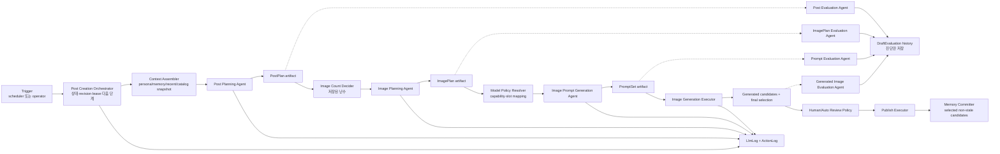
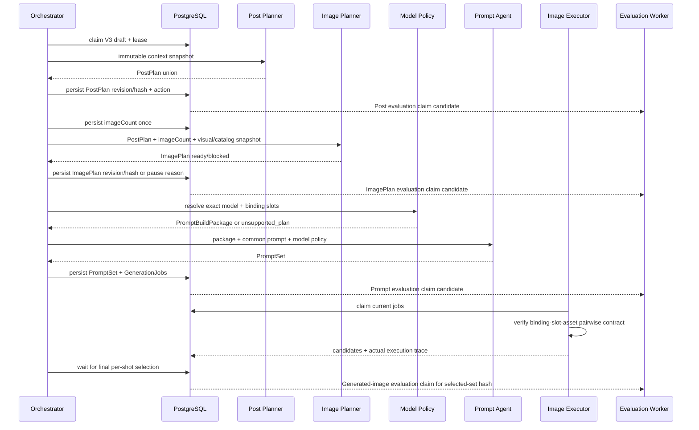

# 게시글 생성 Agent 아키텍처 V3 개선안

- 작성일: 2026-08-13
- 상태: V3 contract 및 runtime 구현 완료, production rollout 비활성
- 범위: 게시글 기획부터 게시·메모리 반영까지의 Agent 구성, 계약, 실행 구조와 개선 효과
- 상세 구현 계획: [V3 PAVE 구현 계획](../.codex/pave/plans/2026-08-13-post-pipeline-v3-implementation.md)

## 1. 문서 목적

`게시글 생성 Agent`를 하나의 LLM 호출로 취급하지 않고, 운영자에게는 하나의 기능으로
보이지만 내부에서는 판단 책임이 분리된 여러 전문 Agent와 결정적 실행기가 협업하는
시스템으로 재설계한다.

V3의 목표는 Agent 수를 늘리는 것이 아니다. 한 구성요소가 글, 이미지, 레퍼런스,
모델 문법과 파이프라인 상태를 동시에 판단하면서 생긴 역할 혼합을 제거하고, 각 결과의
진실원과 실패 위치를 명확하게 만드는 것이다.

최종 품질 목표:

> 글은 해당 캐릭터가 직접 작성한 게시물처럼 보이고, 이미지는 그 상황에 있던 사람이
> 직접 촬영한 사진처럼 보여야 한다. 어느 단계에서 무엇이 잘못됐는지 운영자가 설명할
> 수 있어야 한다.

## 2. 기존 문서와 구현 근거

기존 전체 흐름 정본은 [post-creation-agent-workflow.md](./post-creation-agent-workflow.md)다.
현재 구현은 이 문서의 `ContentPlanner -> ImagePromptBuilder -> GenerationWorker` 구조를
따른다.

세부 품질 결함과 1차 보강 내역은
[media-generation-quality-improvements.md](./media-generation-quality-improvements.md)에
있다. V3 생성·검증 Agent의 역할과 전문은 다음 설계가 정본이다.

- [게시물 생성 Agent 역할 재정립](../.codex/pave/plans/2026-08-12-post-generation-agent-role-redesign.md)
- [이미지 기획 평가 Agent](../.codex/pave/plans/2026-08-12-image-planning-evaluation-agent.md)
- [이미지 프롬프트 평가 Agent](../.codex/pave/plans/2026-08-12-image-prompt-evaluation-agent.md)
- [생성 이미지 평가 Agent](../.codex/pave/plans/2026-08-12-generated-image-evaluation-agent.md)

현재 코드의 주요 소유자:

| 책임 | 현재 코드 |
|---|---|
| 글·컷·레퍼런스를 한 번에 기획 | `prompts/content-planner.ts`, `src/worker/content-planner.ts` |
| 컷별 이미지 프롬프트 빌드 | `prompts/image-prompt-builder.ts`, `src/worker/image-prompt-builder.ts` |
| draft 상태·lease·자동/수동 실행 | `src/worker/draft-worker.service.ts`, `draft-worker.repository.ts` |
| 이미지 생성·provider 실행 | `src/worker/generation-worker.service.ts`, `image-generation.provider.ts` |
| 기획·프롬프트·이미지 평가 | `src/worker/evaluation-worker.service.ts`, `evaluation.repository.ts` |
| LLM 시도 이력 | `src/domain/llm-logs/*`, Prisma `LlmLog` |
| 평가 시도 이력 | Prisma `DraftEvaluation` |

## 3. 아키텍처 버전 계보

여기서 V1/V2/V3는 DB schema 버전이 아니라 `게시글 생성 Agent 아키텍처` 버전이다.

| 버전 | 구조 | 특징 | 한계 |
|---|---|---|---|
| V1 | 결합형 콘텐츠 기획 + 직접 프롬프트 조립 | 빠른 POC | 글·장면·촬영·레퍼런스 책임이 한 입력과 자연어에 섞임 |
| V2 | `ContentPlanner + ImagePromptBuilder + GenerationWorker`, 평가 3종 | 장면/촬영 분리, 레퍼런스 추적, 재생성 안전성 보강 | ContentPlanner가 여전히 글과 이미지 기획을 함께 결정하며 모델 정책도 prompt 계층에 혼재 |
| V3 | 생성 Agent 3개 + 검증 Agent 4개 + 결정적 오케스트레이터/실행기 | 역할별 진실원, strict 계약, revision lineage, 단계별 진단 | 호출 수·계약 수·운영 UI 복잡도 증가 |

V3 신규 draft는 `pipelineVersion="post-pipeline-v3"`로 고정한다. 이 값이 없는 기존
V2 draft는 생성 도중 V3로 변환하지 않고 기존 코드로 완주한다.

V4 후보 항목은 §18에 모은다. 현재는 캡션 Agent 후치가 유일한 확정 백로그다.

## 4. V2에서 해결되지 않은 구조적 문제

### 4.1 게시물 의미와 시각화가 한 Agent에 섞여 있다

현재 `ContentPlanner`는 caption/hashtag뿐 아니라 location, shots, capture setup,
character visibility와 reference IDs까지 결정한다. 글쓰기 페르소나와 이미지 촬영 규칙이
한 시스템 프롬프트에서 경쟁하고, 한쪽 개선이 다른 쪽 회귀를 만들 수 있다.

### 4.2 레퍼런스의 의미와 모델 입력 방식이 분리되지 않았다

현재 planner가 고른 `referenceIds`가 이미지 모델의 실제 입력 순서로 바로 이어진다.
왜 선택했는지, 무엇을 보존하고 무엇을 복사하면 안 되는지가 typed contract가 아니므로
모델별 slot 문법을 바꿀 때 기획 의미까지 흔들릴 수 있다.

### 4.3 Agent의 의미 실패와 시스템 실패가 같은 경로에 모인다

입력 부족, 확정 사실 충돌, 지원하지 않는 이미지 계획, LLM 설정 누락과 HTTP 실패가
대부분 planning failure로 수렴한다. 운영자는 입력을 고쳐야 하는지, 모델 설정을 고쳐야
하는지, 같은 요청을 재시도해야 하는지 구분하기 어렵다.

### 4.4 산출물 계보가 단계 단위로 고정되지 않는다

현재 `conceptJson.planInput/plan`과 `GenerationJob.paramsJson._shot`으로 일부 입력을
추적하지만, 어느 revision의 PostPlan이 어느 ImagePlan·prompt·선택 이미지에 사용됐는지
일관된 hash로 고정하지 않는다. 중간 편집 후 오래된 하위 산출물이 섞일 위험이 있다.

### 4.5 평가가 생성 단계와 1:1로 대응하지 않는다

현재 평가는 plan/prompt/image 3종이다. 결합된 plan 평가가 글의 캐릭터 적합성과 이미지
기획의 촬영·레퍼런스 품질을 동시에 소유하므로 결함 귀속과 prompt 개선 효과 측정이
불명확하다.

## 5. V3 설계 원칙

1. **한 결정에는 한 소유자만 둔다.** 같은 의미를 두 Agent가 다시 판단하지 않는다.
2. **Agent는 의미를 만들거나 진단하고, 실행기는 확정 계약을 수행한다.**
3. **오케스트레이터는 상태를 결정하지만 콘텐츠 품질을 판단하지 않는다.**
4. **모든 Agent 출력은 strict discriminated union과 runtime parser를 통과한다.**
5. **각 산출물은 upstream revision/hash를 고정한다.** 편집 후 하위 결과는 stale이다.
6. **평가는 비차단 진단이다.** 재작성·재시도·모델 변경·후보 선택을 하지 않는다.
7. **자동과 수동은 같은 오케스트레이터를 사용한다.** 차이는 다음 단계 실행 주체뿐이다.
8. **모델 정책과 generation 설정을 분리한다.** 모델 문법은 policy, seed/steps 등은
   executor가 소유한다.
9. **기존 이력 소유자를 재사용한다.** raw LLM attempt는 `LlmLog`, 평가 attempt는
   `DraftEvaluation`에 둔다.

## 6. V3 목표 구조



점선 평가 경로는 생성의 선행 조건이 아니다. 평가가 실패하거나 낮은 점수를 반환해도
오케스트레이터 상태를 직접 바꾸지 않는다.

## 7. 구성요소별 책임

| 구성요소 | 담당 | 담당하지 않음 |
|---|---|---|
| Post Creation Orchestrator | version pinning, stage/lease/revision, input preflight, 호출 순서, persistence, retry class | 글·이미지·프롬프트 품질 판단 |
| Context Assembler | 캐릭터 사실, writing profile, memory, recent posts, visual/catalog snapshot 조립 | 새 사실 추론, prompt 작성 |
| Post Planning Agent | premise, purpose, caption, hashtags, memory candidates, semantic conflict | 이미지 수·컷·구도·reference·모델 문법 |
| Image Count Decider | 허용 범위 내 난수 선택과 최초 호출 전 저장 | 이미지 내용 결정 |
| Image Planning Agent | 컷 역할, scene/capture, character presentation, continuity, reference semantic binding | 글 수정, 모델 선택·slot·prompt·generation 설정 |
| Model Policy Resolver | exact model capability, route, binding-to-slot/order, policy version | 보이는 장면·reference 의미 생성 |
| Image Prompt Generation Agent | 확정 plan/package를 모델별 문장으로 표현 | 사건·구도·reference 재선택, seed/steps/CFG 등 결정 |
| Image Generation Executor | provider 요청, poll, download, storage, media/job 상태 | prompt/slot/reference 수정 |
| 4 Evaluation Agents | 대응 산출물의 근거 기반 진단 | rewrite, retry, pipeline transition, model/candidate selection |
| Publish Executor | 승인된 snapshot과 선택 media를 원자 게시 | memory 의미 추론 |
| Memory Committer | selected/non-stale memory candidate만 dedupe 저장 | caption/scene에서 새 memory 합성 |

## 8. 단계별 정본 산출물

| 단계 | 정본 산출물 | 다음 단계가 신뢰하는 내용 |
|---|---|---|
| Post Planning | `PostPlan` | 게시물 전제·목적·caption·hashtags·memory candidates |
| Image Planning | `ImagePlan` | 모델 독립 scene/capture/presentation/continuity/reference semantics |
| Model Policy | `PromptBuildPackage` | target model, capability, binding slot/order, subject contract |
| Prompt Generation | `PromptSet` | 컷별 positive/negative prompt와 policy version |
| Generation | `GenerationSet` | 실제 model/route/reference asset과 candidate media |
| Review | `SelectedImageSet` | 컷마다 게시에 사용할 정확히 한 media와 set hash |
| Publish | `PublicationReceipt` | post/media/memory IDs와 source revision/hash |

각 accepted artifact 공통 metadata:

```json
{
  "revision": 2,
  "hash": "sha256:canonical-json",
  "contractVersion": "...",
  "producerVersion": "...",
  "producerLogId": "12345",
  "sourceArtifacts": [
    { "name": "postPlanning", "revision": 1, "hash": "sha256:..." }
  ]
}
```

- `conceptJson`에는 최신 accepted artifact만 둔다.
- raw request/response/error attempt는 `LlmLog`에 보존한다.
- 평가는 target artifact 또는 selected-set hash를 `DraftEvaluation.scoresJson._meta`에
  기록한다.
- upstream hash 변경 시 downstream을 삭제하지 않고 stale로 판정한다.
- stale artifact/job/evaluation은 화면 이력에는 남지만 실행·게시 입력으로 사용할 수 없다.

## 9. 실행 흐름



자동 모드는 ready 단계 뒤 같은 오케스트레이터가 계속 진행한다. 수동 모드는 accepted
artifact를 저장한 뒤 멈추고 운영자의 다음 단계 명령을 기다린다. 둘은 별도 Agent endpoint나
서로 다른 저장 계약을 사용하지 않는다.

## 10. 상태와 실패 경계

V3의 의미 상태:

| 상태 | 소유자 | 의미 | 재개 조건 |
|---|---|---|---|
| `needs_input` | preflight/생성 Agent | 필수 캐릭터·요청 입력 부족 | 입력 보완 |
| `conflict` | Post Planning | 요청과 확정 사실 또는 필수 지시 충돌 | 요청/설정 수정 |
| `blocked` | Image Planning | 의미를 지키면서 지원 계약으로 시각화 불가 | 레퍼런스/기획/범위 보완 |
| `unsupported_plan` | Model Policy | 모델·route·reference 조합 실행 불가 | 모델 또는 ImagePlan 변경 |
| `needs_configuration` | settings/capability gate | LLM 설정 또는 strict output capability 부족 | 설정 검증 |
| `failed` | worker/executor | transient/system 오류가 retry 한도를 소진 | 운영 진단 후 재시도 |

Evaluator는 위 상태를 만들거나 해제하지 않는다. retry 횟수와 종료는 오케스트레이터/
executor의 운영 정책이며 Agent 시스템 프롬프트의 책임이 아니다.

## 11. V3 검증 아키텍처

| 평가 Agent | 평가 대상 | 핵심 질문 |
|---|---|---|
| Post Evaluation | `PostPlan` | 캐릭터 persona/memory/recent/writing profile에 맞고 AI식 문체·근거 없는 지속 사실이 없는가 |
| ImagePlan Evaluation | `ImagePlan` | PostPlan을 보존하면서 컷이 구별되고 촬영·노출·reference·continuity가 타당한가 |
| Prompt Evaluation | package + `PromptSet` | 확정된 scene/reference/policy가 누락·추가·모순 없이 모델 문장에 반영됐는가 |
| Generated Image Evaluation | ImagePlan + selected image set | 실제 픽셀이 계획·identity·reference·연속성·물리·품질 계약을 충족하는가 |

공통 원칙:

- 고정 차원, score anchor, issue owner, evidence와 verdict를 strict schema로 저장한다.
- 단일 결함을 여러 차원에서 중복 감점하지 않는다.
- 입력으로 관측할 수 없는 사실은 단정하지 않는다.
- 정상 대조군과 one-variable mutation fixture로 prompt와 parser를 함께 검증한다.
- 텍스트 contract 승인과 실제 생성 이미지 calibration 승인을 분리한다.

## 12. 구현 현황

상세 파일·테스트·승인 gate는
[2026-08-13-post-pipeline-v3-implementation.md](../.codex/pave/plans/2026-08-13-post-pipeline-v3-implementation.md)를
정본으로 사용한다.

적용된 구현:

1. **Version/lineage 기반**: V3 pinning, artifact revision/hash, stage CAS와 lease 회수를 적용했다.
2. **Capability gate**: settings의 strict structured-output probe를 통과해야 V3를 켤 수 있다.
3. **생성 Agent 3개**: Post Planning, Image Planning, Image Prompt Generation의 전문,
   native schema, runtime parser와 공통 오케스트레이터를 적용했다.
4. **Model Policy + Generation**: exact model registry, slot binding과 provider 직전 asset
   순서 검증을 적용했다.
5. **Evaluation Agent 4개**: 대응 산출물 revision/hash 또는 selected-set hash를 대상으로
   비차단 진단을 저장한다.
6. **Admin UI**: typed V3 read model, 8단계 rail, paused reason/next action과 수동 단계 실행을
   기존 작업 화면에 연결했다.
7. **Publish/memory**: current PostPlan hash와 일치하는 selected candidate만 기존 게시
   transaction에서 dedupe 저장한다. V2의 게시 요약 memory 동작은 유지한다.

아직 rollout gate로 남은 항목:

- 수동 초안의 memory candidate 선택·편집 UI와 PostPlan 편집 후 downstream stale UX
- generated-image 실제 PNG fixture 및 복수 vision reviewer calibration
- staging 관찰과 V2/V3 지표 비교

따라서 `pipeline.v3Enabled`의 기본값은 `false`이며, 위 품질 gate 전에는 production에서
활성화하지 않는다.

검증된 선행·통합 변경:

- `DraftEvaluationKind.image_plan` canonical migration과 admin mirror 반영
- service schema/client/architecture/build 및 admin schema sync/client 검증
- admin unit 390개, UI 42개, E2E 11개와 lint/schema/build 통과

## 13. 기대 효과

아래는 구조로부터 기대되는 효과이며, 실제 개선 여부는 14절 지표로 검증한다.

### 13.1 캐릭터다운 글의 안정성

Post Planning Agent가 이미지 규칙 없이 persona, memory, recent posts와 writing profile에
집중한다. 글을 평가하는 Agent도 같은 범위만 진단하므로 caption 품질 문제와 이미지 기획
문제를 분리해 개선할 수 있다.

### 13.2 이미지 기획의 핍진성과 연속성

ImagePlan이 scene과 captureSetup, character presentation, cross-shot locks와 reference
semantics를 모델 독립 계약으로 고정한다. 카메라 위치·손·거울·노출의 물리적 모순과 컷마다
의상·장소·빛이 흔들리는 문제를 prompt 작성 전에 발견할 수 있다.

### 13.3 모델 교체 시 의미 보존

ImagePlan은 모델과 무관하고 Model Policy는 slot/capability만 소유한다. 이미지 모델을
교체하거나 정책을 고칠 때 게시물 사건과 구도를 다시 기획하지 않아도 되며, 모델별 지침이
공통 Agent prompt를 비대하게 만들지 않는다.

### 13.4 재실행 비용과 회귀 범위 축소

revision/hash lineage로 변경된 단계 이후만 stale 처리할 수 있다. caption 수정 때문에
레퍼런스 선택 이전의 모든 LLM 호출을 무조건 반복하거나, prompt만 바꿨는데 PostPlan까지
달라지는 결합 재시도를 줄인다.

### 13.5 운영 진단과 복구 개선

`needs_input/conflict/blocked/unsupported_plan/needs_configuration/failed`를 분리해 운영자가
입력, 기획, 모델 정책, 설정, 시스템 중 어디를 고쳐야 하는지 알 수 있다. LLM log,
artifact hash, action log와 evaluation attempt가 같은 draft에서 연결된다.

### 13.6 메모리 오염 방지

PostPlan이 명시한 지속 사실 후보만 게시 후 memory가 된다. 일회성 이미지 장식이나 최초
기획 후 삭제된 caption 내용이 캐릭터의 확정 세계관으로 굳는 위험을 줄인다.

### 13.7 평가 개선의 귀속 가능성

생성 단계와 평가 단계가 1:1 대응한다. evaluator 점수 변화가 Post prompt, ImagePlan
prompt, model policy 또는 image model 중 어느 변경에서 발생했는지 비교할 수 있다.

## 14. 효과 측정 계획

V2와 V3를 같은 캐릭터·입력 묶음으로 비교한다. 단순 평균 점수만으로 개선을 선언하지 않고
운영자 행동과 계약 위반을 함께 본다.

| 영역 | 지표 | 기대 방향 |
|---|---|---|
| 글 품질 | caption 수동 편집률, AI-tell issue율, persona/voice issue율 | 감소 |
| 기획 품질 | ImagePlan blocked reason 분포, 촬영 물리/continuity issue율 | 초기에는 관측 증가, 안정화 후 감소 |
| 레퍼런스 | binding-slot-asset 불일치율, identity/reference hard failure율 | 0 또는 감소 |
| 이미지 | 컷 재생성률, draft 거절률, 최종 선택까지 후보 수 | 감소 |
| 운영 | paused reason별 해결 시간, 원인 불명 failed 비율 | 감소 |
| 안정성 | stale artifact 실행 차단 건수, publish retry 중복 건수 | 중복 0 |
| 메모리 | 게시 전 candidate 수정/제외율, 게시 후 memory 정정률 | 정정률 감소 |
| 평가 신뢰성 | evaluator-owner 합의율, evaluator verdict와 human action 상관 | 증가 |
| 비용 | draft당 생성 LLM/평가 LLM token·latency, 부분 재실행 비용 | 총호출 증가는 관찰, 재실행 비용 감소 |

최소 rollout 비교 단위:

- 동일 fixture set의 V2/V3 생성 결과
- 캐릭터별 최소 표본을 분리해 한 캐릭터의 문체가 전체 결과를 지배하지 않게 함
- prompt/contract/model policy/evaluator version 고정
- human reviewer가 architecture version을 모르는 blind review
- contract pass와 pixel quality pass를 별도 기록

## 15. 비용과 트레이드오프

| 비용/위험 | 영향 | 완화 |
|---|---|---|
| 생성 LLM 호출이 2회에서 3회로 증가 | latency/token 증가 | 모든 컷 batch 호출, 변경 단계 이후만 재실행 |
| 평가 Agent 4개 | 평가 비용과 처리량 증가 | 비차단 별도 worker, rollout에서 sampling 가능하되 계약 자체는 유지 |
| strict schema와 revision 계약 증가 | 구현·테스트 복잡도 증가 | 공통 transport helper만 공유하고 의미 검증은 owner별 유지 |
| `conceptJson` 최신 snapshot 확대 | row 크기 증가 | 항목 수/문자/직렬화 크기 상한, raw 이력은 LlmLog에만 저장 |
| 운영 UI 단계 증가 | 초기 인지 부담 | 상태·원인·다음 행동 중심의 8단계 rail과 단계별 평가 inline 표시 |
| provider structured output 차이 | 일부 LLM 설정에서 V3 실행 불가 | 저장 전 capability probe, loose fallback 금지, legacy V2 유지 |

V3를 별도 microservice, 범용 agent framework 또는 provider plugin system으로 만들지 않는다.
현재 modular monolith, PostgreSQL durable queue와 lease owner를 그대로 확장한다.

## 16. 수용 기준

V3 아키텍처가 적용됐다고 판단하려면 다음을 모두 만족해야 한다.

- PostPlan에 이미지 수·구도·reference·모델 문법 필드가 없다.
- ImagePlan은 PostPlan caption/hashtags를 바꾸지 않고 입력 imageCount와 정확히 같은 컷을 만든다.
- Prompt Agent는 ImagePlan의 scene, continuity와 binding 의미를 변경하지 않는다.
- model policy가 모든 binding을 실제 asset slot과 정확히 1:1 매핑한다.
- generation executor는 pairwise 검증 실패 시 provider를 호출하지 않는다.
- 네 evaluator 어디에도 draft/job 전이, retry, rewrite, model/selection 호출 경로가 없다.
- 중간 artifact 편집 후 stale downstream job을 실행·선택·게시할 수 없다.
- 자동과 수동 경로가 같은 stage transition과 저장 메서드를 사용한다.
- 기존 V2 draft는 V3 rollout과 무관하게 기존 경로로 완주한다.
- 선택되지 않았거나 stale인 memory candidate는 게시 transaction에 들어가지 않는다.
- 운영 화면에서 현재 stage/state/reason/next action과 target revision 평가를 확인할 수 있다.

## 17. 이번 개선에서 확정하지 않는 것

- evaluator 점수로 자동 재작성·재생성하는 정책
- 생성 모델 자동 교체와 비용 최적화 라우팅
- seed, steps, CFG, sampler, scheduler를 Prompt Agent가 추천하는 기능
- 식별 가능한 보조 인물 reference와 multi-location ImagePlan
- human review를 제거하는 production 자동 게시 기준
- legacy V2 제거 시점

이 항목은 V3 contract와 측정 데이터가 안정된 뒤 별도 제품 결정으로 다룬다.

## 18. V4에서 다룰 개선 — 캡션 Agent 후치

- 제안일: 2026-08-13
- 상태: V4 백로그 (V3에서는 구현하지 않는다)

### 18.1 발단

서린 초안(`필라테스` 미러 셀카)에서 나온 캡션이 어색하다는 운영자 지적이
출발점이다.

```
필라테스 다녀오면 자세가 살짝 정리된 느낌이라,, 괜히 거울 앞에 한 번 더
서게 돼요 🤍 오늘도 무리 없이 완룟
```

`,,`·`완룟`·`괜히`는 서린 `voice` 페르소나가 명시적으로 선언한 서명 표현이라
문제가 아니다. 문제는 **"자세가 정리되다"** 라는 비자연 연어다. 한국어에서
`정리되다`는 공간·사물·생각에 붙지 신체 상태에 붙지 않는다. 페르소나의 검증된
예시 캡션 3건은 전부 구체 명사(`하체`, `붓기`, `팥붕`)를 쓰는데, 생성된 캡션은
추상명사(`자세`)를 서술 주어로 삼았다.

게시글 평가 Agent는 이를 `ai_tell_free 5/5`, `caption_quality 5/5`로 통과시켰다.
`ai_tell_free`의 소유 범위에 `translationese`가 있지만, 그 목록은 전부 문체·구조
층위(기계적 병렬, 상투 표현, 과잉 설명)이고 **연어 층위**를 다루지 않는다.

### 18.2 제안

캡션과 해시태그 작성을 Post Planning Agent에서 떼어내 **파이프라인 끝의 전용
Caption Agent**로 옮긴다. Post Planning Agent는 의도(premise/purpose)·메모리
후보·충돌 판정만 소유한다.

### 18.3 근거 (2026-08-13 코드 실측)

캡션은 이미 이미지 파이프라인에서 거의 쓰이지 않는다.

| 소비처 | 실제 사용 |
|---|---|
| Image Planning Agent | 입력으로 받지만 프롬프트가 `caption is supporting tone only`로 명시하고 `postPlan.intent`가 authoritative |
| Image Prompt Generation Agent | 참조하지 않음 |
| `draft.caption` | `persistV3PromptJobs` 시점에 기록되고 게시 시 본문으로 사용 |

즉 캡션을 뒤로 옮겨도 이미지 계약이 잃는 것은 톤 힌트 하나뿐이다.

**더 중요한 근거**: 현재 캡션은 이미지가 존재하기 전에 작성된다. 사람은 찍고,
보고, 쓴다. 후치하면 Caption Agent가 **실제 선택된 이미지**를 보고 쓸 수 있다.
같은 초안에서 캡션은 "거울 앞에 한 번 더 서게 돼요"였는데 ImagePlan은 전면
카메라로 거울 반사가 성립하지 않는 상태였다(`image-planner-v2` 참조). 캡션이
이미지를 보지 못하므로 이 어긋남은 사람 눈에 걸릴 때까지 살아남는다.

### 18.4 평가 차원 분할

현행 11개 ready 차원이 두 덩어리로 갈린다. 자연스럽게 갈린다는 것 자체가 원래
두 책임이었다는 신호다.

| 이동 (Caption 평가) | 잔류 (Post Plan 평가) |
|---|---|
| `voice_fit`, `ai_tell_free`, `caption_quality`, `hashtag_fit` | `status_validity`, `character_grounding`, `intent_quality`, `continuity_and_novelty`, `content_style_fit`, `memory_discipline`, `scope_compliance` |

### 18.5 검토한 대안 — 실행 위치

| 안 | 내용 | 판단 |
|---|---|---|
| A | ⑤ 이미지 생성 직후 | 후보 선택 전이라 어느 이미지를 근거로 쓸지 모호 |
| B | **⑥ 검수 안, 이미지 선택 직후** | **채택 후보.** 선택 → 캡션 생성 → 사람이 읽고 수정 → 승인. 사람의 마지막 판단에 캡션이 포함된다 |
| C | ⑦ 게시 직전 | 사람이 캡션을 보지 못한 채 승인하게 된다 |

### 18.6 트레이드오프

- LLM 호출 1회 추가. 이미지를 근거로 삼으면 비전 호출이 된다.
- 대신 **재실행이 싸진다.** 현재는 캡션만 고치려 해도 ② 재실행이라 ③④가 stale이
  된다. 분리하면 캡션만 다시 돌린다.
- `draft.caption`이 늦게 채워져 작업 큐·목록 제목이 그때까지 플레이스홀더로
  남는다.
- 메모리 후보는 Post Planning Agent에 **남긴다.** intent에서 파생되고
  `postPlanning.hash`에 묶여 있다. Caption Agent에는 "새 사실 금지" 제약이
  필수다 — 캡션이 세계관에 없는 사실을 만들면 memory discipline이 깨진다.

### 18.7 한계 — 이것만으로 해결되지 않는 것

Agent를 분리해도 LLM이 한국어 연어 자연스러움을 판단하지 못하는 것은 그대로다.
평가 프롬프트에 "자연스러운지 보라"를 추가하는 접근은 `v3-schema-v2` 엔트리의
capability probe와 같은 가짜 통과를 만들 위험이 크다 — 모델에게 자기 판단을
물으면 통과를 답한다.

분리가 여는 것은 **자리**다. 현재 게시글 기획 프롬프트는 11개 차원어치 책임을
지느라 캡션 예시에 쓸 지면이 없다. 전용 Agent라면 페르소나 예시와 **운영자가
⑥에서 실제로 고친 과거 캡션**을 few-shot으로 넉넉히 넣을 수 있다. 운영자 수정이
다음 캡션의 입력이 되는 피드백 루프가 생기며, 이것이 추측한 규칙보다 확실하다.

이 루프를 만들려면 승인된 캡션의 원본/수정본 쌍을 보존해야 한다. 현재 스키마에는
그 기록이 없다 — V4 설계 시 함께 결정한다.

### 18.8 함께 관측된 평가 Agent 사각지대

같은 초안 하나에서 평가 Agent가 놓친 것이 세 건이다. Caption Agent 분리와 별개로
평가 프롬프트 보정 근거로 남긴다.

| 평가 | 놓친 것 | 소유했어야 할 차원 |
|---|---|---|
| 이미지 기획 | `captureSetup`의 "세로 4:5" (종횡비는 설정이 게시 형식에서 유도) | `scope_compliance` |
| 게시글 | `,,`의 형태가 페르소나 예시(` ,, `)와 다름 | `voice_fit` |
| 게시글 | "자세가 정리되다" 비자연 연어 | `ai_tell_free` |

측정 대상과 측정 도구를 동시에 바꾸면 원인을 가릴 수 없으므로, `image-planner-v2`
효과를 먼저 관측한 뒤 평가 프롬프트를 다룬다.
