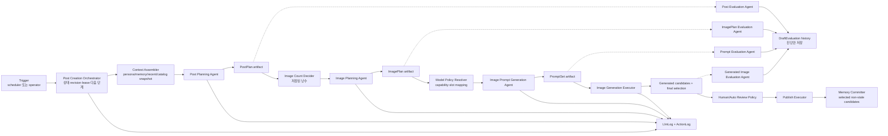
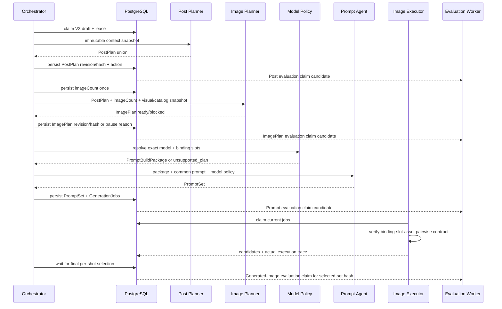
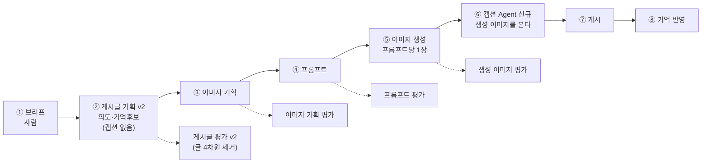

# 게시글 생성 Agent 아키텍처 V3 개선안

- 작성일: 2026-08-13
- 상태: V3 contract 및 runtime 구현 완료, production rollout 비활성
- 범위: 게시글 기획부터 게시·메모리 반영까지의 Agent 구성, 계약, 실행 구조와 개선 효과
- 상세 구현 계획: [V3 PAVE 구현 계획](../.codex/pave/plans/2026-08-13-post-pipeline-v3-implementation.md)

## 1. 문서 목적

`게시글 생성 Agent`를 하나의 LLM 호출로 취급하지 않고, 운영자에게는 하나의 기능으로
보이지만 내부에서는 판단 책임이 분리된 여러 전문 Agent와 결정적 실행기가 협업하는
시스템으로 재설계한다.

V3의 목표는 Agent 수를 늘리는 것이 아니다. 한 구성요소가 글, 이미지, 레퍼런스,
모델 문법과 파이프라인 상태를 동시에 판단하면서 생긴 역할 혼합을 제거하고, 각 결과의
진실원과 실패 위치를 명확하게 만드는 것이다.

최종 품질 목표:

> 글은 해당 캐릭터가 직접 작성한 게시물처럼 보이고, 이미지는 그 상황에 있던 사람이
> 직접 촬영한 사진처럼 보여야 한다. 어느 단계에서 무엇이 잘못됐는지 운영자가 설명할
> 수 있어야 한다.

## 2. 기존 문서와 구현 근거

기존 전체 흐름 정본은 [post-creation-agent-workflow.md](./post-creation-agent-workflow.md)다.
현재 구현은 이 문서의 `ContentPlanner -> ImagePromptBuilder -> GenerationWorker` 구조를
따른다.

세부 품질 결함과 1차 보강 내역은
[media-generation-quality-improvements.md](./media-generation-quality-improvements.md)에
있다. V3 생성·검증 Agent의 역할과 전문은 다음 설계가 정본이다.

- [게시물 생성 Agent 역할 재정립](../.codex/pave/plans/2026-08-12-post-generation-agent-role-redesign.md)
- [이미지 기획 평가 Agent](../.codex/pave/plans/2026-08-12-image-planning-evaluation-agent.md)
- [이미지 프롬프트 평가 Agent](../.codex/pave/plans/2026-08-12-image-prompt-evaluation-agent.md)
- [생성 이미지 평가 Agent](../.codex/pave/plans/2026-08-12-generated-image-evaluation-agent.md)

문서마다 소유하는 것이 다르다. 같은 사실을 두 곳에 쓰지 않는다.

| 문서 | 소유 |
|---|---|
| [post-creation-agent-workflow.md](./post-creation-agent-workflow.md) | V2 워크플로우와 UML. V2가 legacy로 동결됐으므로 **역사 기록**으로 읽는다 |
| 이 문서 | V3 설계 정본 — 계약, 상태 경계, 검증 아키텍처, 유보(§17), V4 백로그(§18), 개선 연대기(§19), V4 설계(§20) |
| [prompt-research-log.md](./prompt-research-log.md) | 프롬프트·루브릭 실험. 가설 → 변경 → 결과 → 판정 |
| [pipeline-v3-ux-plan.md](./pipeline-v3-ux-plan.md) | V3 운영 화면 설계 — 8단계 데이터 성격별 표현 |
| [media-generation-quality-improvements.md](./media-generation-quality-improvements.md) | 품질 결함과 1차 보강 누적 기록 |
| [media-generation-pipeline.md](./media-generation-pipeline.md) | 미디어 생성 파이프라인 |
| [image-prompt-optimization-report.md](./image-prompt-optimization-report.md) | 프롬프트 최적화 실측 보고 |
| [plan-prompt-evaluation-agent.md](./plan-prompt-evaluation-agent.md), [image-prompt-evaluation-agent.md](./image-prompt-evaluation-agent.md), [generated-image-evaluation-agent.md](./generated-image-evaluation-agent.md) | 평가 Agent 3종 설계 |
| [api/admin-drafts.md](./api/admin-drafts.md) | draft API 계약 |

작업 단위 기록은 `.codex/pave/plans/`(착수 시점 판단)와 `.codex/pave/reports/`
(완료 시점 실측과 정정)에 있다. 둘이 다르면 **정정 자체가 자료다**.

현재 코드의 주요 소유자:

| 책임 | 현재 코드 |
|---|---|
| 글·컷·레퍼런스를 한 번에 기획 | `prompts/content-planner.ts`, `src/worker/content-planner.ts` |
| 컷별 이미지 프롬프트 빌드 | `prompts/image-prompt-builder.ts`, `src/worker/image-prompt-builder.ts` |
| draft 상태·lease·자동/수동 실행 | `src/worker/draft-worker.service.ts`, `draft-worker.repository.ts` |
| 이미지 생성·provider 실행 | `src/worker/generation-worker.service.ts`, `image-generation.provider.ts` |
| 기획·프롬프트·이미지 평가 | `src/worker/evaluation-worker.service.ts`, `evaluation.repository.ts` |
| LLM 시도 이력 | `src/domain/llm-logs/*`, Prisma `LlmLog` |
| 평가 시도 이력 | Prisma `DraftEvaluation` |

## 3. 아키텍처 버전 계보

여기서 V1/V2/V3는 DB schema 버전이 아니라 `게시글 생성 Agent 아키텍처` 버전이다.

| 버전 | 구조 | 특징 | 한계 |
|---|---|---|---|
| V1 | 결합형 콘텐츠 기획 + 직접 프롬프트 조립 | 빠른 POC | 글·장면·촬영·레퍼런스 책임이 한 입력과 자연어에 섞임 |
| V2 | `ContentPlanner + ImagePromptBuilder + GenerationWorker`, 평가 3종 | 장면/촬영 분리, 레퍼런스 추적, 재생성 안전성 보강 | ContentPlanner가 여전히 글과 이미지 기획을 함께 결정하며 모델 정책도 prompt 계층에 혼재 |
| V3 | 생성 Agent 3개 + 검증 Agent 4개 + 결정적 오케스트레이터/실행기 | 역할별 진실원, strict 계약, revision lineage, 단계별 진단 | 호출 수·계약 수·운영 UI 복잡도 증가 |

V3 신규 draft는 `pipelineVersion="post-pipeline-v3"`로 고정한다. 이 값이 없는 기존
V2 draft는 생성 도중 V3로 변환하지 않고 기존 코드로 완주한다.

V4 후보 항목은 §18에 모은다. 현재는 캡션 Agent 후치가 유일한 확정 백로그다.

## 4. V2에서 해결되지 않은 구조적 문제

### 4.1 게시물 의미와 시각화가 한 Agent에 섞여 있다

현재 `ContentPlanner`는 caption/hashtag뿐 아니라 location, shots, capture setup,
character visibility와 reference IDs까지 결정한다. 글쓰기 페르소나와 이미지 촬영 규칙이
한 시스템 프롬프트에서 경쟁하고, 한쪽 개선이 다른 쪽 회귀를 만들 수 있다.

### 4.2 레퍼런스의 의미와 모델 입력 방식이 분리되지 않았다

현재 planner가 고른 `referenceIds`가 이미지 모델의 실제 입력 순서로 바로 이어진다.
왜 선택했는지, 무엇을 보존하고 무엇을 복사하면 안 되는지가 typed contract가 아니므로
모델별 slot 문법을 바꿀 때 기획 의미까지 흔들릴 수 있다.

### 4.3 Agent의 의미 실패와 시스템 실패가 같은 경로에 모인다

입력 부족, 확정 사실 충돌, 지원하지 않는 이미지 계획, LLM 설정 누락과 HTTP 실패가
대부분 planning failure로 수렴한다. 운영자는 입력을 고쳐야 하는지, 모델 설정을 고쳐야
하는지, 같은 요청을 재시도해야 하는지 구분하기 어렵다.

### 4.4 산출물 계보가 단계 단위로 고정되지 않는다

현재 `conceptJson.planInput/plan`과 `GenerationJob.paramsJson._shot`으로 일부 입력을
추적하지만, 어느 revision의 PostPlan이 어느 ImagePlan·prompt·선택 이미지에 사용됐는지
일관된 hash로 고정하지 않는다. 중간 편집 후 오래된 하위 산출물이 섞일 위험이 있다.

### 4.5 평가가 생성 단계와 1:1로 대응하지 않는다

현재 평가는 plan/prompt/image 3종이다. 결합된 plan 평가가 글의 캐릭터 적합성과 이미지
기획의 촬영·레퍼런스 품질을 동시에 소유하므로 결함 귀속과 prompt 개선 효과 측정이
불명확하다.

## 5. V3 설계 원칙

1. **한 결정에는 한 소유자만 둔다.** 같은 의미를 두 Agent가 다시 판단하지 않는다.
2. **Agent는 의미를 만들거나 진단하고, 실행기는 확정 계약을 수행한다.**
3. **오케스트레이터는 상태를 결정하지만 콘텐츠 품질을 판단하지 않는다.**
4. **모든 Agent 출력은 strict discriminated union과 runtime parser를 통과한다.**
5. **각 산출물은 upstream revision/hash를 고정한다.** 편집 후 하위 결과는 stale이다.
6. **평가는 비차단 진단이다.** 재작성·재시도·모델 변경·후보 선택을 하지 않는다.
7. **자동과 수동은 같은 오케스트레이터를 사용한다.** 차이는 다음 단계 실행 주체뿐이다.
8. **모델 정책과 generation 설정을 분리한다.** 모델 문법은 policy, seed/steps 등은
   executor가 소유한다.
9. **기존 이력 소유자를 재사용한다.** raw LLM attempt는 `LlmLog`, 평가 attempt는
   `DraftEvaluation`에 둔다.

## 6. V3 목표 구조



점선 평가 경로는 생성의 선행 조건이 아니다. 평가가 실패하거나 낮은 점수를 반환해도
오케스트레이터 상태를 직접 바꾸지 않는다.

## 7. 구성요소별 책임

| 구성요소 | 담당 | 담당하지 않음 |
|---|---|---|
| Post Creation Orchestrator | version pinning, stage/lease/revision, input preflight, 호출 순서, persistence, retry class | 글·이미지·프롬프트 품질 판단 |
| Context Assembler | 캐릭터 사실, writing profile, memory, recent posts, visual/catalog snapshot 조립 | 새 사실 추론, prompt 작성 |
| Post Planning Agent | premise, purpose, caption, hashtags, memory candidates, semantic conflict | 이미지 수·컷·구도·reference·모델 문법 |
| Image Count Decider | 허용 범위 내 난수 선택과 최초 호출 전 저장 | 이미지 내용 결정 |
| Image Planning Agent | 컷 역할, scene/capture, character presentation, continuity, reference semantic binding | 글 수정, 모델 선택·slot·prompt·generation 설정 |
| Model Policy Resolver | exact model capability, route, binding-to-slot/order, policy version | 보이는 장면·reference 의미 생성 |
| Image Prompt Generation Agent | 확정 plan/package를 모델별 문장으로 표현 | 사건·구도·reference 재선택, seed/steps/CFG 등 결정 |
| Image Generation Executor | provider 요청, poll, download, storage, media/job 상태 | prompt/slot/reference 수정 |
| 4 Evaluation Agents | 대응 산출물의 근거 기반 진단 | rewrite, retry, pipeline transition, model/candidate selection |
| Publish Executor | 승인된 snapshot과 선택 media를 원자 게시 | memory 의미 추론 |
| Memory Committer | selected/non-stale memory candidate만 dedupe 저장 | caption/scene에서 새 memory 합성 |

## 8. 단계별 정본 산출물

| 단계 | 정본 산출물 | 다음 단계가 신뢰하는 내용 |
|---|---|---|
| Post Planning | `PostPlan` | 게시물 전제·목적·caption·hashtags·memory candidates |
| Image Planning | `ImagePlan` | 모델 독립 scene/capture/presentation/continuity/reference semantics |
| Model Policy | `PromptBuildPackage` | target model, capability, binding slot/order, subject contract |
| Prompt Generation | `PromptSet` | 컷별 positive/negative prompt와 policy version |
| Generation | `GenerationSet` | 실제 model/route/reference asset과 candidate media |
| Review | `SelectedImageSet` | 컷마다 게시에 사용할 정확히 한 media와 set hash |
| Publish | `PublicationReceipt` | post/media/memory IDs와 source revision/hash |

각 accepted artifact 공통 metadata:

```json
{
  "revision": 2,
  "hash": "sha256:canonical-json",
  "contractVersion": "...",
  "producerVersion": "...",
  "producerLogId": "12345",
  "sourceArtifacts": [
    { "name": "postPlanning", "revision": 1, "hash": "sha256:..." }
  ]
}
```

- `conceptJson`에는 최신 accepted artifact만 둔다.
- raw request/response/error attempt는 `LlmLog`에 보존한다.
- 평가는 target artifact 또는 selected-set hash를 `DraftEvaluation.scoresJson._meta`에
  기록한다.
- upstream hash 변경 시 downstream을 삭제하지 않고 stale로 판정한다.
- stale artifact/job/evaluation은 화면 이력에는 남지만 실행·게시 입력으로 사용할 수 없다.
  실질 규칙(2026-08-15 V4 리뷰에서 명문화): **파이프라인이 소유한 값은 hash로
  거르고, 운영자가 소유한 값은 거르지 않는다.** 코드에서 게시 시 hash 검사가
  실제로 적용되는 곳은 `memoryCandidates`뿐이며(`selectedPublishedMemories`),
  ImagePlan/PromptSet은 게시가 읽지 않고 캡션 컬럼은 V3에서도 운영자 소유였다.
  stale은 진단(평가)의 대상 자격까지 빼앗지 않는다 — 평가는 비차단 진단이다.

## 9. 실행 흐름



자동 모드는 ready 단계 뒤 같은 오케스트레이터가 계속 진행한다. 수동 모드는 accepted
artifact를 저장한 뒤 멈추고 운영자의 다음 단계 명령을 기다린다. 둘은 별도 Agent endpoint나
서로 다른 저장 계약을 사용하지 않는다.

## 10. 상태와 실패 경계

V3의 의미 상태:

| 상태 | 소유자 | 의미 | 재개 조건 |
|---|---|---|---|
| `needs_input` | preflight/생성 Agent | 필수 캐릭터·요청 입력 부족 | 입력 보완 |
| `conflict` | Post Planning | 요청과 확정 사실 또는 필수 지시 충돌 | 요청/설정 수정 |
| `blocked` | Image Planning | 의미를 지키면서 지원 계약으로 시각화 불가 | 레퍼런스/기획/범위 보완 |
| `unsupported_plan` | Model Policy | 모델·route·reference 조합 실행 불가 | 모델 또는 ImagePlan 변경 |
| `needs_configuration` | settings/capability gate | LLM 설정 또는 strict output capability 부족 | 설정 검증 |
| `failed` | worker/executor | transient/system 오류가 retry 한도를 소진 | 운영 진단 후 재시도 |

Evaluator는 위 상태를 만들거나 해제하지 않는다. retry 횟수와 종료는 오케스트레이터/
executor의 운영 정책이며 Agent 시스템 프롬프트의 책임이 아니다.

## 11. V3 검증 아키텍처

| 평가 Agent | 평가 대상 | 핵심 질문 |
|---|---|---|
| Post Evaluation | `PostPlan` | 캐릭터 persona/memory/recent/writing profile에 맞고 AI식 문체·근거 없는 지속 사실이 없는가 |
| ImagePlan Evaluation | `ImagePlan` | PostPlan을 보존하면서 컷이 구별되고 촬영·노출·reference·continuity가 타당한가 |
| Prompt Evaluation | package + `PromptSet` | 확정된 scene/reference/policy가 누락·추가·모순 없이 모델 문장에 반영됐는가 |
| Generated Image Evaluation | ImagePlan + selected image set | 실제 픽셀이 계획·identity·reference·연속성·물리·품질 계약을 충족하는가 |

공통 원칙:

- 고정 차원, score anchor, issue owner, evidence와 verdict를 strict schema로 저장한다.
- 단일 결함을 여러 차원에서 중복 감점하지 않는다.
- 입력으로 관측할 수 없는 사실은 단정하지 않는다.
- 정상 대조군과 one-variable mutation fixture로 prompt와 parser를 함께 검증한다.
- 텍스트 contract 승인과 실제 생성 이미지 calibration 승인을 분리한다.

## 12. 구현 현황

상세 파일·테스트·승인 gate는
[2026-08-13-post-pipeline-v3-implementation.md](../.codex/pave/plans/2026-08-13-post-pipeline-v3-implementation.md)를
정본으로 사용한다.

적용된 구현:

1. **Version/lineage 기반**: V3 pinning, artifact revision/hash, stage CAS와 lease 회수를 적용했다.
2. **Capability gate**: settings의 strict structured-output probe를 통과해야 V3를 켤 수 있다.
3. **생성 Agent 3개**: Post Planning, Image Planning, Image Prompt Generation의 전문,
   native schema, runtime parser와 공통 오케스트레이터를 적용했다.
4. **Model Policy + Generation**: exact model registry, slot binding과 provider 직전 asset
   순서 검증을 적용했다.
5. **Evaluation Agent 4개**: 대응 산출물 revision/hash 또는 selected-set hash를 대상으로
   비차단 진단을 저장한다.
6. **Admin UI**: typed V3 read model, 8단계 rail, paused reason/next action과 수동 단계 실행을
   기존 작업 화면에 연결했다.
7. **Publish/memory**: current PostPlan hash와 일치하는 selected candidate만 기존 게시
   transaction에서 dedupe 저장한다. V2의 게시 요약 memory 동작은 유지한다.

**V4 (2026-08-15 구현 완료)** — 같은 실행 기계 위에서 검수 단계를 캡션 단계로
바꿨다. 새 초안은 `pipelineVersion="post-pipeline-v4"`로 핀하고, 배포 전 v3
초안은 검수 경로로 그대로 완주한다(`isPostPipelineV3`가 v3|v4 모두 참,
분기는 `isPostPipelineV4`로만).

1. `post-planner-v2`(캡션 3필드 제거) + `caption-writer-v1`(생성 이미지 vision +
   ImagePlan 원문 + operatorRequest) + `post-evaluator-v2`(글 4차원 삭제).
2. stage `caption` — 표준 claim/CAS/pause/requeue를 그대로 쓴다. ⑤ 완료 시
   `needs_review` 대신 `planned + stage=caption`, ⑥ 완료 시 artifact 저장과 게시
   컬럼 갱신이 한 트랜잭션(`DRAFT_V3_CAPTION_READY`).
3. 프롬프트당 1장(`candidateCount: 1`) + 유일 출력 자동 선택. 후보·선택·승인 없음.
4. 게시 술어 `PUBLISHABLE_WHERE` = approved(V2/V3) ∪ v4 publish 대기. 빈 캡션은
   게시 직전 preflight로 차단(`caption_missing`).
5. read model: `caption` stage·V4 레일·`captionBuild`(stale·matchesColumn 서버
   계산, 해시 함수는 평가 워커와 공유). UI는 ⑥ 캡션 화면(Agent 원본 카드 +
   게시 캡션 편집 폼), ⑦ 미리보기 폴백 제거, 제목 전제 폴백 3곳.
6. 동반 수리: prompt 평가 재트리거에 `DRAFT_V3_PROMPTS_READY` 추가(V3에서 ④
   재실행이 재평가를 못 돌리던 버그).

검증: backend 51 suites/424 tests, admin 17 files/62 tests, lint·typecheck·
build·schema:check 통과. `overallScore=0` 버그는 이번 범위 밖으로 남았다.

아직 rollout gate로 남은 항목:

- 수동 초안의 memory candidate 선택·편집 UI와 PostPlan 편집 후 downstream stale UX
- generated-image 실제 PNG fixture 및 복수 vision reviewer calibration
- staging 관찰과 V2/V3 지표 비교

따라서 `pipeline.v3Enabled`의 기본값은 `false`이며, 위 품질 gate 전에는 production에서
활성화하지 않는다.

검증된 선행·통합 변경:

- `DraftEvaluationKind.image_plan` canonical migration과 admin mirror 반영
- service schema/client/architecture/build 및 admin schema sync/client 검증
- admin unit 390개, UI 42개, E2E 11개와 lint/schema/build 통과

## 13. 기대 효과

아래는 구조로부터 기대되는 효과이며, 실제 개선 여부는 14절 지표로 검증한다.

### 13.1 캐릭터다운 글의 안정성

Post Planning Agent가 이미지 규칙 없이 persona, memory, recent posts와 writing profile에
집중한다. 글을 평가하는 Agent도 같은 범위만 진단하므로 caption 품질 문제와 이미지 기획
문제를 분리해 개선할 수 있다.

### 13.2 이미지 기획의 핍진성과 연속성

ImagePlan이 scene과 captureSetup, character presentation, cross-shot locks와 reference
semantics를 모델 독립 계약으로 고정한다. 카메라 위치·손·거울·노출의 물리적 모순과 컷마다
의상·장소·빛이 흔들리는 문제를 prompt 작성 전에 발견할 수 있다.

### 13.3 모델 교체 시 의미 보존

ImagePlan은 모델과 무관하고 Model Policy는 slot/capability만 소유한다. 이미지 모델을
교체하거나 정책을 고칠 때 게시물 사건과 구도를 다시 기획하지 않아도 되며, 모델별 지침이
공통 Agent prompt를 비대하게 만들지 않는다.

### 13.4 재실행 비용과 회귀 범위 축소

revision/hash lineage로 변경된 단계 이후만 stale 처리할 수 있다. caption 수정 때문에
레퍼런스 선택 이전의 모든 LLM 호출을 무조건 반복하거나, prompt만 바꿨는데 PostPlan까지
달라지는 결합 재시도를 줄인다.

### 13.5 운영 진단과 복구 개선

`needs_input/conflict/blocked/unsupported_plan/needs_configuration/failed`를 분리해 운영자가
입력, 기획, 모델 정책, 설정, 시스템 중 어디를 고쳐야 하는지 알 수 있다. LLM log,
artifact hash, action log와 evaluation attempt가 같은 draft에서 연결된다.

### 13.6 메모리 오염 방지

PostPlan이 명시한 지속 사실 후보만 게시 후 memory가 된다. 일회성 이미지 장식이나 최초
기획 후 삭제된 caption 내용이 캐릭터의 확정 세계관으로 굳는 위험을 줄인다.

### 13.7 평가 개선의 귀속 가능성

생성 단계와 평가 단계가 1:1 대응한다. evaluator 점수 변화가 Post prompt, ImagePlan
prompt, model policy 또는 image model 중 어느 변경에서 발생했는지 비교할 수 있다.

## 14. 효과 측정 계획

V2와 V3를 같은 캐릭터·입력 묶음으로 비교한다. 단순 평균 점수만으로 개선을 선언하지 않고
운영자 행동과 계약 위반을 함께 본다.

| 영역 | 지표 | 기대 방향 |
|---|---|---|
| 글 품질 | caption 수동 편집률, AI-tell issue율, persona/voice issue율 | 감소 |
| 기획 품질 | ImagePlan blocked reason 분포, 촬영 물리/continuity issue율 | 초기에는 관측 증가, 안정화 후 감소 |
| 레퍼런스 | binding-slot-asset 불일치율, identity/reference hard failure율 | 0 또는 감소 |
| 이미지 | 컷 재생성률, draft 거절률, 최종 선택까지 후보 수 | 감소 |
| 운영 | paused reason별 해결 시간, 원인 불명 failed 비율 | 감소 |
| 안정성 | stale artifact 실행 차단 건수, publish retry 중복 건수 | 중복 0 |
| 메모리 | 게시 전 candidate 수정/제외율, 게시 후 memory 정정률 | 정정률 감소 |
| 평가 신뢰성 | evaluator-owner 합의율, evaluator verdict와 human action 상관 | 증가 |
| 비용 | draft당 생성 LLM/평가 LLM token·latency, 부분 재실행 비용 | 총호출 증가는 관찰, 재실행 비용 감소 |

최소 rollout 비교 단위:

- 동일 fixture set의 V2/V3 생성 결과
- 캐릭터별 최소 표본을 분리해 한 캐릭터의 문체가 전체 결과를 지배하지 않게 함
- prompt/contract/model policy/evaluator version 고정
- human reviewer가 architecture version을 모르는 blind review
- contract pass와 pixel quality pass를 별도 기록

## 15. 비용과 트레이드오프

| 비용/위험 | 영향 | 완화 |
|---|---|---|
| 생성 LLM 호출이 2회에서 3회로 증가 | latency/token 증가 | 모든 컷 batch 호출, 변경 단계 이후만 재실행 |
| 평가 Agent 4개 | 평가 비용과 처리량 증가 | 비차단 별도 worker, rollout에서 sampling 가능하되 계약 자체는 유지 |
| strict schema와 revision 계약 증가 | 구현·테스트 복잡도 증가 | 공통 transport helper만 공유하고 의미 검증은 owner별 유지 |
| `conceptJson` 최신 snapshot 확대 | row 크기 증가 | 항목 수/문자/직렬화 크기 상한, raw 이력은 LlmLog에만 저장 |
| 운영 UI 단계 증가 | 초기 인지 부담 | 상태·원인·다음 행동 중심의 8단계 rail과 단계별 평가 inline 표시 |
| provider structured output 차이 | 일부 LLM 설정에서 V3 실행 불가 | 저장 전 capability probe, loose fallback 금지, legacy V2 유지 |

V3를 별도 microservice, 범용 agent framework 또는 provider plugin system으로 만들지 않는다.
현재 modular monolith, PostgreSQL durable queue와 lease owner를 그대로 확장한다.

## 16. 수용 기준

V3 아키텍처가 적용됐다고 판단하려면 다음을 모두 만족해야 한다.

- PostPlan에 이미지 수·구도·reference·모델 문법 필드가 없다.
- ImagePlan은 PostPlan caption/hashtags를 바꾸지 않고 입력 imageCount와 정확히 같은 컷을 만든다.
- Prompt Agent는 ImagePlan의 scene, continuity와 binding 의미를 변경하지 않는다.
- model policy가 모든 binding을 실제 asset slot과 정확히 1:1 매핑한다.
- generation executor는 pairwise 검증 실패 시 provider를 호출하지 않는다.
- 네 evaluator 어디에도 draft/job 전이, retry, rewrite, model/selection 호출 경로가 없다.
- 중간 artifact 편집 후 stale downstream job을 실행·선택·게시할 수 없다.
- 자동과 수동 경로가 같은 stage transition과 저장 메서드를 사용한다.
- 기존 V2 draft는 V3 rollout과 무관하게 기존 경로로 완주한다.
- 선택되지 않았거나 stale인 memory candidate는 게시 transaction에 들어가지 않는다.
- 운영 화면에서 현재 stage/state/reason/next action과 target revision 평가를 확인할 수 있다.

## 17. 이번 개선에서 확정하지 않는 것

- evaluator 점수로 자동 재작성·재생성하는 정책
- 생성 모델 자동 교체와 비용 최적화 라우팅
- seed, steps, CFG, sampler, scheduler를 Prompt Agent가 추천하는 기능
- 식별 가능한 보조 인물 reference와 multi-location ImagePlan
- ~~human review를 제거하는 production 자동 게시 기준~~ — 2026-08-15 V4 결정 9로 확정(자동 모드는 사람 없이 게시, §20.11 위험 항목)
- legacy V2 제거 시점

이 항목은 V3 contract와 측정 데이터가 안정된 뒤 별도 제품 결정으로 다룬다.

## 18. V4에서 다룰 개선 — 캡션 Agent 후치

- 제안일: 2026-08-13
- 상태: 설계 확정 진행 — 정본은 §20 (2026-08-15). 이 절은 발단 기록으로 남긴다

### 18.1 발단

서린 초안(`필라테스` 미러 셀카)에서 나온 캡션이 어색하다는 운영자 지적이
출발점이다.

```
필라테스 다녀오면 자세가 살짝 정리된 느낌이라,, 괜히 거울 앞에 한 번 더
서게 돼요 🤍 오늘도 무리 없이 완룟
```

`,,`·`완룟`·`괜히`는 서린 `voice` 페르소나가 명시적으로 선언한 서명 표현이라
문제가 아니다. 문제는 **"자세가 정리되다"** 라는 비자연 연어다. 한국어에서
`정리되다`는 공간·사물·생각에 붙지 신체 상태에 붙지 않는다. 페르소나의 검증된
예시 캡션 3건은 전부 구체 명사(`하체`, `붓기`, `팥붕`)를 쓰는데, 생성된 캡션은
추상명사(`자세`)를 서술 주어로 삼았다.

게시글 평가 Agent는 이를 `ai_tell_free 5/5`, `caption_quality 5/5`로 통과시켰다.
`ai_tell_free`의 소유 범위에 `translationese`가 있지만, 그 목록은 전부 문체·구조
층위(기계적 병렬, 상투 표현, 과잉 설명)이고 **연어 층위**를 다루지 않는다.

### 18.2 제안

캡션과 해시태그 작성을 Post Planning Agent에서 떼어내 **파이프라인 끝의 전용
Caption Agent**로 옮긴다. Post Planning Agent는 의도(premise/purpose)·메모리
후보·충돌 판정만 소유한다.

### 18.3 근거 (2026-08-13 코드 실측)

캡션은 이미 이미지 파이프라인에서 거의 쓰이지 않는다.

| 소비처 | 실제 사용 |
|---|---|
| Image Planning Agent | 입력으로 받지만 프롬프트가 `caption is supporting tone only`로 명시하고 `postPlan.intent`가 authoritative |
| Image Prompt Generation Agent | 참조하지 않음 |
| `draft.caption` | `persistV3PromptJobs` 시점에 기록되고 게시 시 본문으로 사용 |

즉 캡션을 뒤로 옮겨도 이미지 계약이 잃는 것은 톤 힌트 하나뿐이다.

**더 중요한 근거**: 현재 캡션은 이미지가 존재하기 전에 작성된다. 사람은 찍고,
보고, 쓴다. 후치하면 Caption Agent가 **실제 선택된 이미지**를 보고 쓸 수 있다.
같은 초안에서 캡션은 "거울 앞에 한 번 더 서게 돼요"였는데 ImagePlan은 전면
카메라로 거울 반사가 성립하지 않는 상태였다(`image-planner-v2` 참조). 캡션이
이미지를 보지 못하므로 이 어긋남은 사람 눈에 걸릴 때까지 살아남는다.

### 18.4 평가 차원 분할

현행 11개 ready 차원이 두 덩어리로 갈린다. 자연스럽게 갈린다는 것 자체가 원래
두 책임이었다는 신호다.

| 이동 (Caption 평가) | 잔류 (Post Plan 평가) |
|---|---|
| `voice_fit`, `ai_tell_free`, `caption_quality`, `hashtag_fit` | `status_validity`, `character_grounding`, `intent_quality`, `continuity_and_novelty`, `content_style_fit`, `memory_discipline`, `scope_compliance` |

### 18.5 검토한 대안 — 실행 위치

| 안 | 내용 | 판단 |
|---|---|---|
| A | ⑤ 이미지 생성 직후 | 후보 선택 전이라 어느 이미지를 근거로 쓸지 모호 |
| B | **⑥ 검수 안, 이미지 선택 직후** | **채택 후보.** 선택 → 캡션 생성 → 사람이 읽고 수정 → 승인. 사람의 마지막 판단에 캡션이 포함된다 |
| C | ⑦ 게시 직전 | 사람이 캡션을 보지 못한 채 승인하게 된다 |

### 18.6 트레이드오프

- LLM 호출 1회 추가. 이미지를 근거로 삼으면 비전 호출이 된다.
- 대신 **재실행이 싸진다.** 현재는 캡션만 고치려 해도 ② 재실행이라 ③④가 stale이
  된다. 분리하면 캡션만 다시 돌린다.
- `draft.caption`이 늦게 채워져 작업 큐·목록 제목이 그때까지 플레이스홀더로
  남는다.
- 메모리 후보는 Post Planning Agent에 **남긴다.** intent에서 파생되고
  `postPlanning.hash`에 묶여 있다. Caption Agent에는 "새 사실 금지" 제약이
  필수다 — 캡션이 세계관에 없는 사실을 만들면 memory discipline이 깨진다.

### 18.7 한계 — 이것만으로 해결되지 않는 것

Agent를 분리해도 LLM이 한국어 연어 자연스러움을 판단하지 못하는 것은 그대로다.
평가 프롬프트에 "자연스러운지 보라"를 추가하는 접근은 `v3-schema-v2` 엔트리의
capability probe와 같은 가짜 통과를 만들 위험이 크다 — 모델에게 자기 판단을
물으면 통과를 답한다.

분리가 여는 것은 **자리**다. 현재 게시글 기획 프롬프트는 11개 차원어치 책임을
지느라 캡션 예시에 쓸 지면이 없다. 전용 Agent라면 페르소나 예시와 **운영자가
⑥에서 실제로 고친 과거 캡션**을 few-shot으로 넉넉히 넣을 수 있다. 운영자 수정이
다음 캡션의 입력이 되는 피드백 루프가 생기며, 이것이 추측한 규칙보다 확실하다.

이 루프를 만들려면 승인된 캡션의 원본/수정본 쌍을 보존해야 한다. 현재 스키마에는
그 기록이 없다 — V4 설계 시 함께 결정한다.

### 18.8 함께 관측된 평가 Agent 사각지대

같은 초안 하나에서 평가 Agent가 놓친 것이 세 건이다. Caption Agent 분리와 별개로
평가 프롬프트 보정 근거로 남긴다.

| 평가 | 놓친 것 | 소유했어야 할 차원 |
|---|---|---|
| 이미지 기획 | `captureSetup`의 "세로 4:5" (종횡비는 설정이 게시 형식에서 유도) | `scope_compliance` |
| 게시글 | `,,`의 형태가 페르소나 예시(` ,, `)와 다름 | `voice_fit` |
| 게시글 | "자세가 정리되다" 비자연 연어 | `ai_tell_free` |
| 생성 이미지 | 굽힌 무릎에 옷 주름 없음, 접지 그림자 없음 | `style_fidelity`, `visual_integrity` |
| 생성 이미지 | 허리-골반 비율 과장 (네거티브가 `extreme pinched waist`로 금지한 것) | `identity_and_appearance` |

**2026-08-14 관측 — 같은 Agent가 축에 따라 유능하고 무능하다.** 생성 이미지
평가(`019ffa17…`)에서 컷 1은 8개 차원 전부 5점·지적 0건을 받았다. 운영자가
"어색하다"고 지목한 바로 그 이미지다. 반면 컷 2는 정확했다 — 거치 촬영이어야
할 것이 미러 샷으로 나온 것을 major로 잡았고, 크롭이 턱 아래여야 하는데 턱·입술이
보이는 것까지 잡았다(사람 판정자가 놓친 것).

경계가 뚜렷하다. **언어화할 수 있는 계약-픽셀 대조는 잡고, 사람이 느끼는 사진
자연스러움은 못 잡는다.** 따라서 이 Agent를 "자연스러움"을 재는 실험의 판정
도구로 쓸 수 없다. `negative-block-ablation`이 정확히 그 축을 재므로, 그 실험은
사전 등록 이진 체크와 블라인딩으로 판정해야 한다.

**별건 — `overallScore`가 항상 0이다 (버그, 미수정).** `evaluationAverage()`의
수집기가 `key === "score"`인 키로만 하위로 내려간다. V3 이미지 평가는 점수가
`shots[].dimensions.<차원>.score`와 `setDimensions.<차원>.score`에 있어 한 단계
더 깊고, shot 레코드의 키는 `issues`/`sortOrder`/`dimensions`뿐이라 수집기가
멈춘다. 숫자를 하나도 못 모아 0을 반환한다. 실제 평균이 4.8인데 화면에는
`이미지 심사 0.0/5`가 뜬다.

수정 시 함정: 무작정 전 계층을 순회하면 `sortOrder: 0`, `sortOrder: 1`을 점수로
주워 담는다. 원 구현이 `key === "score"`로 제한한 이유다. **하위로는 자유롭게
내려가되 `score` 키에서만 수확**해야 한다. 텍스트 평가 3종은 `result.scores`가
평면 `{차원: 숫자}`라 정상 동작하므로 그 경로를 깨뜨리면 안 된다.

측정 대상과 측정 도구를 동시에 바꾸면 원인을 가릴 수 없으므로, `image-planner-v2`
효과를 먼저 관측한 뒤 평가 프롬프트를 다룬다.

## 19. 개선 연대기와 되풀이된 실패 유형

나중에 문서·연구로 정리할 때 쓰는 뼈대다. 결론이 아니라 인과 사슬과 1차 증거의
위치를 담는다.

### 19.1 관측 → 변경 → 결과

| # | 관측 | 변경 | 결과 | 1차 증거 |
|---|---|---|---|---|
| 1 | V2 ContentPlanner가 글·장면·촬영·레퍼런스를 한 자연어 입력에 섞어 결정한다 | 역할별 Agent 분리(V3) — 생성 3 + 검증 4 + 결정적 오케스트레이터 | 구현 완료, 설정 게이트로 신규 초안만 적용 | §4~§12, `902b459` |
| 2 | V3를 켜니 게시글 기획이 전부 400 — `'oneOf' is not permitted` | 판별 union을 루트 object 한 겹으로, `const`→`enum`, `uniqueItems` 제거 | 세 스키마 전부 SCHEMA ACCEPTED | research-log `v3-schema-v2`, `8f13aeb` |
| 3 | (2를 조사하다 발견) capability probe가 `{ok:true}` 하나로 "지원 확인"을 반환해 **가짜 초록불**을 냈다 | probe를 실제 스키마 문법으로 교체 + 네트워크 전 정적 검사 | 회귀 테스트로 고정 | `src/worker/strict-schema.spec.ts` |
| 4 | "이미지 기획 단계가 없다" | 진단: 기능 누락이 아니라 **버전 발견성** 문제(게이트 off, 초안 31건 전부 V2, 화면에 버전 표시 없음) | 파이프라인 버전 배지 | ux-plan §1 |
| 5 | 평가가 만점인데 화면엔 `{"issues": [], "suggestions": null}`만 | 표시 버그 2건 — 화면이 V2 모양만 읽고, 조기 반환이 총점까지 삼켰다 | 수정 | ux-plan §2, report `v3-stage-screen-visibility` |
| 6 | 단계 상태·산출물이 화면에 없어 실행 여부를 눈으로 확인 못 한다 | 8단계 횡단 규칙 + 단계별 산출물 노출 | 완료 | ux-plan §3, reports `v3-stage-screen-*` |
| 7 | 평가 "원문 보기"가 빈 껍데기 | V3는 `suggestionsJson`이 항상 null이고 지적 0건이면 `issuesJson`도 `[]`. 실제 산출물은 `scoresJson`에 있다 | 원문을 `scoresJson`으로 교체 | `6c6eae4` |
| 8 | ImagePlan이 "전면 카메라로 미러 셀피" — 기하학적으로 불가능 | `image-planner-v2` — 촬영 기하 원칙 + 거울 사례 | **부분 성공.** 거울 결함은 사라졌고 같은 차원에서 새 유형(카메라를 올려둔 물체가 배경에 보인다)이 났다 | research-log `image-planner-v2`, `c8c9c73` |
| 9 | 평가가 정확한 진단을 내놔도 재실행에 반영할 방법이 없다 | 운영자 요청 수정 API + 브리프 편집 폼 | 사람을 통한 우회로 확보. 자동 되먹임은 §17 유보 | report `operator-request-edit`, `52620fb` |
| 10 | 캡션 "자세가 정리된 느낌" — 한국어 연어가 아니다 | (미적용) 캡션 Agent 후치를 §18에 기록 | 관측만 | §18 |
| 11 | 생성 이미지가 사람 눈에 어색하다 (허리-골반 과장, 주름 없음, 접지 그림자 없음) | 운영자 가설 검증 — 제약 과다가 원인인가. 워커가 붙이는 네거티브 1,102자(전송본의 36%, 금지어 62개)를 제거한 어블레이션 | **기각 — 현행 유지.** 시드 페어링 6쌍 블라인드 본실험에서 현행이 4/6 승, 유일한 이진 체크 실패(로고)도 제거 조건에서 발생. 파일럿의 "다섯 축 개선"은 시드 분산이 만든 착시였다 | research-log `negative-block-ablation` |
| 12 | 두 모델이 장소 레퍼런스를 반대로 다룬다 | (미적용) 원인은 계약 모순 — 같은 프롬프트가 레퍼런스 시점과 거울 반사 시점을 동시에 요구한다 | 관측만 | research-log `negative-block-ablation` 부수 발견 |
| 13 | 운영자 재리뷰: 실험 12장 중 게시 가능 2~3장. 공통 탈락은 배경 비현실성과 마루 위 운동화 | (미적용) 위반은 프롬프트가 상류에서 지시했다 — "stands on the oak floor … gray running shoes, all fully visible". 주거 문화 규범을 소유하는 평가 차원이 없다 | 관측만. planner-v3 후보 2건 추가 | research-log `negative-block-ablation` 재리뷰 |
| 14 | (13의 후속 가설) 결함은 디테일 간 상호작용에서 난다 — 플래너가 과잉 단언한다 | "없어도 되는" 단언 11건(마루·신발·거리·정체성 재서술 등, 727자)을 뺀 조건 C를 사전 등록 후 시드 페어 6쌍으로 검증 | **기각.** 통과 A 2/6 : C 2/6 동률, 둘 다 통과한 쌍 0. B(악화)·C(무효과)로 과제약 가설 양 절반이 닫혔다 — 프롬프트 길이 층은 통과율의 지렛대가 아니다 | research-log `detail-budget-ablation` |
| 15 | 계약 모순 2유형이 픽셀까지 내려간다 — 지지물 프레임 침입, layout↔반사 시점 | `image-planner-v3` — 지지물은 카메라 위치(직촬에서 프레임 밖), preserve는 요소만(layout·composition·시점 금지, 시점은 captureSetup 소유) | **유지 확정** (관측 1: 두 모순 미발생 + 운영자 게이트 통과, 2026-08-15). n=1 위험 항목은 유지 | research-log `image-planner-v3` |
| 16 | 이미지 트랙 안정 — 다음 병목은 글 트랙(#10) | V4 설계 — 캡션 Agent를 ⑤ 생성 뒤 정규 단계로 후치. 리뷰 2라운드 후 운영자 결정으로 **검수 단계 삭제·캡션 평가 없음·후보 없음**으로 재설계 | 구현 완료(2026-08-15), 관측 전 | §20 (§20.0 결정, §20.15 리뷰 생사) |
| 17 | V4 배포 직후 컨테이너 검증에서 claim SQL이 `pipelineVersion = 'post-pipeline-v3'`로 남아 있음 — 새 파이프라인이 **한 단계도 안 돈다** | 버전 술어를 `V3_FAMILY`(v3\|v4) 상수 하나로 통일(claim 3·sweep 3·V2 제외 2 + 메모리 커밋). 회귀 테스트 4건 | 수정·재배포 후 컨테이너에서 실행 확인 | 커밋 `692e58a`, §19.2 "버전 게이트는 타입이 안 지켜준다" |
| 18 | 첫 V4 완주(서린 `01a0089b…`) 캡션에 운영자 정정 4건 — 그중 2건의 씨앗은 ② premise(v2에서 "충분히 구체적으로" 요구 → 147자 사연 지어냄), 2건은 ⑥ 연어. **모든 프롬프트 변경이 서린 1캐릭터 사례에서 나왔다**는 지적 | (a) post-planner-v2의 그 문장 삭제 예정(제약 빼기), (b) 한소이로 V4 첫 실행 → 즉시 ⑤ 실패: V2 가드 "보이면 인물 레퍼런스 필수"가 손만 보이는 컷을 막음. 서린은 항상 체형 레퍼런스를 묶어 5건 내내 우연히 통과 | 가드를 계약(`identityPreservationRequired`)으로 교체 `f304dd3`. **한 캐릭터로 검증한 가정이 두 번째 캐릭터에서 깨진 첫 사례** | research-log caption-writer-v1 관측 1, §19.2 "표본이 캐릭터 1개" |

### 19.2 되풀이된 실패 유형

개별 사건보다 이 분류가 오래 간다.

**가짜 초록불.** 측정 도구가 자기 대상보다 약해서 통과를 반환한 사례가 둘이다 —
capability probe(#3)와, 한국어 연어 부자연스러움에 만점을 준 평가 Agent(#10,
§18.8). 공통 구조는 하나다: **검증자에게 "이게 괜찮은가?"를 묻고 답을 믿었다.
검증자가 그 판단을 실제로 수행할 능력이 있는지는 확인하지 않았다.** §18.7의
판단이 여기서 나온다 — 평가 프롬프트에 "자연스러운지 보라"를 추가하는 접근은
같은 실패를 재생산할 가능성이 크다.

**저장돼 있는데 화면이 못 읽는다.** #5, #7. 데이터는 전부 도착해 있는데 화면이
다른 세대의 모양을 읽는다. 미구현으로 오인되어 "기능이 없다"는 요청으로 들어왔다.
징후는 DB에 값이 있는데 화면에 빈 배열·null·"없음"이 뜨는 것이다.

**사례는 고쳐지고 원칙은 일반화되지 않는다.** #8. 프롬프트에 원칙 한 문장과 재발
사례 한 문장을 함께 넣었더니 사례만 지켜졌다. 사례를 계속 추가하면 프롬프트가
결함 목록으로 자라고, 목록에 없는 결함은 계속 난다.

**금지어가 결함을 부른다 — 검증 결과 기각(이 표본에서).** #11. 관측한 결함
다섯 개가 전부 금지 목록에 이름 그대로 있어 "부정이 결함을 소환한다"는 가설을
세웠고, 파일럿 4장은 그것을 지지하는 듯 보였다. 시드를 짝지은 블라인드
본실험에서 뒤집혔다 — 현행(네거티브 포함)이 강제 선택 4/6으로 이겼고, 유일한
이진 체크 실패(신발 로고)도 제거 조건에서 나왔다. 파일럿의 신호는 조건 차이가
아니라 시드 분산이었다.

더 중요한 반전: 운영자가 제거 조건을 탈락시킨 사유(거울 반사가 아님, 실내에서
신발)는 제거한 블록 안의 방어 항목(`impossible mirror reflection`, 장소
네거티브의 `shoes`)과 텍스트로 대응한다. **네거티브 블록은 장면 정합성 축에서
실제로 일하고 있었다.** 자연스러움을 질감·체형으로 좁혀 읽으면 이 이득이
안 보인다 — 보는 사람의 자연스러움에는 장면 정합성이 포함된다.

**모순된 계약은 모델이 임의로 푼다.** #11 부수 발견, 그리고 컷 1의 공간 모순.
계약이 서로 배타적인 두 가지를 요구하면 모델은 하나를 버리거나 둘 다 그린다.
무엇을 버릴지는 우리가 통제하지 못하고, 모델마다 다르게 고른다.

**계약 안에 있는 결함은 아무도 잡지 않는다.** #13. 평가자들은 계약 충실도를
재므로, 계약 자체가 틀리면(마루 위 운동화를 지시) 기획 평가→프롬프트 평가→
이미지 평가 전 단계를 통과하고 모델이 충실할수록 위반이 선명해진다. 모순(#11
부수)과 다르다 — 여기엔 모순이 없고, 정합적으로 틀린 지시가 있다.

**버전 게이트는 타입이 안 지켜준다.** #17. V4 배포 직후 컨테이너 검증에서
`claimV3DraftNow`가 `pipelineVersion = 'post-pipeline-v3'`(raw SQL 문자열 비교)
로 남아 있는 것을 발견했다. V4 초안은 (a) V3 claim에서 안 잡혀 파이프라인이
아예 안 돌고, (b) `NOT (= v3)`인 V2 경로로 새어 V2 플래너가 덮어쓸 수 있었다.
같은 결함이 8곳(claim 3·sweep 3·V2 제외 2)과 메모리 커밋 1곳에 있었고,
**타입 검사·단위 테스트·빌드·린트가 전부 통과했다** — 버전이 문자열이고
비교가 SQL/JSON path에 있기 때문이다. 교훈 둘: 새 버전을 도입할 때 판별자를
함수(`isPostPipelineV3`) 하나로 몰았어도 **raw SQL과 Prisma JSON 필터는 그
함수를 못 쓴다** — 그 층의 술어도 상수 하나로 몰아야 한다. 그리고 배포 후
"코드가 올라갔는가"만 확인하면 이걸 못 잡는다. **새 경로가 실제로 claim되는지**
를 컨테이너 안에서 실행해 확인해야 한다.

**표본이 캐릭터 1개다.** #18. V3·V4 초안 5건이 전부 서린이었고, 프롬프트에
들어간 규칙 사례(거울 셀피 후면 카메라, 폰으로 얼굴 가림, 지지물 프레임 밖)와
워커 가드("보이면 인물 레퍼런스")가 전부 서린 콘셉트에서 나왔다. 프롬프트에
이름이 박힌 건 아니지만, 다른 캐릭터에서 검증된 적이 없었다. 한소이 첫 실행이
⑤에서 바로 실패했고 원인은 서린에서만 우연히 참이던 가정이었다. 교훈: 규칙을
더할 때마다 **다른 캐릭터로 한 판** 돌리는 것이 그 규칙의 일반화 검증이다.
그리고 이번 정정 4건 중 2건의 씨앗이 내가 v2에 넣은 제약("premise를 충분히
구체적으로")이었다 — 제약이 결함을 만드는 경로는 이미 #11·#14에서 봤는데 다시
밟았다. 처방은 더하기가 아니라 빼기였다.

**진단은 정확한데 처방 경로가 없다.** #9. 평가자는 설계상 진단 전용
(`Diagnose only`)이고 러너는 평가를 읽지 않는다. 정확한 지적이 나와도 되먹일 수
없어 프롬프트를 전역으로 바꾸고 주사위를 다시 굴리는 것 외에 할 게 없었다.

### 19.3 측정 방법

- **측정 대상과 측정 도구를 동시에 바꾸지 않는다.** #8을 관측하는 동안 이미지
  기획 평가자를 건드리지 않았다. 함께 바꾸면 점수 변화의 원인을 가릴 수 없다.
- **총점은 약한 신호다.** #8에서 major 하나가 11차원 평균을 5.0 → 4.818로 깎아
  "거의 만점"으로 읽힌다. 판정과 최저 차원을 본다.
- **표본 1건으로 판정하지 않는다.** LLM이 비결정적이라 규칙 없이도 우연히 맞는다.
  research-log의 판정에는 표본 수를 명시한다.
- **1차 증거는 DB에 있다.** artifact의 `promptVersion`으로 어느 프롬프트가 실제로
  쓰였는지, `draft_evaluations.scores_json._meta.targetHash`로 평가가 어느
  리비전을 봤는지, `generation_jobs.prompt`와 `params_json`으로 provider에 실제로
  간 것을 확인한다.

### 19.4 아직 검증되지 않은 것

여기 있는 것을 성과로 적으면 안 된다.

| 항목 | 상태 |
|---|---|
| V3 생성 이미지 평가 표시 | 2026-08-14 첫 실데이터 확보(`019ffa17…`). 화면 렌더링은 아직 눈으로 확인하지 않았다. `overallScore=0` 버그 때문에 총점 배지가 `0.0/5`로 뜬다 |
| `image-planner-v2` 효과 | 관측 1건, 부분 성공 판정 |
| 캡션 자연스러움 개선 | 관측만, 변경 없음(§18) — 설계는 §20 |
| 평가자 사각지대 3건 | 기록만(§18.8), 보정 미적용 |
| V3 파이프라인 완주 | 2026-08-15 기준 ⑤ 생성까지 완주한 초안 존재(`01a003f0…`, image-planner-v3 관측 1). ⑦ 게시까지 간 V3 초안은 아직 없다 |

## 20. V4 설계 — 캡션 Agent 후치 (2026-08-15)

- 설계일: 2026-08-15 (오전 초안 → 리뷰 2라운드 → **오후 운영자 결정으로 재설계**)
- 상태: **구현 완료** (2026-08-15, 커밋 `81a9dc4`+`1d518e3`) — 개발 서버 관측 대기
- 발단: §18 (2026-08-13, 캡션 "자세가 정리된 느낌" 비자연 연어)
- 진입 조건: `image-planner-v3` 유지 확정(research-log, 2026-08-15)

### 20.0 운영자 결정 (2026-08-15 오후) — 이 절의 전제

오전 설계는 "⑥ 검수 안의 하위 스텝으로 캡션 Agent를 둔다"였고 리뷰 2라운드까지
마쳤다(§20.13·§20.14). 도식을 보고 운영자가 세 가지를 결정했다:

1. **검수 단계를 없앤다.** 자동 모드에서는 애초에 사람이 없고, 수동 모드에서는
   단계마다 사람이 실행 버튼을 누르며 결과를 보므로 그것이 곧 검수다.
2. **캡션 평가 Agent를 만들지 않는다.** 한국어 자연스러움은 LLM이 못 잡는다는
   관측(§18.7)을 그대로 따른다 — 사람 몫으로 남긴다.
3. **후보 생성을 없앤다.** 프롬프트 1개당 이미지 1장. 고를 것이 없으니 선택
   단계도 없다.

셋이 합쳐지면 캡션은 "검수 안의 스텝"이 아니라 **⑤ 이미지 생성과 ⑦ 게시 사이의
평범한 파이프라인 단계**가 된다. 오전 설계에서 어렵던 것 대부분(검수 상태의
lease·CAS·stale 승인·편집 폼 경합)이 이 결정으로 사라진다. 지난 리뷰 finding의
생사는 §20.15에 표로 정리했다.

### 20.1 목표와 비목표

목표:
1. 캡션·해시태그를 **생성된 이미지를 본 뒤** 쓴다.
2. 캡션 개선의 자리 — 전용 Agent라야 페르소나 예시·운영자 정정 사례를 few-shot으로
   넣을 지면이 생긴다(§18.7).
3. 캡션 재실행이 ②~⑤를 건드리지 않는다.
4. 파이프라인이 사람 없이 끝까지 간다(자동 모드). 사람은 수동 모드의 단계 버튼으로만
   개입한다.

비목표:
- 캡션 품질의 LLM 판정(결정 2).
- 이미지 후보 비교·선택(결정 3).
- V2 경로 변경 — V2 draft는 기존 검수 화면으로 완주한다.

### 20.2 목표 구조



8단계는 유지된다 — ⑥ 검수가 ⑥ 캡션으로 바뀔 뿐이다. 자동 모드는 ②→⑧을 사람
없이 진행하고 ⑦은 예약 시각에 게시한다. 수동 모드는 단계마다 정지하고 사람이
결과를 본 뒤 다음 단계 버튼을 누른다 — 원칙 7(자동과 수동은 같은 오케스트레이터).

### 20.3 소유권 이동

| 항목 | V3 | V4 |
|---|---|---|
| caption·hashtags·captionLanguages | ② Post Planning Agent | **⑥ Caption Agent** |
| `draft.caption`/`hashtags` 컬럼 | ④ 프롬프트 빌드 트랜잭션이 기록 | ⑥ 캡션 단계가 기록 |
| 이미지 선택 | ⑥ 검수에서 사람 | 없음 — 프롬프트당 1장, 그 1장이 곧 게시 이미지 |
| 게시 승인 | ⑥ 검수에서 사람 | 없음 — 자동: 예약 시각 도래, 수동: ⑦ 버튼 |
| 게시 본문 | `draft.caption` → `Post.content` | 변동 없음 |
| memory candidates·의도 | ② | 변동 없음 |

### 20.4 상태와 단계

`pipeline.stage` 배열: `post_plan → image_plan → image_prompt → generation →
caption → publish → memory`. 기존 `review`가 `caption`으로 바뀐다.

`draft.status`는 V4 draft에서 `planned ↔ generating → published | failed`만
쓴다. `needs_review`·`approved`·`regenerating`·`rejected`는 V2 draft 전용으로
남긴다(enum 삭제 없음). 단계 사이의 정지 상태는 지금과 같다 — `status=planned`,
`pipeline.state=pending`, 자동 모드는 워커가 집어가고 수동 모드는 버튼이 집어간다
(`claimV3DraftNow` 그대로).

⑤→⑥ 전이: 컷별 잡이 전부 completed이면 지금은 `needs_review`로 갔다
(`markDraftNeedsReview`). V4는 `planned` + `stage=caption, state=pending`으로 간다.
하나라도 failed면 지금처럼 failed.

⑦ 게시 단계: 자동 = `stage=publish, state=pending` + `scheduledAt` 도래(없으면
즉시). 수동 = 게시 버튼. `publishDueDrafts`가 V2의 `approved+due`에 더해 이 조건을
본다. 게시 preflight에 **캡션 비어있지 않음**을 추가한다 — ⑥이 끝나야 ⑦에 오므로
보통은 채워져 있지만, 안전판이다(리뷰 S1의 잔여).

컷 재생성(수동): ⑤ 결과 화면의 컷별 "다시 생성"은 유지한다. draft는 `generating`
(stage=generation)으로 돌아가고 완료 후 다시 `stage=caption pending`이 된다 —
captionBuild는 generation set hash가 바뀌어 stale이 되고 ⑥ 재실행을 유도한다.

### 20.5 CaptionSet 계약 (caption-writer-v1 / caption-set-v1)

입력(오케스트레이터가 조립):
- `postPlan.intent` — premise·primaryPurpose·secondaryPurpose (사건·관계의 authoritative)
- 페르소나 writing profile — voice·contentStyle·boundaries·검증된 예시 캡션
- recentPosts 캡션·해시태그 — 반복 회피
- `operatorRequest` — 브리프의 운영자 요청 원문. post-planner-v1이 소유하던 "요청의
  글쓰기 부분 적용·요청 태그는 호환될 때만"을 인계한다
- **생성 이미지** — 컷당 1장(vision). ImagePlan 컷별 visualPurpose/scene/lockedElements
  **원문**을 텍스트 근거로 함께 준다. 전송은 생성 이미지 평가가 쓰는 경로
  (`visionUserContent`, base64 `image_url`)를 재사용 — 인프라 변경 없음.
  `captionBuild.input`에는 media ID만 저장한다.
- 콘텐츠 언어 스냅숏
- `operatorNote`(선택) — 수동 재실행 시 이번 실행에만 전달되는 지시. 카드에 표시,
  다음 재실행 폼에 프리필

출력: `{ status: "ready", caption, hashtags[], captionLanguages[] }` — strict schema,
파서 검증(BCP-47 canonical, 2,000자, 태그 정규화·중복 금지 — post-planner에서 이관).

제약(프롬프트 규칙):
- postPlan에 없는 새 사건·관계·루틴·지속 사실 금지(memory discipline). 해시태그도
  같은 규칙 — 프로필·반복 사용·호환되는 요청 태그만, 새 장소·루틴·브랜드 태그 금지.
- **이미지에도 보이고 계획에도 있는 요소만 근거로 삼는다.** 이미지에만 있는 것
  (오생성 소품)은 결함의 승격이고, 계획에만 있는 것(생성 누락)은 사진에 없는 것을
  말하는 캡션이다.
- 검증은 LLM 평가가 아니라 (a) 파서의 결정적 검사, (b) 수동 모드의 사람 눈, (c)
  게시 후 정정 쌍(§20.8)이다.

저장: `conceptJson.captionBuild = { revision, hash, contractVersion, promptVersion,
producerLogId, input, output, source: { postPlanning: {revision, hash},
generationSetHash } }` — 코드 관례(`source{}`)를 따른다. `generationSetHash` =
컷별 최신 completed 잡의 (sortOrder, jobId, mediaId) 해시. 함수는 평가 워커의
`selectedSetHash`를 export해 공유한다(구현이 둘이면 "항상 stale"이 된다). 저장은
`persistV3Artifact`의 CAS(stage=caption, state=running, revision)로 하고, 같은
트랜잭션에서 `draft.caption`/`hashtags` 컬럼을 갱신한다 — `persistV3PromptJobs`가
하던 컬럼 기록은 제거한다. 다음 stage는 `publish/pending`. 액션
`DRAFT_V3_CAPTION_READY`.

stale: `source.generationSetHash` ≠ 현재 generation set이면 stale. 수동 ⑥·⑦ 화면에
경고 + ⑥ 재실행 유도. 자동 모드는 ⑤ 완료 직후 ⑥이 돌므로 stale이 생기지 않는다.
stale은 §8 실질 규칙대로 게시를 막지 않는다 — 게시는 컬럼을 읽고 컬럼은 ⑥ 이후
운영자 소유다.

### 20.6 수동 모드 화면 (⑤·⑥·⑦)

원칙은 지금과 같다 — 단계마다 버튼·산출물·실행 불가 사유. 바뀌는 것만 적는다.

- **⑤ 이미지 생성 결과**: 컷당 1장. 후보 카드·"이 이미지 선택" 버튼 제거. 컷별
  "다시 생성"과 마감 프리셋(finish)은 유지.
- **⑥ 캡션**: 실행 버튼(재실행 시 `operatorNote` 접이식 입력) → CaptionSet 카드
  (캡션·해시태그·계보 푸터 `프롬프트 caption-writer-v1`) + **게시 캡션 편집 폼**
  (컬럼 = 게시되는 것). 카드는 "Agent 원본 · 참고용", 폼은 "게시 캡션 — 이 내용이
  게시됩니다"로 라벨을 나눈다. ⑥ 실행 성공 시 폼을 새 컬럼 값으로 리셋한다 —
  현재 `ReviewEditForm`처럼 uncontrolled 초기값 1회 읽기로 두면 재실행 후 "저장"이
  옛 글을 되돌린다(리뷰 S2). 폼이 컬럼과 다를 때(운영자 수정본) 재실행은 확인을
  받는다(수정본 소실 고지). stale이면 계보 자리에 경고 배너("컷 재생성 전 이미지
  기준 — 그대로 게시할 수 있음 / 다시 쓰려면 재실행"). "무효" 어휘 금지.
- **⑦ 게시**: 미리보기 = 게시 이미지 + 게시 캡션. 캡션 없으면 폴백 없이 "게시 캡션
  없음 — ⑥에서 생성하거나 입력하세요". 게시 버튼(예약 시각 입력 유지).
- **② 기획 카드**: 캡션·해시태그 필드 제거(계약 v2, v1 artifact는 계속 표시). 리드는
  premise.
- **제목 폴백 3곳** — 작업 큐 목록(`PostQueuePage.tsx:138`), 상세 헤더
  (`PostWorkPage.tsx:168`), 캐릭터 상세 "최근 초안"(`CharacterAutomationPanel.tsx:97`,
  다른 API를 읽어 폴백이 자동으로 안 따라온다). ⑥ 전에는 premise + "가제" 배지,
  "(기획 전)" 문구는 "(제목 없음)"으로. read model `:312`를 덮어쓰지 않고 UI에서.
- **캡션 편집 게이트**: `PATCH /drafts/:id`의 `EDITABLE_STATUSES`(needs_review·
  approved)는 V2용으로 남기고, V4 draft는 `planned` + `stage ∈ {publish}`(그리고
  caption ready 이후)에서 편집 허용.

### 20.7 평가

- 평가 Agent는 4개 유지: 게시글(v2)·이미지 기획·프롬프트·생성 이미지. **캡션 평가는
  없다**(결정 2). 게시글 평가 루브릭 v2에서 `voice_fit`·`ai_tell_free`·
  `caption_quality`·`hashtag_fit`을 **삭제**한다(이동이 아니라 삭제) — 대상이 없다.
  `memory_discipline`의 "premise/caption fact" 문구도 정리한다.
- 생성 이미지 평가의 "selected set"은 후보가 없으므로 generation set 그 자체다.
  트리거 `DRAFT_READY_FOR_REVIEW`는 ⑤ 완료 액션으로 이름을 바꾸거나 유지한다 —
  구현에서 결정.
- §14 글 품질 지표(AI-tell issue율·persona/voice issue율)는 V4부터 측정되지 않는다.
  대체 지표는 §20.8.
- 측정 도구 수리 2건(`overallScore=0`, `DRAFT_V3_PROMPTS_READY` 누락)은 V4와 별건으로
  남긴다.

### 20.8 측정과 피드백 루프

인프라 신설 없이 기존 데이터로 유도한다.

| 지표 | 유도 | 용도 |
|---|---|---|
| 수동 게시 캡션 개입률 | 수동 모드 게시에서 (편집: `captionBuild.output.caption` ≠ `Post.content`) ∨ (`operatorNote` 사용) ∨ (⑥ 재실행 > 1) — 셋 분리 | V4-1 전후, V4-3 전후(`promptVersion` 계보) |
| 편집 유형 | 편집 쌍에 라벨(연어 / 이미지-픽셀 어긋남 / 계획 밖 요소 / 페르소나 / 반복 / 기타). 규칙을 첫 쌍 전에 research-log에 사전 등록, `promptVersion` 가림, 1차 라벨은 편집 당사자(저장 시 "왜 고쳤나" → `DRAFT_CAPTION_EDITED` reason) | 다음 프롬프트 변경 대상 |
| 자동 게시 사후 정정 | 자동 모드로 나간 게시물의 사후 수정·삭제 건수(운영자 행동) | 자동 게시의 실제 위험 관측 |

few-shot 루프(V4-3): 정정 쌍은 `captionBuild.output.caption`(Agent 원본, 불변) vs
`Post.content`(게시본)로 이미 유도된다 — 새 테이블 없음. 무편집 승인도 양성 예시로
포함, stale·note 사용 쌍 제외, 주입한 쌍은 `captionBuild.input`에 스냅숏, 초안 단위
배제 플래그. 착수는 쌍 10건 이후 검토(few-shot 지면의 하한이지 효과 판정 표본이
아님).

### 20.9 롤아웃

| 단계 | 내용 |
|---|---|
| **V4-0 (권장, 개발 0)** | 지금 `needs_review`인 V3 초안(`01a003f0…`·`019ffa17…`)을 현행 검수 화면으로 게시까지 완주. 이유 둘: ⑦ 게시 경로를 한 번은 지나가 본다, 배포 후 V3 draft가 legacy 검수 상태에 남지 않게 한다(남으면 V3용 검수 UI를 유지해야 함). 그리고 V4 전 기준선 쌍이 생긴다 |
| **V4-1 (한 번에)** | `post-planner-v2` · `caption-writer-v1` + stage `caption` · `num_images=1` · ⑤→⑥ 전이(needs_review 대체) · ⑦ 자동 게시 조건 + 캡션 preflight · `persistV3PromptJobs` 컬럼 기록 제거 · 게시글 평가 루브릭 v2(4차원 삭제) · ⑤⑥⑦ 화면 + 제목 폴백 3곳 · PATCH 게이트 |
| **V4-3** | few-shot 정정 쌍 주입(`caption-writer-v2`) — 쌍이 쌓인 뒤 |

V4-2(평가 복원)는 결정 2로 삭제됐다. 되돌림: 프롬프트·계약 버전 롤백,
`pipeline.v3Enabled`와 같은 결의 게이트는 두지 않는다(V3 draft가 아직 소수).

### 20.10 수용 기준

- PostPlan 계약 v2에 caption·hashtags·captionLanguages가 없다.
- ⑤는 프롬프트당 정확히 1장을 만들고, 그 1장이 게시 이미지다(후보·선택 없음).
- ⑤ 완료 후 V4 draft는 `needs_review`가 아니라 `stage=caption pending`으로 간다.
- ⑥은 표준 stage 머신(claim·CAS·pause·requeue)을 그대로 쓴다 — 별도 lease·상태 없음.
- 자동 모드 draft는 ②→⑧을 사람 없이 완주하고 ⑦은 `scheduledAt`에 게시한다.
- 수동 모드는 단계마다 정지하고, ⑥ 결과 화면에서 캡션을 고쳐 저장한 뒤 ⑦을 누를 수
  있다. ⑥ 재실행 성공 시 편집 폼이 새 값으로 채워진다.
- 게시는 컬럼을 읽고, 빈 캡션으로는 게시하지 않는다(preflight).
- 캡션 재실행은 ②~⑤ 어떤 산출물도 stale로 만들지 않는다. 컷 재생성은 ⑥을 stale로
  만든다(표시만, 차단 아님).
- Caption Agent는 memory candidates를 건드리지 않는다(구조 시험). 새 사실 금지의 행동
  부분은 결정적 시험이 없다 — 사람 눈과 정정 쌍으로 관측.
- 게시글 평가 v2에 삭제 4차원이 없고, 캡션 평가 kind가 생기지 않는다.
- V2 draft 경로 무변경. 배포 전 존재하는 V3 draft는 컬럼이 이미 채워져 있으면 기존
  경로로 게시된다(V4-0).
- ③ 입력에서 caption이 빠져도 `image-planner-v3` 프롬프트 문장·버전은 불변
  (research-log에 입력 변경 기록).

### 20.11 트레이드오프

| 비용/위험 | 영향 | 완화 |
|---|---|---|
| **자동 모드 = 사람 없는 게시** | §17이 미확정으로 남겼던 "human review 제거 자동 게시"를 이 결정이 확정한다. 품질 게이트는 평가 Agent(비차단)뿐 | 운영자 결정. 자동 게시 사후 정정 건수를 측정(§20.8). 위험이 관측되면 자동 모드에 한해 ⑦ 앞 정지 옵션을 별도 결정 |
| 후보 없음 | 컷당 1장이라 나쁜 장이 나오면 재생성뿐 | 수동: 컷 재생성. 자동: 그대로 게시 — 위와 같은 측정 |
| vision 호출 1회 추가 | 토큰·지연 | 컷당 1장만 입력 |
| ⑥ 전까지 `draft.caption` 공백 | 제목·미리보기 공백 | 제목은 premise 폴백, 미리보기는 명시적 공백 |
| 캡션 품질 LLM 판정 없음 | 자동 게시 캡션은 아무도 안 본다 | 결정 2의 의도된 결과. 정정 쌍·사후 정정으로 사후 관측 |
| ② 재실행 → ⑥ stale 규칙 | 검수 이후 ②로 되돌아가는 경로가 현재 없어 휴면 | 단위 시험만. ② 되돌리기 기능이 생기면 E2E |

### 20.12 결정 기록

1. 이중 소유 과도기 없음 — ②에서 캡션을 원자적으로 뺀다.
2. 캡션은 **정규 stage** `caption` (오전 "review 하위 스텝" 결정을 대체).
3. 피드백 쌍에 새 테이블 없음.
4. blocked variant 없이 시작.
5. stale은 경고, 차단 아님.
6. 파이프라인은 컬럼을 비우지 않는다.
7. 빈 캡션 게시 차단은 ⑦ preflight (오전 "승인 게이트"를 대체 — 승인이 없어졌다).
8. §8 실질 규칙 — 파이프라인 소유 값만 hash로 거른다.
9. **검수 단계 삭제, 자동 모드 자동 게시** (운영자, 2026-08-15 오후).
10. **캡션 평가 없음, 게시글 평가 4차원 삭제** (운영자).
11. **후보 생성 없음, 프롬프트당 1장** (운영자).
12. 승인 후 재생성 불가 규칙은 승인 자체가 없어져 소멸.

열린 결정: V4-0(초안 2건 게시 완주) 수행 여부.

### 20.13 설계 리뷰 1라운드 (2026-08-15 오전) — 검수 단계 전제의 기록

> 아래 §20.13·§20.14는 "캡션 = ⑥ 검수 안의 하위 스텝" 전제에서 진행한 리뷰다.
> §20.0의 결정으로 전제가 바뀌었다. 각 finding의 생사는 §20.15에 있다. 본문의
> 조항 번호(§20.4 등)는 당시 초안 기준이므로 현재 절과 어긋날 수 있다 — 전문은
> git `6f4663d`.

리뷰 기준은 §19.2의 되풀이된 실패 유형에서 도출했다(A1 가짜 초록불 / A2 저장-표시
불일치 / A3 사례-원칙 / A4 처방 경로 / A6 계약 모순 / A7 계약 내 결함)에 설계
일반 기준(B 상태·동시성 / C 마이그레이션 / D 목표-수단 / E 시험 가능성 / F 검수
UX)을 더했다. finding은 **구체적 실패 시나리오가 있는 것만** 인정했다.
PM(A3·D) 리뷰는 subagent가 완료했고, 개발(A2·A6·A7·B·C)·QA(A1·A4·E)·UX(F)는
subagent가 세션 한도로 중단되어 **설계자가 코드로 직접 검증**했다 — 그래서 QA·UX
축은 아래 표에서 부분 커버다.

| # | 기준 | 심각도 | finding | 검증 | 반영 |
|---|---|---|---|---|---|
| R1 | D | should-fix | V4 자체 측정 계획이 없어 V4-1 효과 관측과 V4-3 진행 판정이 지표 없이 열려 있다 | 타당 — §20.11이 "보장 없음"만 적고 관측 방법을 안 적었다 | 아래 측정 계획 추가 |
| R2 | D | should-fix | V3 게시 완주 0건인데 V4-1이 정확히 ⑥→⑦을 바꾼다 | 타당 — §19.4 실측 | V4-0 선행 조건 신설(§20.9) |
| R3 | D | should-fix | stale 하드 차단 vs 운영자 수기 캡션 동급 게시가 모순 | 타당 + 코드 확인: 선택 엔드포인트에 상태 게이트 없음, PATCH는 approved 허용 | 결정 5 — stale은 경고. §20.4·§20.10 수정 |
| R4 | A3 | note | few-shot 쌍 선별 규칙 미정의 — 소표본에서 맥락 한정 정정이 상시 규칙으로 역일반화 | 타당하나 V4-3 설계 사항 | §20.7에 "무편집 승인도 양성 예시로 포함, stale 아닌 쌍만" 한 줄. 선별 규칙은 V4-3 설계에서 |
| R5 | D | note | 게시글 평가 루브릭 v2로 §14 글 품질 지표 시계열이 끊긴다 | 타당 | §20.6에 재귀속 명시 |
| R6 | B② | note | 캡션 컬럼 CAS(needs_review)와 실행 중 승인의 경합 | 설계자 검증 — 이론적 경합, 1인 운영 | 한 트랜잭션 + CAS 실패 시 사유 노출(§20.4) |
| R7 | B③ | note | Agent 실행 중 선택 변경 시 저장된 캡션이 어느 선택 기준인지 불명 | 설계자 검증 | selectedSetHash를 claim 직후 고정(§20.4) |
| R8 | C | should-fix | 구 계약 V3 draft 3건(`01a003f0…`·`019ffa17…`·`019ff9b5…`)의 재실행·표시·게시 경로 미기재 | 설계자 검증 — 컬럼은 이미 채워져 게시 가능, ② 카드는 v1 표시 호환 필요 | 결정 6 + §20.10 두 항목 |
| R9 | A7 | should-fix | "일회성 시각 요소 언급 허용"의 경계 — 오생성 소품을 캡션이 사실로 승격 | 설계자 검증 — R1 결함(신발장 위 폰)이 그대로 캡션이 될 수 있었다 | §20.4 제약에 "이미지·계획이 함께 뒷받침하는 것만" 추가 |
| R10 | C·A2 | **설계자 오류** | §20.11 "전송 계층 텍스트 전용" 주장이 틀렸다 | 코드 확인: `userContent` 존재, 이미지 평가가 이미 vision 전송 | §20.11 정정. captionBuild.input은 media ID만 저장(§20.4) |

미커버(구현 전 재확인 필요): A1 — vision capability probe는 인프라 변경이 없어져
필요성 자체가 사라졌으나, `image_grounding` 차원이 자연스러움 판정으로 새지 않도록
루브릭 문구를 V4-2 설계에서 검사한다. A4 — 처방 경로 표는 구현 계획서에서
작성한다. E — §20.10 수용 기준의 시험 문장 변환은 구현 계획서의 Test Value Gate에서
수행한다. F — 검수 화면의 "어느 캡션이 게시되는가" 표현은 §20.8에 원칙만 있고
구체 배치는 구현 시 UX 확인이 필요하다.

**측정 계획 (R1 반영)** — 인프라 신설 없이 기존 데이터에서 유도한다.

| 지표 | 유도 방법 | 기준선 | 판정 용도 |
|---|---|---|---|
| 게시 캡션 **개입률** (편집률 대신) | 개입 = 편집(Agent 원본 ≠ `Post.content`) ∨ `input.operatorNote` 비어있지 않음 ∨ `DRAFT_V3_CAPTION_READY` 카운트 > 1 — **셋을 분리 보고**. Agent 원본은 `captionBuild`가 있으면 그것, 없으면(구 계약) `postPlanning.output.caption` | V4-0에서 얻는 V3 쌍 2~3건 (표본이 작음을 명시) | V4-1 전후·V4-3 전후 비교(`promptVersion` 계보). note로 3회 조종한 뒤 무편집 승인을 "무편집"으로 세면 개선이 과장된다(리뷰 A1-3) |
| stale 상태 게시 건수 | 게시 액션 로그 reason의 stale 표기(§20.4) | 없음 | 위험 표본을 지표에서 분리 |
| 편집 유형 | 라벨 분류·판정 규칙을 첫 쌍을 열기 **전에** research-log에 사전 등록(연어 / 이미지-픽셀 어긋남 / 계획 밖 요소 승격 / 페르소나 / 반복 / 기타 — "이미지 어긋남"을 둘로 분리). 라벨링 시 `promptVersion` 가림 후 unblind. 1차 라벨은 **편집 당사자**(⑥ 저장 시 "왜 고쳤나" → `DRAFT_CAPTION_EDITED` reason, §20.8 규칙 9), 설계자 라벨은 2차 코딩이며 일치율을 함께 적는다 | 없음 | 라벨러 = 다음 프롬프트 변경 결정자라 기대 축으로 쏠린 전례가 있다(research-log 사후 범위 축소, 리뷰 A1-4) |
| 재생성 횟수/초안 | `DRAFT_V3_CAPTION_READY` 카운트 | 없음 | 운영 마찰 관측 |
| 이미지-캡션 어긋남 | V4-2 `image_grounding` 지적 건수 — **뮤테이션 calibration 통과 후에만** 지표로 인정(§20.6). V4-1 기간은 편집 유형 라벨로 대체하되, 라벨러가 ⑥에서 계획 원문을 캡션 옆에서 볼 수 있어야 성립 | 없음 | 후치의 직접 효과 |

판정 규칙: 표본 수를 항상 함께 적는다(§19.3). V4-3 착수는 stale 아닌·note 없는
편집 쌍이 **최소 10건** 쌓인 뒤 검토한다 — 이 숫자는 few-shot 지면 확보의 하한이지
효과 판정 표본이 아니다.

### 20.14 설계 리뷰 2라운드 (2026-08-15) — 중단됐던 3축 완료

1라운드에서 세션 한도로 중단된 개발(A2·A6·A7·B·C)·QA(A1·A4·E)·UX(F) 리뷰를
리뷰 반영판(§20.13 포함) 대상으로 재실행했다. 조건: R1~R10 재제출 금지, 설계자
판정이 틀렸으면 새 근거로 반박. **R6·R7·R10 판정은 개발 리뷰어가 코드로 재확인해
유지됐다.** 아래는 새 finding만이며, 설계자가 코드로 확인한 것은 "검증" 열에
표기했다.

| # | 기준 | 심각도 | finding (발견자) | 검증 | 반영 |
|---|---|---|---|---|---|
| S1 | A6·A4·F | **blocking** | 빈 캡션 승인·게시 게이트 부재 → 본문 없는 게시물이 정상 흐름 (UX F-6 · QA A4-1 · 개발 F4 — **3인 독립 발견**) | `approveDraft`는 status+전 컷 선택만, 게시는 컬럼 그대로, `caption @default("")` | 승인 계층 게이트 + UI 차단 조건 + 실행 중 승인 비활성 (§20.5, §20.8-5, 결정 7) |
| S2 | F·A2 | **blocking** | 캡션 생성 후 편집 폼이 옛 값을 들고 있어 "저장"이 새 캡션을 되돌림 (UX F-1 · 개발 F2) | `ReviewEditForm` uncontrolled + `ReviewStage`만 key 없음 | §20.8 규칙 1 (hash 기반 리셋, dirty 보호) |
| S3 | B·A4 | **blocking** | claim·실패 경로 미정의 — 기존 lease 관례를 쓰면 regenerating 영구 고착 또는 unknown_stage failed (개발 F10 · QA A4-2) | `claimV3DraftNow` planned만, sweep generating만, regenerating 미회수 | `captionBuild.run` 상태 + 모든 종료 경로 닫기 + N분 stale-running (§20.4, 결정 8) |
| S4 | B | should-fix | conceptJson 전체 RMW lost update — PATCH finish/markManual과 캡션 persist 겹침 (개발 F11 · QA B 관측) | PATCH finish는 전체 객체 read→spread→write | jsonb_set 키 단위 기록 (§20.4) |
| S5 | A2 | should-fix | captionBuild read model 필드 미명시 — stale은 서버 계산이어야, hash 함수 공유·job 정렬·mediaId include (개발 F1 · UX A2-3 · QA E-2) | `selectedSetHash`는 evaluation-worker 내부 함수, read model include에 mediaId 없음 | §20.8 read model 계약, §20.6 export 공유 |
| S6 | A6 | should-fix | ⑦ 재생성 버튼 vs needs_review 게이트 모순 (개발 F5 · UX F-5B) | approved에서 선택 변경 가능, 승인 해제 경로 없음 | 승인 후 재생성 불가·수기만 (§20.4, 결정 10) |
| S7 | A6 | should-fix | stale 게시 허용 + 평가 제외 = 가장 위험한 사례가 진단 사각지대 (개발 F6) | 타당 — 1라운드 결정이 §8을 과독 | stale도 평가, hash 병기 (§20.4·§20.6, 결정 9) |
| S8 | A7 | should-fix | `operatorRequest`가 Caption Agent 입력에 없어 글쓰기 지시 소유자 공백 (개발 F7) | post-planner-v1이 소유하던 규칙, 읽기는 열려 있음 | 입력에 추가 (§20.4) |
| S9 | A7·A1 | should-fix | 계획 편향 — 계획에 있고 픽셀에 없는 요소가 통과; `image_grounding`이 자연스러움 판정으로 샐 위험 (개발 F8 · QA A1-1·A1-2) | 타당 | 제약 양방향화, 차원 두 대조 한정, ledger 5점 필수 + 부분 문자열 결정적 검사, 뮤테이션 fixture 착수 조건, ImagePlan 원문 저장 (§20.4·§20.6) |
| S10 | A7 | should-fix | 해시태그 근거 규칙 부재 — 본문 금지 사실이 태그로 승격 (개발 F9) | post-planner-v1 규칙 이관 누락 | §20.4 출력 |
| S11 | A1 | should-fix | 편집률이 note 재생성·다중 재생성·stale 게시를 개입으로 안 셈 (QA A1-3) | 타당 | 개입률 3분리 + stale 게시 건수 (§20.13) |
| S12 | A1 | should-fix | 편집 유형 라벨러 = 프롬프트 변경 결정자 → 기대 축 편향 (QA A1-4) | research-log에 사후 범위 축소 전례 | 사전 등록·promptVersion 블라인드·편집자 동시 기록 (§20.13, §20.8-9) |
| S13 | E·C | should-fix | "② 재실행 → stale" 경로가 현재 코드에 없음 (QA E-1 · 개발 F15) | claim planned+pending만, runner 현재 stage만 | 단위 한정·휴면 규칙 명시 (§20.10) |
| S14 | E | should-fix | "새 지속 사실 금지"는 결정적 시험 없음; `memory_discipline` caption 문구 잔존 (QA E-3) | 타당 | 구조/행동 분리 (§20.10), 루브릭 v2 문구 정리 (§20.6) |
| S15 | E | note | ③ 입력에서 caption 제거 = image-planner-v3의 입력 계약 변경 → 관측 조건이 바뀜 (QA E-5) | 프롬프트가 caption을 언급(`image-planner.ts:12,33`) | 프롬프트 문장 불변·promptVersion 유지, research-log v3 항목에 "입력 변경" 기록 |
| S16 | F | should-fix ×5 | 덮어쓰기 확인·미저장 승인·stale 어휘·경고 인지·operatorNote 정책·실행 중 표시 (UX F-2~F-8 · QA A4-3 · 개발 F13) | 코드 대조 | §20.8 규칙 2~8 |
| S17 | A2 | should-fix | premise 폴백 화면 3곳 미열거, 캐릭터 상세는 다른 API; ⑦ 미리보기 폴백은 잘못 (UX A2-1·A2-2 · 개발 F16) | 3곳 확인 | §20.8 표, §20.11 정정 (설계자 오류 2건째) |
| S18 | C | note | ④ 미도달 구 계약 draft(`019ff878…` image_plan/pending)는 컬럼이 영원히 안 채워짐 → S1 게이트가 막고 ⑥ 스텝으로 채움; ② 카드 v1 캡션은 죽은 텍스트 (개발 F14 · UX F-9) | DB 조회 | §20.8 규칙 10, 기준선 규칙 |
| S19 | A4 | note | few-shot 쌍 배제 레버 부재 (QA A4-4) | V4-3 사항 | V4-3 설계 조건: 주입 쌍 스냅숏 + 배제 플래그 |
| S20 | A2 | note | V4-2 `caption` kind가 UI 타입·라벨·판정 어휘에 없으면 저장되고 안 보임 (개발 F3) | 타당 | §20.6 V4-2 UI 체크리스트 |
| S21 | A6 | — | §8 stale 규칙과 "게시 입력은 컬럼" 조화는 **일관** — 실질 규칙은 파이프라인 소유 값만 hash로 거른다 (개발 판정) | 코드 확인 | §8 문구 보강 |

**회귀 목록(QA E)** — 구현 계획서로 이관하되 깨지는 spec 4개는 여기 적는다:
`post-planner.spec.ts:17,24`(v1 fixture·BCP-47 검사 → caption-writer spec으로 이동),
`post-pipeline-v3.runner.spec.ts:123`(스텁 v2화; `:173`은 v1 호환 가드로 **유지**),
`image-planner.spec.ts:7-15`(입력 리터럴 caption 제거 — ts-jest 컴파일). 조건부:
`PostWorkPage.test.tsx:186`(② 카드 v1 캡션 표시 — 깨지면 §20.10 위반),
`drafts.service.spec.ts:534`(승인 게이트 음성 케이스 추가), `draft-worker.service.spec.ts:758`
(게이트를 게시 계층에 두면 깨짐 → 승인 계층 근거). 추가 필요: `strict-schema.spec.ts`
캡처 목록에 caption-writer·caption 평가 스키마(빠지면 #3 재현),
`v3-evaluators.spec.ts`에 이동 4차원 교집합 ∅ 단언, `persistV3PromptJobs`의
"caption/hashtags 미기록" 가드.

**남는 미커버**: A4 처방 경로 표는 QA가 작성했고 S1·S3·S19 반영으로 "미닫힘" 3건 중
2건이 닫혔다(S19는 V4-3). 실제 화면 배치는 구현 시 확인.

### 20.15 리뷰 finding 생사 — 검수 삭제 결정 이후

| 리뷰 항목 | 결과 | 이유 |
|---|---|---|
| S1 빈 캡션 게시 (blocking, 3인) | **유지 · 축소** | 승인 게이트 → ⑦ preflight. stage 순서상 ⑥ 후에만 ⑦이 오므로 안전판 성격 |
| S2 편집 폼 갱신 (blocking) | **유지** | ⑥ 결과 화면 편집 폼에 그대로 적용(§20.6) |
| S3 claim·실패 경로 (blocking) | **소멸** | 캡션이 정규 stage라 표준 claim·CAS·requeue·sweep을 그대로 쓴다 |
| S4 conceptJson lost update | **소멸** | 캡션 실행 중 status=generating이라 운영자 PATCH(planned 전용)와 상태로 분리됨 |
| S5 read model 필드 | 유지 | captionBuild·stale·matchesColumn 노출, hash 함수 export 공유 |
| S6 approved 재생성 모순 | 소멸 | approved 상태 없음 |
| S7 stale 평가 사각지대 | 소멸 | 캡션 평가 없음 |
| S8 operatorRequest 입력 | 유지 | §20.5 |
| S9 계획 편향 제약 / `image_grounding` | 제약 유지 · 차원 소멸 | 캡션 평가 없음 |
| S10 해시태그 규칙 이관 | 유지 | §20.5 |
| S11·S12 개입률·라벨 편향 | 유지 · 축소 | 수동 게시에서만 발생. §20.8 |
| S13 ② 재실행 stale 휴면 | 유지 | 여전히 도달 불가 |
| S14 새 사실 금지 시험 분리 | 유지(구조 시험) | 행동 시험 없음 — 평가 자체가 없다 |
| S15 ③ 입력 변경 = v3 관측 조건 | 유지 | research-log 기록 완료 |
| S16 UX 규칙 10개 | 축소 | 덮어쓰기 확인·operatorNote·실행 중 표시·stale 어휘만 유지. 승인 인지·미저장 승인·approved 규칙 소멸 |
| S17 제목 폴백 3곳·⑦ 미리보기 | 유지 | §20.6 |
| S18 구 계약 draft·needs_review 잔존 | 유지 · 강화 | V4-0의 두 번째 이유가 됨 |
| S19 few-shot 배제 레버 | 유지 (V4-3) | §20.8 |
| S20 caption kind UI | 소멸 | 캡션 평가 없음 |
| S21 §8 실질 규칙 | 유지 | 반영 완료 |
| R2 V4-0 선행 조건 | 유지 · 권장 | 이유가 하나 늘었다(S18) |
| R1 측정 계획 | 유지 · 단순화 | §20.8 |
| 회귀 spec 4개 | 유지 | 구현 계획서로 |
| §17 "human review 제거 자동 게시 미확정" | **확정됨** | 결정 9. §17에서 이 항목을 제거하고 §20.11 위험 항목으로 이관 |
