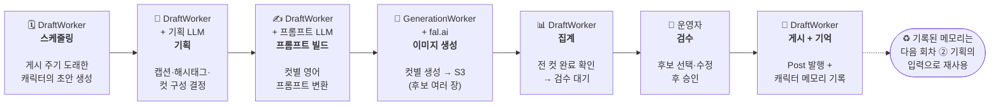
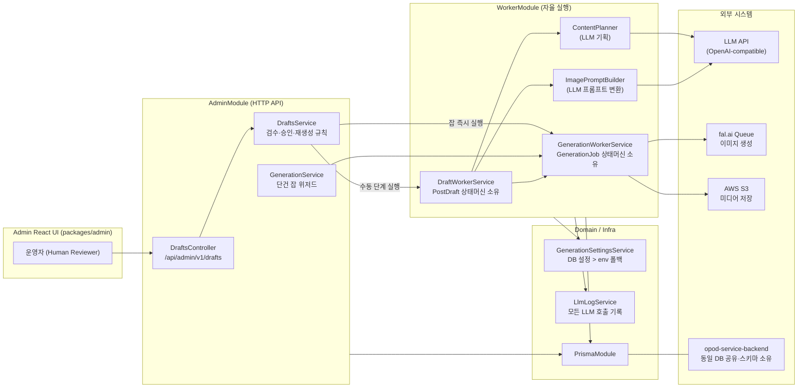
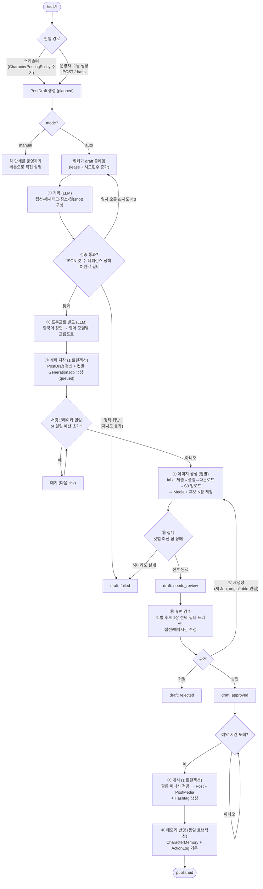
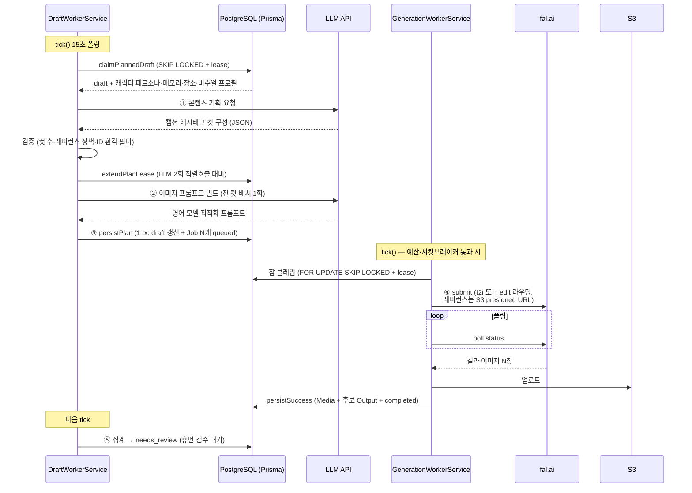
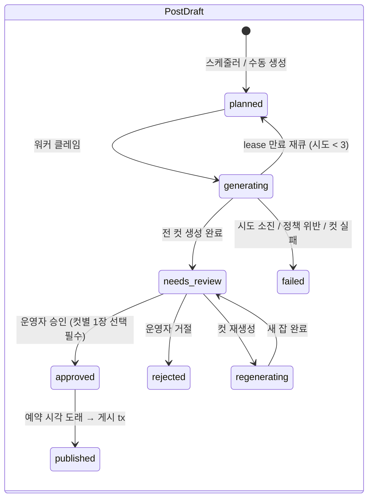
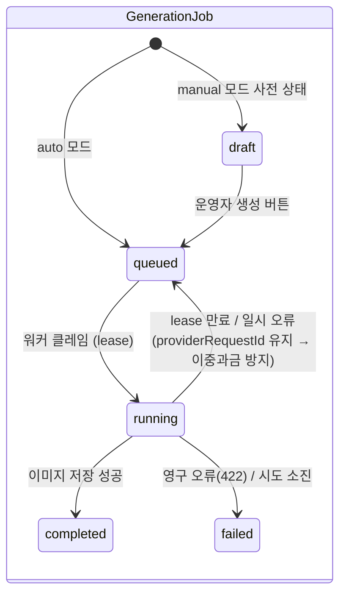

# opod-admin 게시물 생성 Agent — 아키텍처 UML

파이프라인 한 줄 요약: **기획 → 프롬프트 빌드 → 이미지 생성 → 저장 → 검수(휴먼) → 게시 → 메모리 반영**

오케스트레이션 패턴: 별도 큐 시스템(Redis/BullMQ) 없이 **PostgreSQL을 내구성 큐로 쓰는 상태 머신 + lease 기반 클레임 + 15초 폴링 워커**.

---

## 0. 흐름 요약 모형 — 누가, 무엇을, 어떤 순서로

자동/수동 구분 없이(사람이 진행 버튼을 누르냐 차이일 뿐) 실행 순서만 단순화한 모형.

| 순서 | 담당 | 작업 | 산출물 |
|---|---|---|---|
| 1 | DraftWorker | 스케줄링 — 게시 주기 도래한 캐릭터의 초안 생성 | `PostDraft(planned)` |
| 2 | DraftWorker + LLM | 기획 — 무엇을 올릴지 결정 | 캡션·해시태그·컷 구성 |
| 3 | DraftWorker + LLM | 프롬프트 빌드 — 컷별 이미지 프롬프트 작성 | 컷당 `GenerationJob` |
| 4 | GenerationWorker + fal.ai | 이미지 생성 — 컷별 실행, S3 저장 | `Media` 후보 N장 |
| 5 | DraftWorker | 집계 — 전 컷 완료 확인 | `needs_review` |
| 6 | 운영자 (사람) | 검수 — 후보 선택·수정·승인 | `approved` |
| 7 | DraftWorker | 게시 — Post 발행 + 캐릭터 메모리 기록 | `Post` + `CharacterMemory` |

---

## 1. 컴포넌트 다이어그램 — 시스템 구성과 의존 방향

핵심 규칙: 의존 방향은 **Admin → Worker 단방향**. WorkerModule은 AdminModule을 모른다. 프롬프트 템플릿은 `prompts/` 디렉터리에 순수 문자열로만 격리(네트워크·DB 접근 금지).

---

## 2. 액티비티 다이어그램 — 전체 워크플로우 (auto 모드)

---

## 3. 시퀀스 다이어그램 — 기획~생성 핵심 구간

---

## 4. 상태 머신 — 두 핵심 엔티티

---

## 아키텍처 결정 포인트 요약

| 결정 | 내용 |
|---|---|
| 큐 | 별도 큐 인프라 없음 — Postgres `FOR UPDATE SKIP LOCKED` + lease가 큐 역할 |
| 복구 | 3계층: draft 재큐(≤3회) / 잡 재시도(≤3회, 폴링 재개) / 전역 게이트(서킷브레이커·일일 예산) |
| 휴먼 게이트 | `needs_review` 승인 필수 (현재 POC 제약, 최종 목표는 완전 자동) |
| 수동/자동 | `mode=manual`이면 모든 단계가 운영자 버튼 실행, 자동 게시 제외 |
| 관측성 | 모든 LLM·이미지 호출 → `LlmLog`, 모든 상태 전이 → `CharacterActionLog` |
| 피드백 루프 | 게시 시 `CharacterMemory` 기록 → 다음 기획 LLM의 입력으로 재사용 |
